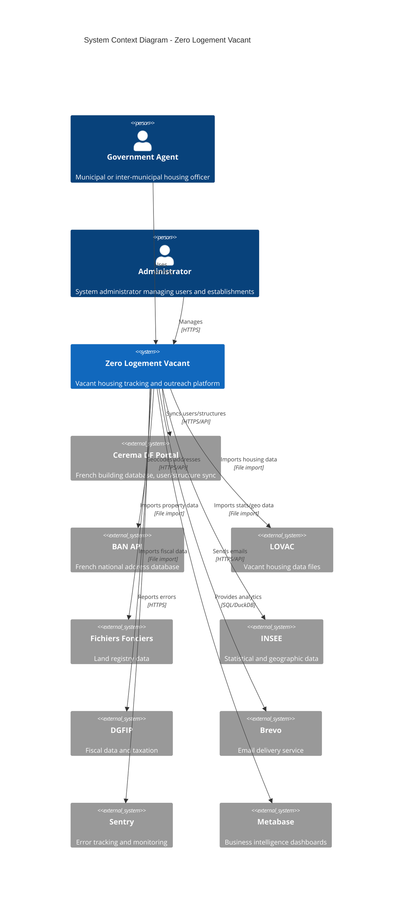
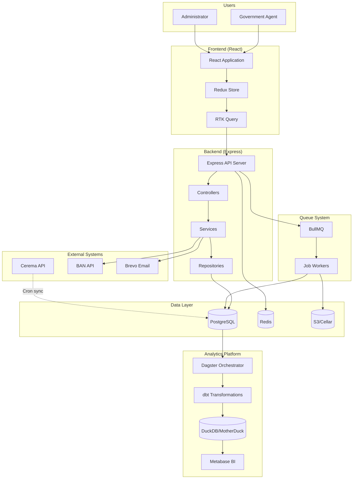
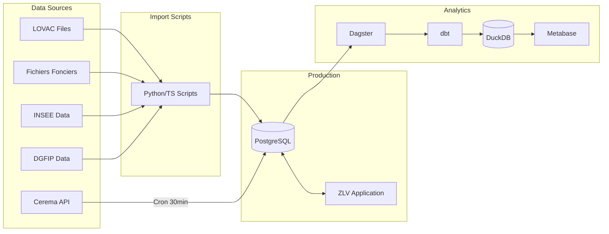

# Zero Logement Vacant - System Architecture

> **Last Updated:** 2026-02-19

## Purpose

Zero Logement Vacant (ZLV) is a French government application designed to help local authorities identify, track, and reduce vacant housing in their territories. The platform enables municipalities and inter-municipal organizations to:

- Identify vacant properties through data from multiple government sources
- Contact property owners through targeted campaigns
- Track the status of vacant housing over time
- Measure the impact of outreach efforts on housing vacancy rates

## System Context Diagram



## High-Level Architecture



## Technology Stack Summary

| Layer | Technology | Version | Purpose |
|-------|------------|---------|---------|
| **Frontend** | React | 18.3 | UI framework |
| | TypeScript | 5.x | Type safety |
| | Redux Toolkit | 1.9 | State management |
| | RTK Query | - | API data fetching |
| | DSFR | 1.28 | French Design System |
| | Vite | 5.x | Build tool |
| | MapLibre GL | 5.16 | Map visualization |
| **Backend** | Express.js | 4.22 | HTTP server |
| | TypeScript | 5.x | Type safety |
| | Knex.js | 3.1 | SQL query builder |
| | Yup | 1.7 | Validation |
| | JWT | 9.x | Authentication |
| **Database** | PostgreSQL | 14+ | Primary database |
| | PostGIS | - | Geospatial extension |
| | Redis | 7.x | Cache & queue backend |
| **Queue** | BullMQ | 5.56 | Job processing |
| **Storage** | S3/Cellar | - | File storage |
| **Analytics** | Dagster | - | Orchestration |
| | dbt | 1.x | Data transformation |
| | DuckDB | - | Analytical database |
| | MotherDuck | - | Cloud DuckDB |
| | Metabase | - | BI dashboards |
| **Hosting** | Clever Cloud | - | PaaS deployment |
| **Monitoring** | Sentry | 7.x | Error tracking |
| | Elasticsearch | 8.x | Log aggregation |

## Workspace Structure

```
zero-logement-vacant/
├── frontend/                 # React application (@zerologementvacant/front)
├── server/                   # Express API (@zerologementvacant/server)
├── queue/                    # BullMQ workers (@zerologementvacant/queue)
├── analytics/                # Data warehouse
│   ├── dagster/             # Orchestration
│   └── dbt/                 # Transformations
├── e2e/                      # Cypress E2E tests
├── packages/                 # Shared packages
│   ├── api-sdk/             # API client
│   ├── models/              # Shared DTOs
│   ├── schemas/             # Validation schemas
│   ├── utils/               # Shared utilities
│   ├── healthcheck/         # Health check utilities
│   └── draft/               # Draft/PDF utilities
├── docs/                     # Documentation
│   ├── architecture/        # This documentation
│   ├── guides/              # Development guides
│   └── decisions/           # ADRs
└── clevercloud/              # Deployment configuration
```

## Data Flow Overview



## Key Architectural Decisions

| Decision | Choice | Rationale |
|----------|--------|-----------|
| Monorepo | Yarn v4 + Nx | Shared code, consistent tooling, atomic changes |
| State Management | Redux + RTK Query | Centralized state, automatic caching |
| API Layer | Express + TypeScript | Type safety, ecosystem maturity |
| Database | PostgreSQL + Knex | Relational model, geospatial support |
| Analytics | DuckDB + dbt | OLAP workloads, SQL transformations |
| Queue | BullMQ + Redis | Reliable job processing |
| Testing | Vitest | Fast, TypeScript-native |
| Deployment | Clever Cloud | French hosting, PaaS simplicity |

## Quick Links

| Document | Description |
|----------|-------------|
| [Frontend Architecture](01-frontend-architecture.md) | React app structure, state management |
| [Backend Architecture](02-backend-architecture.md) | API structure, database schema |
| [Queue Architecture](03-queue-architecture.md) | Job processing system |
| [Data Warehouse](04-data-warehouse-architecture.md) | Analytics platform |
| [Scripts Architecture](05-scripts-architecture.md) | Data import scripts |
| [Infrastructure](06-infrastructure.md) | Deployment and hosting |
| [Integrations](07-integrations.md) | External system connections |
| [Security](08-security.md) | Authentication and data protection |

## Environments

| Environment | URL | Purpose |
|-------------|-----|---------|
| Production | https://zerologementvacant.beta.gouv.fr | Live system |
| Staging | https://<staging-url> | Pre-production testing |
| Development | http://localhost:3000 (front) / :3001 (API) | Local development |
