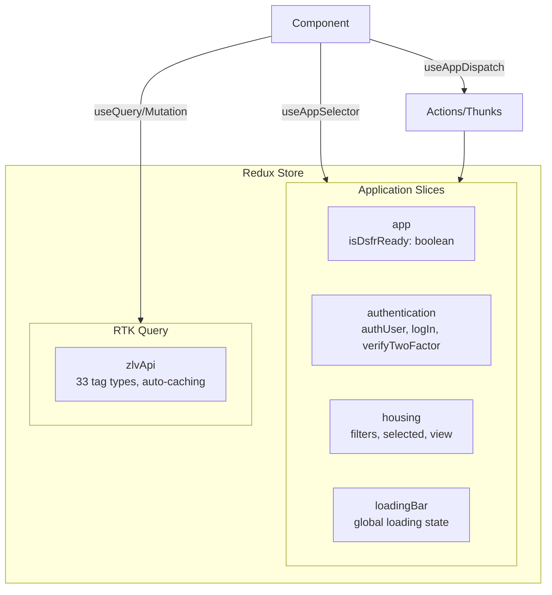
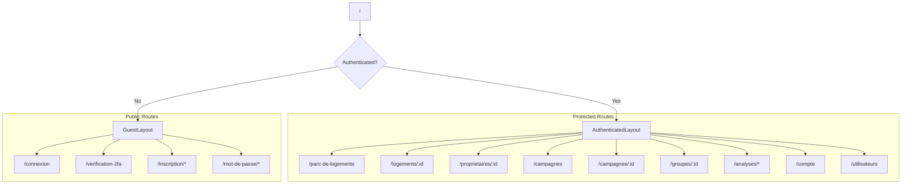

# Frontend Architecture

> **Last Updated:** 2026-02-19

## Overview

The frontend is a single-page React application that provides the user interface for government agents to manage vacant housing in their territories. It communicates with the backend API via RTK Query and uses Redux for state management.

## Technology Stack

| Category | Technology | Version | Purpose |
|----------|------------|---------|---------|
| **Framework** | React | 18.3.1 | UI components |
| **Language** | TypeScript | 5.x | Type safety |
| **Routing** | React Router | 6.30 | Navigation |
| **State** | Redux Toolkit | 1.9.7 | Global state |
| **API** | RTK Query | - | Data fetching |
| **Forms** | React Hook Form | 7.66 | Form handling |
| **Validation** | Yup | 1.7 | Schema validation |
| **UI Components** | MUI + DSFR | 7.3 / 1.28 | Design system |
| **Maps** | MapLibre GL | 5.16 | Mapping |
| **Rich Text** | Lexical | 0.39 | Text editor |
| **Build** | Vite | 5.x | Build tool |
| **Testing** | Vitest | - | Unit tests |
| **Mocking** | MSW | 2.12 | API mocking |

## Application Architecture Diagram

```mermaid
flowchart TB
    subgraph Views["Views (Pages)"]
        HousingListView[HousingListView]
        HousingView[HousingView]
        CampaignView[CampaignView]
        OwnerView[OwnerView]
        GroupView[GroupView]
        AccountView[AccountView]
    end

    subgraph Layouts["Layout Wrappers"]
        AuthLayout[AuthenticatedLayout]
        GuestLayout[GuestLayout]
    end

    subgraph Components["Components (91 directories)"]
        AppComponents[_app/ Components]
        HousingComponents[Housing Components]
        CampaignComponents[Campaign Components]
        OwnerComponents[Owner Components]
        CommonComponents[Common Components]
    end

    subgraph Hooks["Custom Hooks (39+)"]
        useHousing[useHousing]
        useCampaign[useCampaign]
        useSelection[useSelection]
        useNotification[useNotification]
    end

    subgraph Store["Redux Store"]
        AppSlice[appSlice]
        AuthSlice[authenticationSlice]
        HousingSlice[housingSlice]
        LoadingBar[loadingBarSlice]
        RTKCache[RTK Query Cache]
    end

    subgraph Services["RTK Query Services (27)"]
        HousingService[housing.service]
        OwnerService[owner.service]
        CampaignService[campaign.service]
        AuthService[auth.service]
    end

    subgraph HTTP["HTTP Layer"]
        FetchBase[fetchBaseQuery]
        AuthHeaders[Auth Headers]
    end

    Views --> Layouts
    Layouts --> Components
    Components --> Hooks
    Hooks --> Store
    Store --> Services
    Services --> HTTP
    HTTP --> API[Backend API]
```



## Directory Structure

```
frontend/src/
├── App.tsx                    # Router configuration
├── index.tsx                  # Entry point
├── theme.tsx                  # MUI theme
│
├── views/                     # Page components
│   ├── HousingList/          # Main housing list
│   ├── Housing/              # Housing details
│   ├── Campaign/             # Campaign management
│   ├── Owner/                # Owner details
│   ├── Group/                # Group management
│   ├── Account/              # User account
│   ├── Analysis/             # Analytics views
│   ├── Login/                # Authentication
│   └── Resources/            # Help pages
│
├── components/               # Reusable UI (91 dirs)
│   ├── _app/                # App-specific widgets
│   ├── Housing*/            # Housing-related (12)
│   ├── Campaign*/           # Campaign-related (11)
│   ├── Group*/              # Group-related (5)
│   ├── Owner/               # Owner components
│   ├── Map/                 # Map visualization
│   ├── AdvancedTable/       # Data tables
│   └── [Common]             # Shared components
│
├── services/                # RTK Query endpoints (27)
│   ├── api.service.ts       # Base configuration
│   ├── housing.service.ts   # Housing CRUD
│   ├── owner.service.ts     # Owner CRUD
│   ├── campaign.service.ts  # Campaign CRUD
│   └── [other].service.ts   # Other resources
│
├── store/                   # Redux configuration
│   ├── store.tsx            # Store setup
│   ├── reducers/            # Slices
│   ├── thunks/              # Async actions
│   └── actions/             # Action creators
│
├── hooks/                   # Custom hooks (39+)
│   ├── useStore.tsx         # Typed Redux hooks
│   ├── useHousing.tsx       # Housing context
│   ├── useNotification.ts   # Toast integration
│   └── [other].tsx          # Other hooks
│
├── models/                  # TypeScript interfaces
│   ├── Housing.tsx          # Housing model
│   ├── Owner.tsx            # Owner model
│   ├── HousingFilters.tsx   # Filter types
│   └── [other].tsx          # Other models
│
├── layouts/                 # Layout wrappers
│   ├── AuthenticatedLayout.tsx
│   └── GuestLayout.tsx
│
├── utils/                   # Utilities
│   ├── config.ts            # Environment config
│   ├── dateUtils.ts         # Date formatting
│   └── [other].ts           # Other utilities
│
├── mocks/                   # MSW handlers
│   └── handlers/            # API mocks
│
└── assets/                  # Static files
```

## State Management

### Redux Store Structure



### Redux Slices

| Slice | State | Purpose |
|-------|-------|---------|
| `app` | `isDsfrReady: boolean` | DSFR initialization status |
| `authentication` | `authUser`, `logIn`, `verifyTwoFactor`, `isLoggedOut` | Auth state & async operations |
| `housing` | `filters`, `selected`, `view`, `totalCount` | Housing list state |
| `loadingBar` | Loading indicator state | Global loading bar |

### RTK Query Cache Tags

```typescript
tagTypes: [
  'Account', 'Building', 'Campaign', 'Datafoncier housing',
  'Document', 'Draft', 'Establishment', 'Event', 'GeoPerimeter',
  'Group', 'Housing', 'HousingByStatus', 'HousingCountByStatus',
  'HousingEvent', 'HousingOwner', 'Locality', 'Note', 'Owner',
  'OwnerHousing', 'Precision', 'Prospect', 'Settings', 'Stats',
  'SignupLink', 'User'
  // ... 33 total
]
```

## Routing Structure



### Route Table

| Path | Component | Description |
|------|-----------|-------------|
| `/` | Redirect | → `/parc-de-logements` |
| `/parc-de-logements` | HousingListView | Main housing list |
| `/logements/:id` | HousingView | Housing details |
| `/logements/:id/proprietaires` | HousingOwnersView | Housing owners |
| `/proprietaires/:id` | OwnerView | Owner details |
| `/campagnes` | CampaignListView | Campaign list |
| `/campagnes/:id` | CampaignView | Campaign details |
| `/groupes/:id` | GroupView | Group details |
| `/analyses/*` | AnalysisView | Analytics dashboards |
| `/compte` | AccountView | User account |
| `/utilisateurs` | UsersView | User management |
| `/connexion` | LoginView | Login page |
| `/verification-2fa` | TwoFactorView | 2FA verification |
| `/inscription/*` | AccountCreationView | Signup flow |

## Component Architecture

### Component Categories

```
components/
├── _app/                      # App-specific custom components
│   ├── AppBadge/             # Status badges
│   ├── AppCheckbox/          # DSFR-styled checkbox
│   ├── AppHelp/              # Help tooltips
│   ├── AppLink/              # Custom link wrapper
│   ├── AppMultiSelect/       # Multi-select dropdown
│   ├── AppSearchBar/         # Search input
│   ├── AppSelect/            # Single-select dropdown
│   └── AppTextInput/         # Text input
│
├── Housing*/                  # Housing feature (12 components)
│   ├── HousingDetails/       # Detail display
│   ├── HousingEdition/       # Edit form
│   ├── HousingList/          # List table
│   ├── HousingListFilters/   # Filter UI (29 sub-dirs)
│   ├── HousingResult/        # Result card
│   └── HousingStatusBadge/   # Status indicator
│
├── Campaign*/                 # Campaign feature (11 components)
│   ├── Campaign/             # Details
│   ├── CampaignCard/         # Summary card
│   └── CampaignHeader/       # Page header
│
├── Group*/                    # Group feature (5 components)
│   ├── Group/                # Details
│   └── GroupCard/            # Summary card
│
├── Common/                    # Shared components
│   ├── Header/               # Navigation header
│   ├── Footer/               # App footer
│   ├── Aside/                # Sidebar
│   ├── AdvancedTable/        # Data table
│   ├── Map/                  # MapLibre wrapper
│   ├── Modal/                # Modal dialogs
│   └── FileUpload/           # File uploader
```

### Component Patterns

```typescript
// Standard component structure
interface Props {
  readonly housing: Housing;
  readonly onUpdate?: (housing: Housing) => void;
}

function HousingDetails(props: Props) {
  const { housing, onUpdate } = props;

  // Hooks at top
  const { data, isLoading } = useGetHousingQuery(housing.id);
  const [updateHousing] = useUpdateHousingMutation();

  // Notification integration
  useNotification({
    isLoading: isUpdating,
    isSuccess: isUpdateSuccess,
    toastId: 'housing-update',
    message: {
      loading: 'Saving...',
      success: 'Housing updated',
      error: 'Update failed'
    }
  });

  // Event handlers
  const handleUpdate = async (values: FormValues) => {
    await updateHousing({ id: housing.id, ...values });
    onUpdate?.(updatedHousing);
  };

  return (
    <div className={styles.container}>
      {/* JSX */}
    </div>
  );
}

export default HousingDetails;
```

## API Integration

### RTK Query Configuration

```typescript
// services/api.service.ts
export const zlvApi = createApi({
  baseQuery: fetchBaseQuery({
    baseUrl: `${config.apiEndpoint}/api`,
    prepareHeaders: (headers) => authService.withAuthHeader(headers),
    paramsSerializer: (query) =>
      qs.stringify(query, { arrayFormat: 'comma' })
  }),
  tagTypes: [/* 33 tags */],
  endpoints: () => ({})
});
```

### Service Pattern

```typescript
// services/housing.service.ts
export const housingApi = zlvApi.injectEndpoints({
  endpoints: (builder) => ({
    // Query endpoint
    getHousing: builder.query<Housing, string>({
      query: (id) => `housing/${id}`,
      transformResponse: parseHousing,
      providesTags: (result) => [{ type: 'Housing', id: result?.id }]
    }),

    // Mutation endpoint
    updateHousing: builder.mutation<Housing, UpdatePayload>({
      query: ({ id, ...body }) => ({
        url: `housing/${id}`,
        method: 'PUT',
        body
      }),
      invalidatesTags: ['HousingByStatus', 'HousingCountByStatus']
    }),

    // Paginated query
    findHousing: builder.query<PaginatedResult, FindOptions>({
      query: (opts) => ({
        url: '/housing',
        params: { ...opts.filters, ...opts.pagination }
      }),
      providesTags: (result) =>
        result?.entities.map(({ id }) => ({ type: 'Housing', id })) ?? []
    })
  })
});

// Auto-generated hooks
export const {
  useGetHousingQuery,
  useUpdateHousingMutation,
  useFindHousingQuery
} = housingApi;
```

### Services Summary

| Service | Resource | Key Operations |
|---------|----------|----------------|
| `auth.service` | Authentication | Login, logout, 2FA |
| `housing.service` | Housing | CRUD, batch update, counts |
| `owner.service` | Owners | CRUD, search |
| `campaign.service` | Campaigns | CRUD, export |
| `group.service` | Groups | CRUD, add/remove housing |
| `document.service` | Documents | Upload, link/unlink |
| `event.service` | Events | History retrieval |
| `note.service` | Notes | CRUD |
| `user.service` | Users | Management |
| `geo.service` | Geography | Perimeters, localities |
| `dashboard.service` | Dashboards | Analytics data |

## State Management Patterns

### Pattern 1: RTK Query (API Data)

```typescript
// Component with query
function HousingView({ id }: { id: string }) {
  const { data: housing, isLoading, error } = useGetHousingQuery(id);

  if (isLoading) return <Spinner />;
  if (error) return <Error error={error} />;

  return <HousingDetails housing={housing} />;
}
```

### Pattern 2: Redux Slice (UI State)

```typescript
// Using housing slice for filters
function HousingListView() {
  const dispatch = useAppDispatch();
  const filters = useAppSelector((state) => state.housing.filters);

  const handleFilterChange = (newFilters: Partial<HousingFilters>) => {
    dispatch(changeFilters({ ...filters, ...newFilters }));
  };

  return <Filters value={filters} onChange={handleFilterChange} />;
}
```

### Pattern 3: Context Provider (Scoped State)

```typescript
// Context for housing detail pages
const HousingContext = createContext<HousingContextValue | null>(null);

export function HousingProvider({ children, housing }: Props) {
  return (
    <HousingContext.Provider value={{ housing }}>
      {children}
    </HousingContext.Provider>
  );
}

export function useHousing() {
  const context = useContext(HousingContext);
  if (!context) throw new Error('useHousing must be within HousingProvider');
  return context;
}
```

## Build & Deployment

### Vite Configuration

- **Entry:** `index.html` → `src/index.tsx`
- **Output:** `dist/` directory
- **Environment:** Variables via `VITE_*` prefix
- **Code Splitting:** Automatic chunking

### Environment Variables

```bash
VITE_API_ENDPOINT=http://localhost:3001    # Backend URL
VITE_SENTRY_DSN=...                        # Error tracking
VITE_POSTHOG_KEY=...                       # Analytics
```

### Build Commands

```bash
yarn nx build frontend          # Production build
yarn nx dev frontend           # Development server
yarn nx test frontend          # Run tests
yarn nx lint frontend          # Lint code
yarn nx typecheck frontend     # Type check
```
