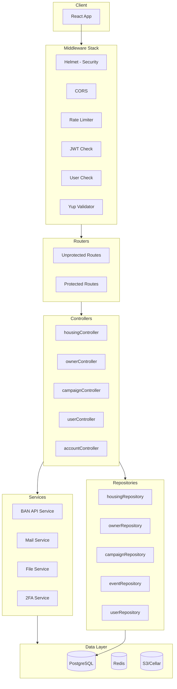
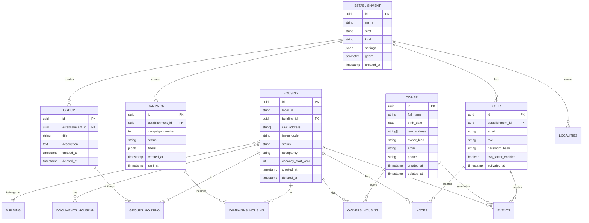
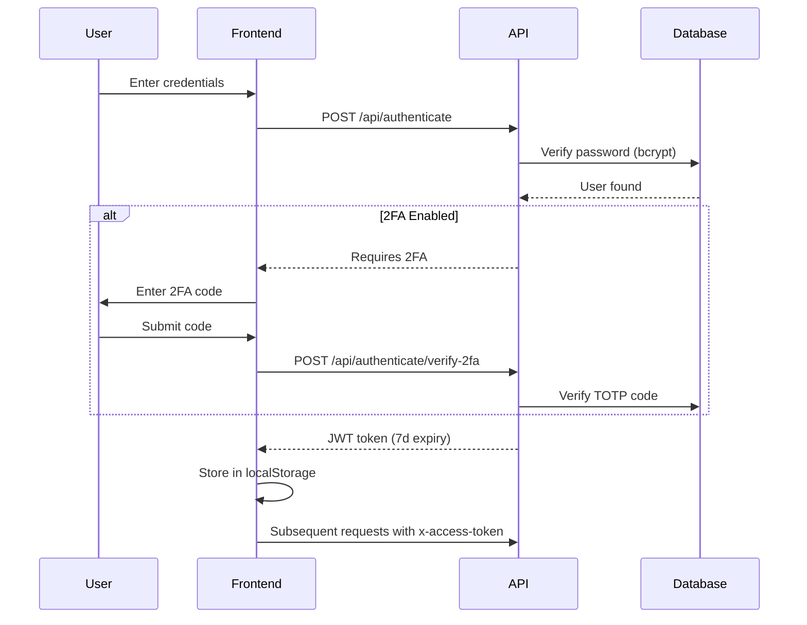
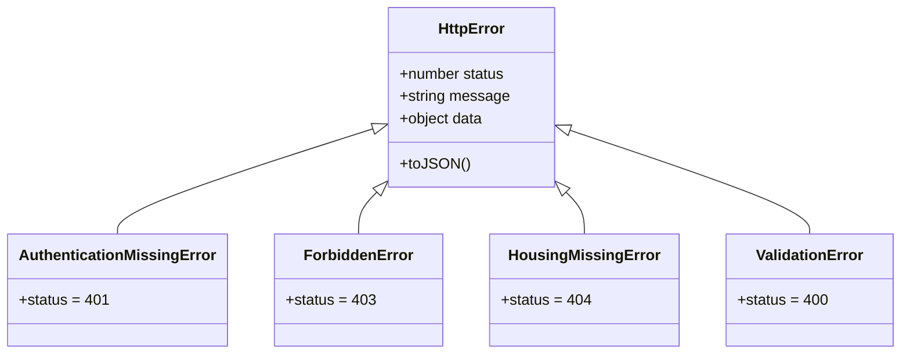

# Backend Architecture

> **Last Updated:** 2026-02-19

## Overview

The backend is an Express.js REST API that provides data access, business logic, and authentication for the frontend application. It follows a layered architecture with clear separation of concerns.

## Technology Stack

| Category | Technology | Version | Purpose |
|----------|------------|---------|---------|
| **Runtime** | Node.js | 24+ | JavaScript runtime |
| **Framework** | Express.js | 4.22 | HTTP server |
| **Language** | TypeScript | 5.x | Type safety |
| **Database** | PostgreSQL | 14+ | Primary database |
| **ORM** | Knex.js | 3.1 | Query builder |
| **Validation** | Yup | 1.7 | Schema validation |
| **Auth** | jsonwebtoken | 9.0 | JWT tokens |
| **Email** | Brevo | 1.0 | Email service |
| **Storage** | AWS S3 | 3.x | File storage |
| **Search** | Elasticsearch | 8.19 | Indexing |
| **Cache** | Redis | 4.7 | Caching |
| **Testing** | Vitest | - | Test framework |

## Architecture Diagram



## Directory Structure

```
server/src/
├── index.ts                  # Entry point
├── infra/                    # Infrastructure
│   ├── server.ts            # Express app factory
│   ├── config.ts            # Convict configuration
│   ├── logger.ts            # Logging
│   ├── sentry.ts            # Error tracking
│   └── database/
│       ├── index.ts         # Knex instance
│       ├── knexfile.ts      # Knex configuration
│       ├── transaction.ts   # Transaction handling
│       ├── db.ts            # Query utilities
│       ├── migrations/      # 193+ migrations
│       ├── seeds/           # Seed data
│       └── procedures/      # SQL procedures
│
├── routers/                  # Route definitions
│   ├── protected.ts         # Auth required
│   └── unprotected.ts       # Public routes
│
├── controllers/              # Request handlers
│   ├── housingController.ts
│   ├── ownerController.ts
│   ├── campaignController.ts
│   ├── userController.ts
│   ├── accountController.ts
│   └── test/                # Integration tests
│
├── repositories/             # Data access
│   ├── housingRepository.ts
│   ├── ownerRepository.ts
│   ├── campaignRepository.ts
│   ├── eventRepository.ts
│   └── test/                # Unit tests
│
├── services/                 # External integrations
│   ├── ban/                 # BAN API client
│   ├── mailService/         # Email service
│   ├── document-upload.ts   # S3 uploads
│   ├── twoFactorService.ts  # 2FA
│   └── file-validation.ts   # File checks
│
├── middlewares/              # Express middleware
│   ├── auth.ts              # JWT + user checks
│   ├── error-handler.ts     # Error handling
│   ├── validator-next.ts    # Yup validation
│   ├── upload.ts            # Multer config
│   └── antivirus.ts         # ClamScan
│
├── models/                   # TypeScript interfaces
│   ├── HousingApi.ts
│   ├── OwnerApi.ts
│   └── EventApi.ts
│
├── errors/                   # Custom errors (41)
│   ├── httpError.ts         # Base class
│   ├── HousingMissingError.ts
│   └── [other]Error.ts
│
├── scripts/                  # CLI scripts
│   ├── import-lovac/
│   ├── import-dpe/
│   └── perimeters-portaildf/
│
└── test/                     # Test utilities
    ├── testFixtures.ts      # Data generators
    └── tokenProvider.ts     # Test JWT
```

## API Endpoints

### Protected Routes (JWT Required)

#### Housing

| Method | Endpoint | Description |
|--------|----------|-------------|
| `GET` | `/api/housing` | List with filters/pagination |
| `GET` | `/api/housing/count` | Count matching housing |
| `GET` | `/api/housing/:id` | Get single housing |
| `POST` | `/api/housing` | Create housing |
| `PUT` | `/api/housing/:id` | Update single |
| `PUT` | `/api/housing` | Batch update |

#### Owners

| Method | Endpoint | Description |
|--------|----------|-------------|
| `GET` | `/api/owners` | List owners |
| `POST` | `/api/owners` | Search owners |
| `GET` | `/api/owners/:id` | Get owner |
| `POST` | `/api/owners/creation` | Create owner |
| `PUT` | `/api/owners/:id` | Update owner |
| `GET` | `/api/owners/:id/housings` | Owner's housings |
| `GET` | `/api/owners/:id/events` | Owner events |

#### Campaigns

| Method | Endpoint | Description |
|--------|----------|-------------|
| `GET` | `/api/campaigns` | List campaigns |
| `POST` | `/api/campaigns` | Create campaign |
| `GET` | `/api/campaigns/:id` | Get campaign |
| `PUT` | `/api/campaigns/:id` | Update campaign |
| `DELETE` | `/api/campaigns/:id` | Delete campaign |
| `GET` | `/api/campaigns/:id/export` | Export data |
| `GET` | `/api/campaigns/:id/download` | Download files |

#### Groups

| Method | Endpoint | Description |
|--------|----------|-------------|
| `GET` | `/api/groups` | List groups |
| `POST` | `/api/groups` | Create group |
| `GET` | `/api/groups/:id` | Get group |
| `PUT` | `/api/groups/:id` | Update group |
| `DELETE` | `/api/groups/:id` | Delete group |
| `POST` | `/api/groups/:id/housing` | Add housing |
| `DELETE` | `/api/groups/:id/housing` | Remove housing |

#### Documents

| Method | Endpoint | Description |
|--------|----------|-------------|
| `POST` | `/api/documents` | Upload document |
| `PUT` | `/api/documents/:id` | Update metadata |
| `DELETE` | `/api/documents/:id` | Delete document |
| `GET` | `/api/housing/:id/documents` | Housing documents |
| `POST` | `/api/housing/:id/documents` | Link to housing |

### Unprotected Routes (Public)

| Method | Endpoint | Description |
|--------|----------|-------------|
| `POST` | `/api/authenticate` | Sign in |
| `POST` | `/api/authenticate/verify-2fa` | 2FA verify |
| `POST` | `/api/users/creation` | Create account |
| `POST` | `/api/reset-links` | Password reset |
| `GET` | `/api/establishments` | List establishments |
| `GET` | `/api/localities` | List localities |

## Database Schema

### Entity Relationship Diagram



### Key Tables

| Table | Purpose | Key Columns |
|-------|---------|-------------|
| `housing` / `fast_housing` | Vacant properties | id, local_id, status, occupancy |
| `owners` | Property owners | id, full_name, raw_address |
| `owners_housing` | Owner-housing link | owner_id, housing_id, property_right |
| `campaigns` | Outreach campaigns | id, status, filters |
| `campaigns_housing` | Campaign-housing link | campaign_id, housing_id |
| `groups` | Housing groups | id, title, establishment_id |
| `groups_housing` | Group-housing link | group_id, housing_id |
| `establishments` | Local authorities | id, name, siret, kind |
| `users` | User accounts | id, email, role, password_hash |
| `events` | Event sourcing | id, type, source, created_by |
| `localities` | INSEE localities | geo_code, name, taxed |
| `buildings` | Building data | id, coordinates, dpe |
| `documents` | Uploaded files | id, filename, mime_type |

### PostgreSQL Extensions

```sql
-- Required extensions
CREATE EXTENSION IF NOT EXISTS "uuid-ossp";    -- UUID generation
CREATE EXTENSION IF NOT EXISTS "postgis";       -- Geospatial
CREATE EXTENSION IF NOT EXISTS "unaccent";      -- Accent-insensitive search
CREATE EXTENSION IF NOT EXISTS "pg_trgm";       -- Fuzzy matching
```

## Authentication & Authorization

### Authentication Flow



### Middleware Stack

```typescript
// Protected route middleware chain
router.use(jwtCheck());      // Validate JWT signature
router.use(userCheck());     // Load User + Establishment
router.use(hasRole(['ADMIN', 'USUAL']));  // Check role
```

### JWT Payload

```typescript
interface TokenPayload {
  userId: string;           // User UUID
  establishmentId: string;  // Establishment UUID
  iat: number;              // Issued at
  exp: number;              // Expiration (7 days)
}
```

### User Roles

| Role | Permissions |
|------|-------------|
| `ADMIN` | Full access, user management |
| `USUAL` | Standard access, no user management |
| `VISITOR` | Read-only access |

## Repository Pattern

### Standard Interface

```typescript
interface Repository<T, Filter> {
  find(options: FindOptions<Filter>): Promise<T[]>;
  findOne(filter: Filter): Promise<T | null>;
  count(filter: Filter): Promise<number>;
  create(entity: T): Promise<void>;
  update(entity: T): Promise<void>;
  remove(id: string): Promise<void>;  // Soft delete
  insert(entities: readonly T[]): Promise<void>;
}
```

### Example Implementation

```typescript
// repositories/housingRepository.ts
const housingRepository = {
  async find(opts: FindOptions<HousingFilters>): Promise<HousingApi[]> {
    const query = db('fast_housing')
      .where(db.where(opts.filters))
      .andWhere(db.notDeleted())
      .orderBy(opts.sort.column, opts.sort.order)
      .offset(opts.pagination.offset)
      .limit(opts.pagination.limit);

    const rows = await query;
    return rows.map(fromHousingDBO);
  },

  async update(housing: HousingApi): Promise<void> {
    await withinTransaction(async (trx) => {
      await db('fast_housing', trx)
        .where({ id: housing.id })
        .update(toHousingDBO(housing));
    });
  }
};
```

### DBO Pattern

```typescript
// Database representation (snake_case)
interface HousingDBO {
  id: string;
  local_id: string;
  raw_address: string[];
  created_at: Date;
  deleted_at: Date | null;
}

// API representation (camelCase)
interface HousingApi {
  id: string;
  localId: string;
  rawAddress: string[];
  createdAt: Date;
  deletedAt: Date | null;
}

// Conversion functions
function toHousingDBO(h: HousingApi): HousingDBO { ... }
function fromHousingDBO(h: HousingDBO): HousingApi { ... }
```

## Error Handling

### Error Hierarchy



### Error Handler Middleware

```typescript
// middlewares/error-handler.ts
function errorHandler(err: Error, req: Request, res: Response, next: NextFunction) {
  if (err instanceof HttpError) {
    return res.status(err.status).json(err.toJSON());
  }

  // Log to Sentry
  Sentry.captureException(err);

  // Generic 500 response
  return res.status(500).json({
    name: 'InternalServerError',
    message: 'An unexpected error occurred'
  });
}
```

### Common Error Classes

| Error | Status | Use Case |
|-------|--------|----------|
| `AuthenticationMissingError` | 401 | No/invalid token |
| `AuthenticationFailedError` | 401 | Wrong credentials |
| `ForbiddenError` | 403 | Insufficient permissions |
| `HousingMissingError` | 404 | Housing not found |
| `OwnerMissingError` | 404 | Owner not found |
| `CampaignMissingError` | 404 | Campaign not found |
| `ValidationError` | 400 | Invalid request data |
| `FileUploadError` | 400 | Upload failed |

## Validation

### Yup Schema Validation

```typescript
// Validation middleware
import { validatorNext } from '@middlewares/validator-next';

// In router
router.post(
  '/housing',
  validatorNext.body(housingCreatePayload),
  housingController.create
);

// Schema definition (packages/schemas)
export const housingCreatePayload = yup.object({
  localId: yup.string().required(),
  rawAddress: yup.array().of(yup.string()).required(),
  inseeCode: yup.string().length(5).required(),
  // ...
});
```

## Services

### BAN Service (Address Geocoding)

```typescript
// services/ban/ban-api.ts
interface BANService {
  search(query: string, inseeCode: string): Promise<BANAddress[]>;
  searchBulk(addresses: Address[]): Promise<BANAddress[]>;
}
```

### Mail Service

```typescript
// services/mailService/mailService.ts
interface MailService {
  send(options: SendOptions): Promise<void>;
  sendPasswordReset(email: string, link: string): Promise<void>;
  sendAccountActivation(email: string, link: string): Promise<void>;
}
```

## Configuration

### Convict Configuration

```typescript
// infra/config.ts
const config = convict({
  app: {
    port: { format: 'port', default: 3001, env: 'PORT' },
    environment: { format: String, default: 'development', env: 'NODE_ENV' }
  },
  auth: {
    secret: { format: String, env: 'AUTH_SECRET', sensitive: true },
    expiresIn: { format: String, default: '7d' }
  },
  database: {
    url: { format: String, env: 'DATABASE_URL', sensitive: true }
  },
  // ...
});
```

### Key Environment Variables

| Variable | Required | Description |
|----------|----------|-------------|
| `DATABASE_URL` | Yes | PostgreSQL connection |
| `AUTH_SECRET` | Yes | JWT signing secret |
| `REDIS_URL` | Yes | Redis connection |
| `S3_BUCKET` | Yes | S3 bucket name |
| `BREVO_API_KEY` | Yes | Email service key |
| `SENTRY_DSN` | No | Error tracking |
