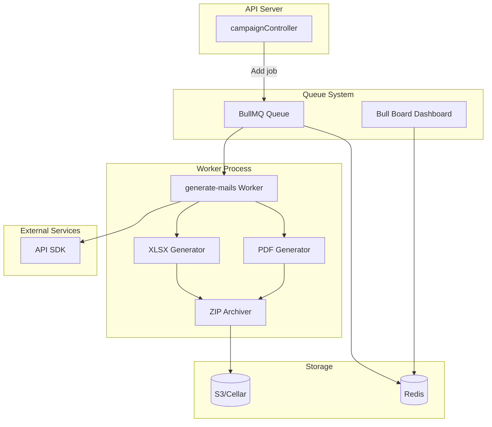
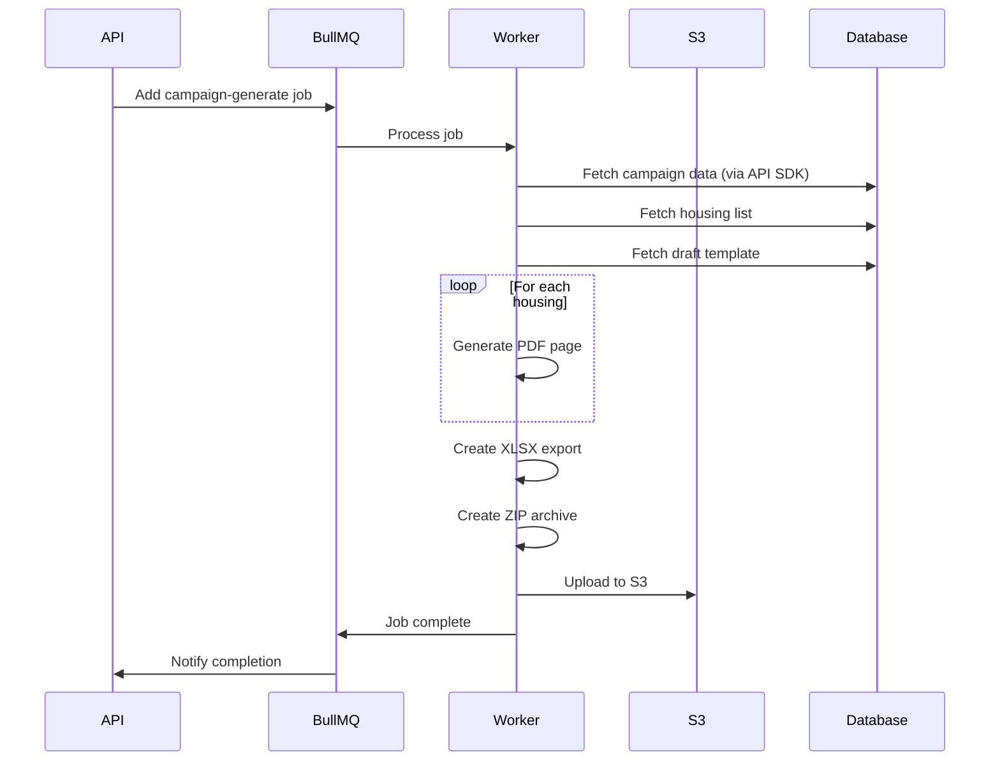

# Queue System Architecture

> **Last Updated:** 2026-02-19

## Overview

The queue system handles background job processing for long-running tasks like campaign mail generation and PDF creation. It uses BullMQ with Redis as the backend and runs as a separate service.

## Technology Stack

| Component | Technology | Version | Purpose |
|-----------|------------|---------|---------|
| **Queue** | BullMQ | 5.56 | Job queue library |
| **Dashboard** | Bull Board | 6.13 | Queue monitoring UI |
| **Backend** | Redis | 7.x | Queue storage |
| **Storage** | AWS S3 | 3.x | File uploads |
| **PDF** | @zerologementvacant/draft | - | PDF generation |
| **Archive** | archiver | 7.0 | ZIP creation |

## Architecture Diagram



## Job Flow



## Job Types

### campaign-generate

Generates mail documents for a campaign.

```typescript
interface CampaignGeneratePayload {
  campaignId: string;      // Campaign to process
  establishmentId: string; // Establishment context
}

interface CampaignGenerateResult {
  id: string;              // S3 file ID
}
```

**Processing Steps:**

1. Fetch campaign details via API SDK
2. Fetch all housing in campaign with owners
3. Fetch draft template (mail body)
4. For each housing:
   - Replace template variables (owner name, address, etc.)
   - Generate PDF page
5. Create XLSX spreadsheet of recipients
6. Bundle everything into ZIP archive
7. Upload to S3 with authenticated-read ACL
8. Return S3 file ID

## Worker Configuration

```typescript
// queue/src/generate-mails.ts
const worker = new Worker(
  'campaign-generate',
  async (job: Job<CampaignGeneratePayload>) => {
    const { campaignId, establishmentId } = job.data;

    // Set establishment context
    setEstablishmentId(establishmentId);

    // Process campaign
    const campaign = await apiSdk.campaigns.get(campaignId);
    const housings = await apiSdk.campaigns.getHousings(campaignId);
    const draft = await apiSdk.drafts.get(campaign.draftId);

    // Generate documents
    const pdf = await generatePDF(housings, draft);
    const xlsx = await generateXLSX(housings);

    // Create archive
    const archive = await createZipArchive([pdf, xlsx]);

    // Upload to S3
    const fileId = await uploadToS3(archive, campaign);

    return { id: fileId };
  },
  {
    connection: redis,
    concurrency: 1  // Process one job at a time
  }
);
```

## Queue Server

```typescript
// queue/src/server.ts
const app = express();

// Health check endpoint
app.get('/', async (req, res) => {
  const health = await checkHealth();  // Redis, PostgreSQL, S3
  res.json(health);
});

// Bull Board dashboard (password protected)
app.use(
  '/queues',
  basicAuth({ users: { admin: process.env.QUEUE_PASSWORD } }),
  createBullBoard([campaignQueue]).getRouter()
);

app.listen(8080);
```

## Redis Configuration

```typescript
// queue/src/config.ts
const redis = new Redis(config.redis.url, {
  maxRetriesPerRequest: null,  // Required by BullMQ
  enableReadyCheck: false
});

// Development
REDIS_URL=redis://localhost:6379

// Production
REDIS_URL=redis://:password@host:port
```

## S3 Configuration

```typescript
const s3Client = new S3Client({
  endpoint: config.s3.endpoint,
  region: config.s3.region,
  credentials: {
    accessKeyId: config.s3.accessKeyId,
    secretAccessKey: config.s3.secretAccessKey
  }
});

const uploadParams = {
  Bucket: config.s3.bucket,
  Key: `campaigns/${campaignId}/${filename}`,
  Body: archiveStream,
  ContentType: 'application/zip',
  ACL: 'authenticated-read'
};
```

## Error Handling

### Retry Strategy

```typescript
const queue = new Queue('campaign-generate', {
  connection: redis,
  defaultJobOptions: {
    attempts: 3,           // Retry up to 3 times
    backoff: {
      type: 'exponential',
      delay: 5000          // Start with 5s delay
    },
    removeOnComplete: 100, // Keep last 100 completed
    removeOnFail: 50       // Keep last 50 failed
  }
});
```

### Event Listeners

```typescript
worker.on('completed', (job, result) => {
  logger.info(`Job ${job.id} completed`, { result });
});

worker.on('failed', (job, error) => {
  logger.error(`Job ${job.id} failed`, { error });
  Sentry.captureException(error, {
    extra: { jobId: job.id, data: job.data }
  });
});

worker.on('error', (error) => {
  Sentry.captureException(error);
});
```

## Monitoring

### Bull Board Dashboard

Access at `/queues` with basic authentication.

Features:
- View pending, active, completed, failed jobs
- Retry failed jobs
- Remove jobs
- View job data and results
- Queue statistics

### Health Check

```json
GET /

{
  "status": "healthy",
  "redis": "connected",
  "postgresql": "connected",
  "s3": "accessible",
  "version": "1.0.0"
}
```

## Environment Variables

| Variable | Required | Description |
|----------|----------|-------------|
| `PORT` | No | Server port (default: 8080) |
| `REDIS_URL` | Yes | Redis connection string |
| `DATABASE_URL` | Yes | PostgreSQL connection |
| `S3_ENDPOINT` | Yes | S3 endpoint URL |
| `S3_REGION` | Yes | S3 region |
| `S3_BUCKET` | Yes | S3 bucket name |
| `S3_ACCESS_KEY_ID` | Yes | S3 access key |
| `S3_SECRET_ACCESS_KEY` | Yes | S3 secret key |
| `QUEUE_PASSWORD` | Yes | Bull Board password |
| `API_ENDPOINT` | Yes | Backend API URL |

## Deployment

The queue runs as a separate Clever Cloud application:

```bash
# Start queue worker
yarn workspace @zerologementvacant/queue start

# Development
yarn workspace @zerologementvacant/queue dev
```

### Scaling

- Single worker process per instance
- Horizontal scaling by running multiple instances
- Each instance processes jobs independently
- Redis ensures no duplicate processing
