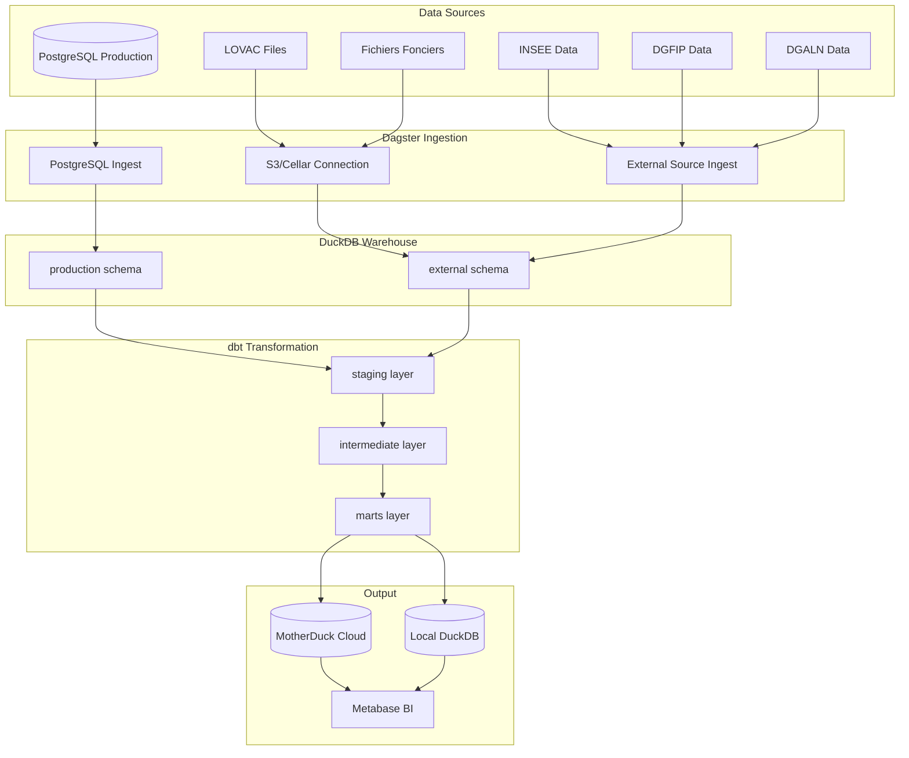
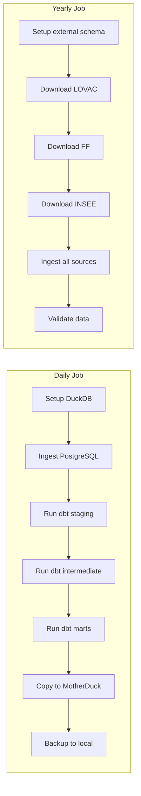
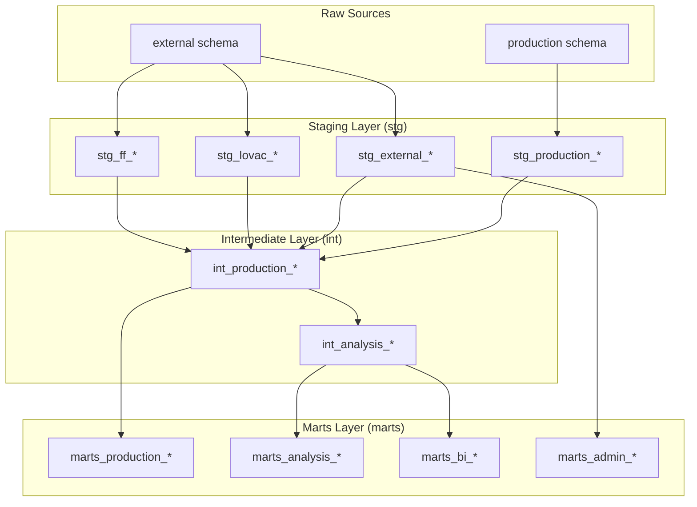
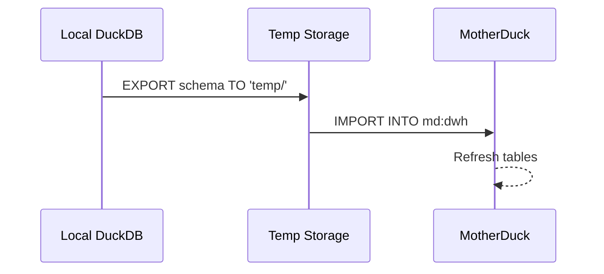

# Data Warehouse Architecture

> **Last Updated:** 2026-02-19

## Overview

The analytics platform consolidates data from PostgreSQL production database and external government sources into an analytical data warehouse built on DuckDB/MotherDuck. Dagster orchestrates the ETL pipeline, dbt handles transformations, and Metabase provides business intelligence dashboards.

## Technology Stack

| Component | Technology | Purpose |
|-----------|------------|---------|
| **Orchestration** | Dagster | Pipeline scheduling & monitoring |
| **Transformation** | dbt | SQL transformations |
| **Storage** | DuckDB | Local analytical database |
| **Cloud** | MotherDuck | Cloud DuckDB hosting |
| **Visualization** | Metabase | BI dashboards |
| **Storage** | S3/Cellar | External file storage |

## Architecture Diagram



## Data Flow Pipeline



## Dagster Configuration

### Schedules

| Schedule | Cron | Job | Description |
|----------|------|-----|-------------|
| `daily_refresh` | `@daily` | datawarehouse_synchronize_and_build | Daily ETL refresh |
| `yearly_external` | `@yearly` | datawarehouse_load_all_external_sources | Annual external data load |

### Assets Organization

```
analytics/dagster/src/assets/
├── dwh/
│   ├── ingest/           # Data ingestion
│   │   ├── ingest_postgresql.py
│   │   ├── ingest_external_*.py
│   │   └── external_sources_config.py
│   ├── copy/             # Database transfers
│   │   ├── copy_to_motherduck.py
│   │   └── copy_to_local.py
│   ├── upload/           # S3 uploads
│   ├── checks/           # Data quality
│   └── setup_duckdb.py   # DB initialization
├── production_dbt.py     # dbt model runs
└── populate_*_addresses.py  # BAN geocoding
```

### External Data Sources

| Provider | Sources | Format | Frequency |
|----------|---------|--------|-----------|
| **CEREMA** | LOVAC (2019-2025), Fichiers Fonciers, Prix Volumes | CSV, XLSX | Yearly |
| **INSEE** | Grille Densité, Recensement, COG | XLSX, Parquet | Yearly |
| **DGALN** | Zonage ABC, Loyers | XLSX, CSV | Yearly |
| **DGFIP** | Fiscalité, TLV | XLSX | Yearly |
| **URSSAF** | Social data | CSV | Yearly |
| **ANAH** | Housing programs | CSV | Yearly |

## dbt Architecture

### Layer Structure



### Model Directory Structure

```
analytics/dbt/models/
├── staging/
│   ├── production/       # ZLV app data
│   │   ├── stg_production_housing.sql
│   │   ├── stg_production_owners.sql
│   │   └── sources.yml
│   ├── external/         # Government data
│   │   ├── stg_external_insee_*.sql
│   │   └── stg_external_dgfip_*.sql
│   ├── lovac/            # LOVAC housing data
│   │   └── stg_lovac_*.sql
│   ├── ff/               # Fichiers Fonciers
│   │   └── stg_ff_*.sql
│   └── admin/            # Administrative boundaries
│       └── stg_admin_*.sql
│
├── intermediate/
│   ├── production/
│   │   ├── int_production_housing_last_status.sql
│   │   └── int_production_events_*.sql
│   └── analysis/
│       └── int_analysis_*.sql
│
└── marts/
    ├── production/       # Core fact tables
    │   ├── marts_production_housing.sql
    │   ├── marts_production_owners.sql
    │   └── marts_production_campaigns.sql
    ├── analysis/         # Impact analysis
    │   ├── marts_analysis_housing_out.sql
    │   └── marts_analysis_city_aggregated.sql
    ├── bi/               # BI-specific views
    │   ├── marts_bi_housing_complete.sql
    │   └── marts_bi_housing_*.sql
    ├── admin/            # Administrative dims
    │   ├── marts_admin_communes.sql
    │   └── marts_admin_epci.sql
    └── stats/            # KPI aggregations
        └── marts_stats_monthly_global.sql
```

### Key Models

| Model | Layer | Purpose |
|-------|-------|---------|
| `marts_production_housing` | marts | Central housing fact table (136+ columns) |
| `marts_production_owners` | marts | Owner dimension |
| `marts_production_campaigns` | marts | Campaign dimension |
| `marts_production_events` | marts | Event history |
| `int_production_housing_last_status` | int | Last status per housing |
| `marts_bi_housing_complete` | marts | Impact analysis with ZLV flags |
| `marts_analysis_housing_out_features` | marts | ML feature table |
| `marts_stats_monthly_global` | marts | Monthly KPIs |

### dbt Configuration

```yaml
# dbt_project.yml
name: 'zlv_dbt_project'
version: '1.0.0'
profile: 'duckdb_profile'

models:
  zlv_dbt_project:
    staging:
      +materialized: view
      +schema: stg
    intermediate:
      +materialized: view
      +schema: int
    marts:
      +materialized: table
      +schema: marts

on-run-start:
  - "{{ dbt_utils.create_schema_if_not_exists('stg') }}"
  - "{{ dbt_utils.create_schema_if_not_exists('int') }}"
  - "{{ dbt_utils.create_schema_if_not_exists('marts') }}"
```

## DuckDB Configuration

### Connection Profiles

```yaml
# profiles.yml
duckdb_profile:
  target: prod
  outputs:
    dev:
      type: duckdb
      path: database.duckdb
      extensions: [httpfs, parquet, spatial]

    prod:
      type: duckdb
      path: "md:dwh?motherduck_token={{ env_var('ZLV_MD_TOKEN') }}"
      extensions: [httpfs, parquet, s3, spatial]
```

### Extensions

| Extension | Purpose |
|-----------|---------|
| `httpfs` | HTTP file downloads |
| `parquet` | Parquet file support |
| `spatial` | Geospatial functions |
| `s3` | S3 file access |

## MotherDuck Integration

### Cloud Database Structure

```
md:dwh/
├── main_marts/           # Materialized marts tables
│   ├── marts_production_housing
│   ├── marts_production_owners
│   └── ...
├── main_int/             # Intermediate views
├── external/             # External source data
└── production/           # PostgreSQL ingestion
```

### Data Transfer



## Metabase Integration

### Connection

- **Type:** DuckDB (via MotherDuck)
- **Database:** `dwh`
- **Schemas:** `main_marts`, `main_int`

### Key Dashboards

| Dashboard | Purpose | Key Metrics |
|-----------|---------|-------------|
| Housing Overview | Vacancy trends | Total vacant, status distribution |
| Campaign Impact | Outreach effectiveness | Contacted %, exit rate |
| Territorial Analysis | Regional breakdown | By department, EPCI |
| Monthly KPIs | Performance tracking | Month-over-month changes |

## Environment Variables

| Variable | Required | Description |
|----------|----------|-------------|
| `POSTGRES_PRODUCTION_*` | Yes | PostgreSQL connection |
| `CELLAR_*` | Yes | S3 storage credentials |
| `MD_TOKEN` | Yes | MotherDuck authentication |
| `USE_MOTHER_DUCK` | No | Enable cloud (default: True) |
| `DUCKDB_MEMORY_LIMIT` | No | Memory limit in GB |
| `DUCKDB_THREAD_NUMBER` | No | Thread count |

## Data Quality

### dbt Tests

```yaml
# schema.yml
models:
  - name: marts_production_housing
    columns:
      - name: housing_id
        tests:
          - unique
          - not_null
      - name: status
        tests:
          - accepted_values:
              values: ['Vacant', 'Occupied', 'Unknown']
```

### Dagster Checks

- Table existence validation
- Source freshness verification
- Row count thresholds
- Schema compliance

## Commands

```bash
# Dagster development
cd analytics/dagster
dagster dev

# dbt commands
cd analytics/dbt
dbt run                    # Run all models
dbt run --select marts     # Run marts only
dbt test                   # Run tests
dbt docs generate          # Generate docs

# Full pipeline
dagster job execute -j datawarehouse_synchronize_and_build
```
