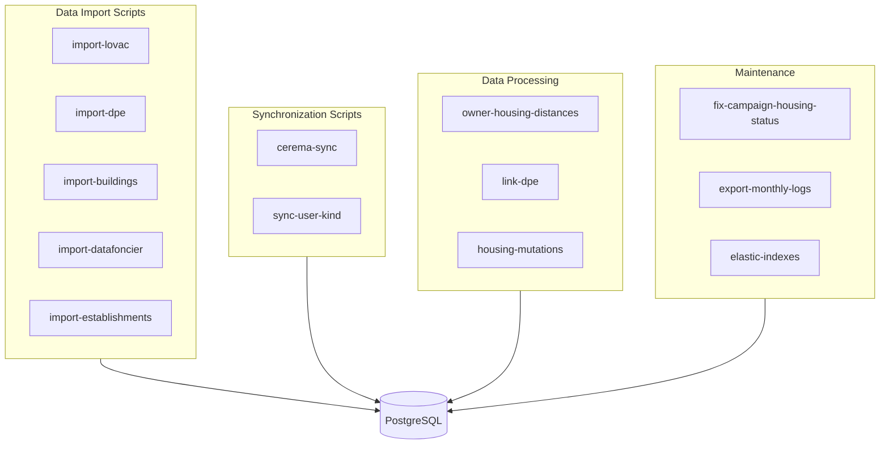
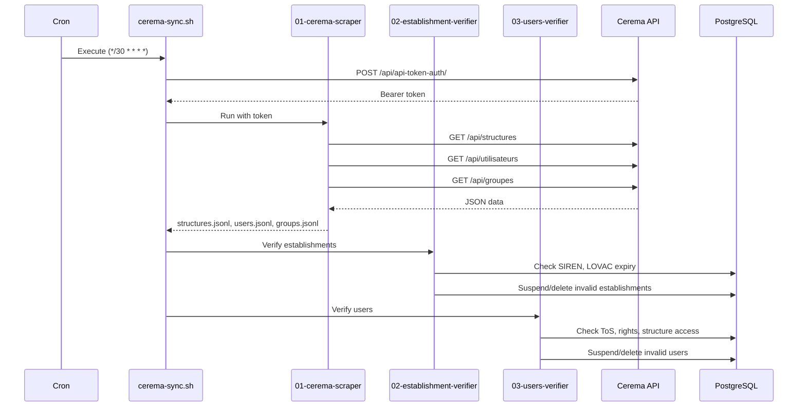

# Scripts & Data Import Architecture

> **Last Updated:** 2026-02-19

## Overview

The scripts system handles data import from various government sources, synchronization with external APIs, and maintenance tasks. Scripts are primarily written in TypeScript and Python, running either manually or via cron jobs.

## Script Categories



## Cron Jobs

Configured in `clevercloud/cron.json`:

| Schedule | Script | Description |
|----------|--------|-------------|
| `*/30 * * * *` | `cerema-sync.sh` | Sync users/structures from Cerema DF Portal |
| `0 3 1 * *` | `export-monthly-logs.sh` | Export Elasticsearch logs to S3 |

## Script Directory Structure

```
server/src/scripts/
├── import-lovac/              # LOVAC housing data
├── import-dpe/                # Energy performance certificates
├── import-buildings/          # Building geometry data
├── import-datafoncier-to-zlv/ # Datafoncier import
├── import-establishments/     # Establishment data
├── import-unified-owners/     # Owner unification
├── import-housing-mutation-data/
├── link-dpe/                  # Link DPE to buildings
├── owner-housing-distances/   # Distance calculations
├── perimeters-portaildf/      # Cerema sync pipeline
│   ├── 01-cerema-scraper/
│   ├── 02-establishment-verifier/
│   ├── 03-users-verifier/
│   └── cerema-sync.sh
├── fix-campaign-housing-status/
├── sync-user-kind/
├── logs/                      # Log export scripts
├── elastic-indexes/
└── shared/                    # Shared utilities
```

## Key Scripts

### Cerema Sync Pipeline

Automated synchronization with Cerema DF Portal every 30 minutes.



#### Step 1: Cerema Scraper (`01-cerema-scraper/`)

```bash
# Usage
python cerema-scraper.py --structures-only
python cerema-scraper.py --users-only
python cerema-scraper.py --groups-only

# Features
- Pagination handling with resume capability
- State files for crash recovery
- CSV and JSONL output formats
- Automatic HTTP→HTTPS upgrade
```

#### Step 2: Establishment Verifier (`02-establishment-verifier/`)

```python
# Rules applied
- Missing SIREN → Delete establishment
- Expired LOVAC subscription → Suspend establishment
- Updates: deleted_at, suspended_at, suspended_cause
```

#### Step 3: Users Verifier (`03-users-verifier/`)

```python
# Rules applied
- User not found in Cerema → Delete
- Expired rights → Suspend
- Invalid ToS acceptance → Suspend
- Structure access expired → Suspend
```

### DPE Import (`import-dpe/`)

Imports energy performance certificates from ADEME.

```bash
# Usage
python import_dpe.py --year 2024 --workers 6 --dry-run

# Process
1. Read JSONL files from dpe_split/YYYY/
2. Match buildings by RNB ID
3. Update buildings table with DPE data
4. Resume capability (skip processed buildings)
```

**Performance:**
- Parallel processing (default 6 workers)
- Progress tracking with tqdm
- Retry logic for connection errors

### Owner-Housing Distances (`owner-housing-distances/`)

Calculates geographic distance between owners and their housing.

```python
# Output classifications
1. Same postal code
2. Same department
3. Same region
4. Owner in mainland France
5. Owner overseas (DOM-TOM)
6. Foreign country detected
7. Other French cases

# Performance
- 6 parallel workers, up to 20
- 50k pairs per batch
- synchronous_commit=off for speed
```

### LOVAC Import (`import-lovac/`)

Imports vacant housing data from LOVAC CSV/JSONL files.

```typescript
// CLI commands
yarn workspace @zerologementvacant/server import-lovac

// Features
- Stream-based processing for large files
- Yup schema validation
- Dry-run mode
- Progress bar display
```

### Buildings Import (`import-buildings/`)

Imports building geometry from JSONL files.

```typescript
// Input: buildings.jsonl (25.9M records)
// Process
1. Stream read JSONL file
2. Chunk processing (1000 per chunk)
3. Upsert on id field
4. Progress bar with ETA

// Mapping
idbat → id
nlogh → housingCount
rnb_id, rnb_id_score
```

### Monthly Logs Export (`logs/`)

Exports Elasticsearch logs to S3 for archival.

```bash
# Usage
./export-monthly-logs.sh           # Export previous month
./export-monthly-logs.sh 2024-12   # Export specific month

# Process
1. Query Elasticsearch with scroll API
2. Compress with gzip
3. Upload to S3 (Cellar)

# Output
s3://zlv-logs-archive/monthly/YYYY/zlv-logs-YYYY-MM.json.gz
```

## Script Patterns

### TypeScript Script Pattern

```typescript
// Standard CLI structure
import { program } from 'commander';

program
  .option('-d, --dry-run', 'Dry run mode')
  .option('-v, --verbose', 'Verbose output')
  .parse();

async function main() {
  const options = program.opts();

  // Progress bar
  const progress = new cliProgress.SingleBar({});
  progress.start(total, 0);

  // Stream processing
  const stream = createReadStream(inputFile);
  for await (const chunk of stream) {
    // Process chunk
    progress.increment();
  }

  progress.stop();
}

main().catch(console.error);
```

### Python Script Pattern

```python
#!/usr/bin/env python3
import click
from concurrent.futures import ThreadPoolExecutor
from tqdm import tqdm

@click.command()
@click.option('--workers', default=6, help='Parallel workers')
@click.option('--dry-run', is_flag=True)
def main(workers: int, dry_run: bool):
    with ThreadPoolExecutor(max_workers=workers) as executor:
        for result in tqdm(executor.map(process_item, items)):
            # Handle result
            pass

if __name__ == '__main__':
    main()
```

### State Management

```python
# State file for resume capability
STATE_FILE = 'script_state.json'

def load_state() -> dict:
    if os.path.exists(STATE_FILE):
        return json.load(open(STATE_FILE))
    return {'last_page': 0, 'processed_ids': set()}

def save_state(state: dict):
    json.dump(state, open(STATE_FILE, 'w'))
```

## Environment Variables

### Cerema Sync

| Variable | Description |
|----------|-------------|
| `CEREMA_USERNAME` | Cerema API username |
| `CEREMA_PASSWORD` | Cerema API password |
| `POSTGRESQL_ADDON_*` | Database connection |

### DPE Import

| Variable | Description |
|----------|-------------|
| `DATABASE_URL` | PostgreSQL connection |
| `DPE_INPUT_DIR` | Input directory path |

### Logs Export

| Variable | Description |
|----------|-------------|
| `ELASTIC_NODE` | Elasticsearch URL |
| `ELASTIC_USERNAME` | ES username |
| `ELASTIC_PASSWORD` | ES password |
| `BACKUP_S3_*` | S3 credentials |

## Database Indexes

Scripts rely on specific indexes for performance:

```sql
-- DPE import
CREATE INDEX idx_buildings_rnb_id ON buildings(rnb_id);
CREATE INDEX idx_buildings_dpe_id ON buildings(dpe_id);

-- Distance calculation
CREATE INDEX idx_ban_addresses_ban_id_housing ON ban_addresses(ban_id);

-- Housing lookups
CREATE INDEX idx_housing_local_id ON housing(local_id);
CREATE INDEX idx_housing_insee_code ON housing(insee_code);
```

## Error Handling

### Retry Logic

```python
@retry(
    stop=stop_after_attempt(3),
    wait=wait_exponential(multiplier=1, min=4, max=10),
    retry=retry_if_exception_type(ConnectionError)
)
def fetch_with_retry(url: str):
    return requests.get(url)
```

### Transaction Safety

```typescript
await startTransaction(async (trx) => {
  // All operations in transaction
  await db('housing', trx).update(data);
  await db('events', trx).insert(event);
  // Auto-commits or rolls back
});
```

## Monitoring

### Script Logs

- All scripts log to stdout/stderr
- Production logs captured by Clever Cloud
- Forwarded to Elasticsearch via log drain
- Archived monthly to S3

### Progress Tracking

```python
# Python with tqdm
for item in tqdm(items, desc="Processing"):
    process(item)

# TypeScript with cli-progress
const bar = new cliProgress.SingleBar({
    format: '{bar} | {percentage}% | ETA: {eta}s | {value}/{total}'
});
```

## Best Practices

See [`docs/SCRIPT_BEST_PRACTICES.md`](../SCRIPT_BEST_PRACTICES.md) for:

- File structure conventions
- Logging requirements
- Error handling patterns
- Testing guidelines
- Documentation standards
