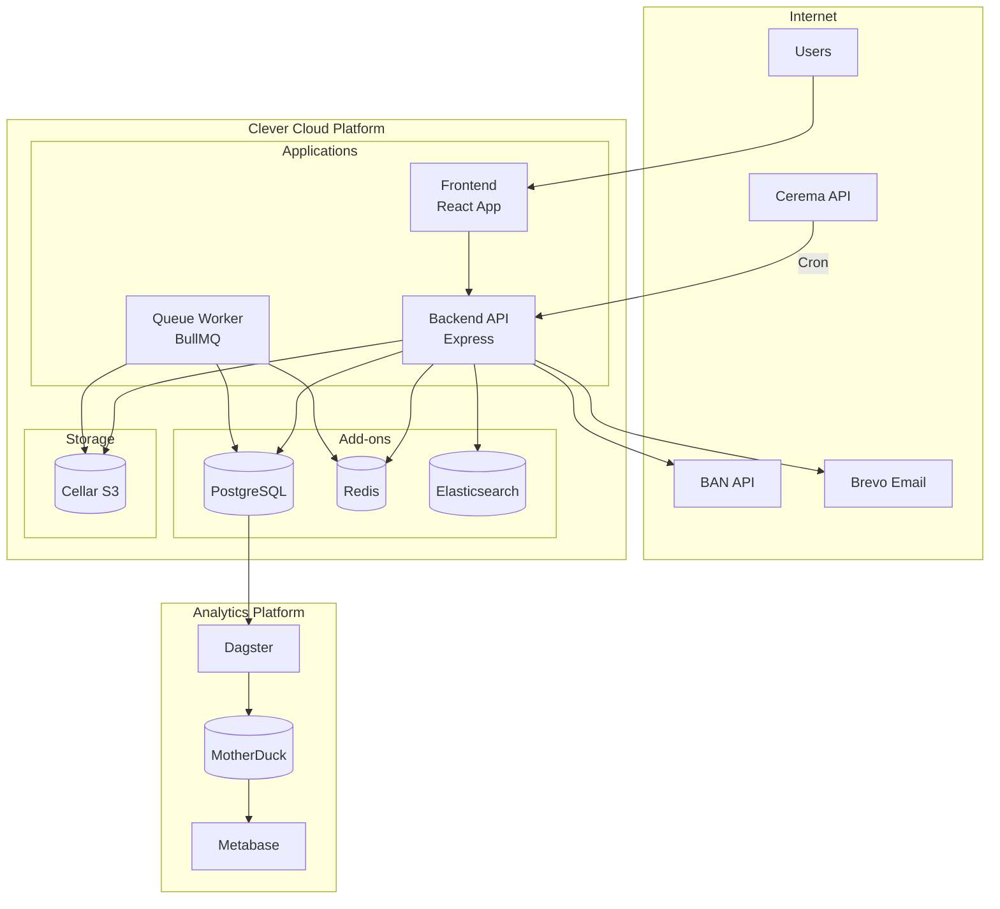
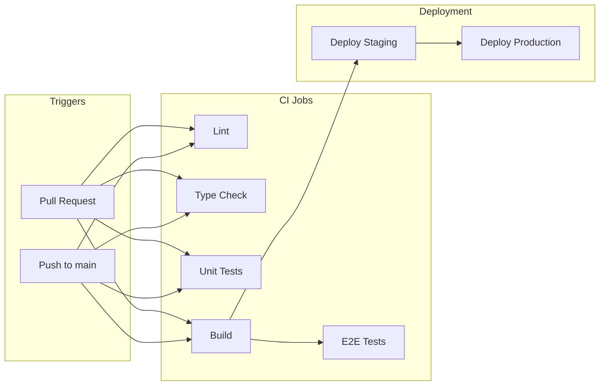
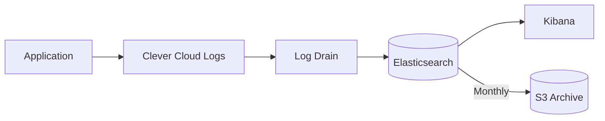
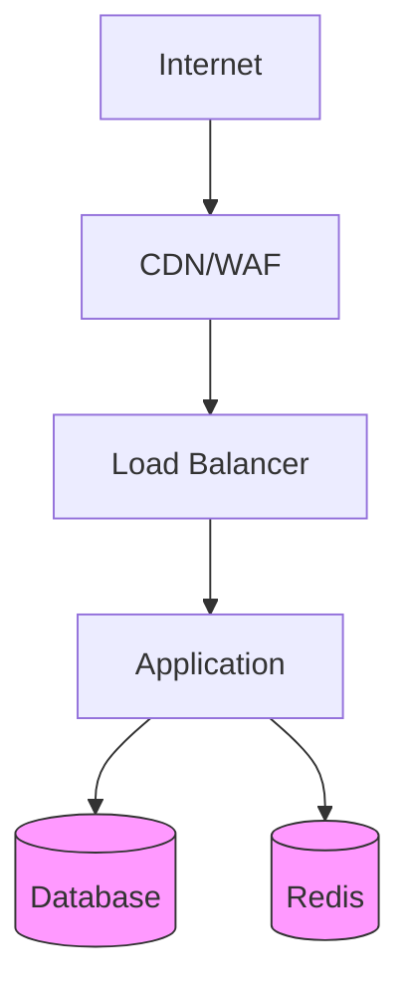

# Infrastructure & Deployment Architecture

> **Last Updated:** 2026-02-19

## Overview

Zero Logement Vacant is deployed on Clever Cloud, a French PaaS provider. The infrastructure includes multiple application instances, managed databases, and supporting services.

## Deployment Diagram



## Environments

| Environment | URL | Purpose |
|-------------|-----|---------|
| **Production** | https://zerologementvacant.beta.gouv.fr | Live system |
| **Staging** | https://<staging-url> | Pre-production |
| **Development** | http://localhost:3000 / :3001 | Local dev |

## Clever Cloud Configuration

### Application Structure

```
clevercloud/
├── cron.json           # Cron job definitions
├── post_build.sh       # Post-build hook
├── pre_run.sh          # Pre-run hook
├── SETUP_CHECKLIST.md  # Deployment checklist
└── README.md           # Configuration docs
```

### Cron Jobs

```json
[
  "*/30 * * * * $ROOT/server/src/scripts/perimeters-portaildf/cerema-sync.sh",
  "0 3 1 * * $ROOT/server/src/scripts/logs/export-monthly-logs.sh"
]
```

### Environment Variables

#### Application

| Variable | Description |
|----------|-------------|
| `NODE_ENV` | Environment (production/staging) |
| `PORT` | Application port |
| `APP_URL` | Public application URL |

#### Database

| Variable | Description |
|----------|-------------|
| `POSTGRESQL_ADDON_URI` | PostgreSQL connection string |
| `REDIS_URL` | Redis connection string |
| `ES_ADDON_HOST` | Elasticsearch host |

#### Authentication

| Variable | Description |
|----------|-------------|
| `AUTH_SECRET` | JWT signing secret |
| `AUTH_EXPIRES_IN` | Token expiration (default: 7d) |

#### External Services

| Variable | Description |
|----------|-------------|
| `BREVO_API_KEY` | Email service API key |
| `S3_ENDPOINT` | S3/Cellar endpoint |
| `S3_ACCESS_KEY_ID` | S3 access key |
| `S3_SECRET_ACCESS_KEY` | S3 secret key |
| `S3_BUCKET` | S3 bucket name |
| `SENTRY_DSN` | Error tracking DSN |

## CI/CD Pipeline

### GitHub Actions Workflow



### Workflow Configuration

```yaml
# .github/workflows/ci.yml
name: CI

on:
  pull_request:
  push:
    branches: [main]

jobs:
  lint:
    runs-on: ubuntu-latest
    steps:
      - uses: actions/checkout@v4
      - run: yarn install
      - run: yarn nx run-many -t lint

  test:
    runs-on: ubuntu-latest
    steps:
      - uses: actions/checkout@v4
      - run: yarn install
      - run: yarn nx run-many -t test

  build:
    runs-on: ubuntu-latest
    steps:
      - uses: actions/checkout@v4
      - run: yarn install
      - run: yarn nx run-many -t build

  e2e:
    needs: build
    runs-on: ubuntu-latest
    steps:
      - run: yarn nx e2e e2e
```

## Monitoring & Observability

### Logging



#### Log Drain Configuration

- **Destination:** Elasticsearch cluster
- **Format:** JSON
- **Retention:** 30 days in ES, archived to S3

### Error Tracking

- **Service:** Sentry
- **Integration:**
  - Backend: `@sentry/node`
  - Frontend: `@sentry/react`
- **Features:**
  - Error grouping
  - Release tracking
  - Performance monitoring
  - Source maps

### Health Checks

```typescript
// Backend health endpoint
GET /

Response:
{
  "status": "healthy",
  "database": "connected",
  "redis": "connected",
  "version": "1.0.0"
}
```

## Database Architecture

### PostgreSQL Configuration

- **Version:** 14+
- **Extensions:** uuid-ossp, postgis, unaccent, pg_trgm
- **Backups:** Automatic daily backups
- **Read replicas:** Available for analytics

### Connection Pooling

```typescript
// Knex configuration
const config = {
  pool: {
    min: 2,
    max: 10,
    acquireTimeoutMillis: 30000,
    createTimeoutMillis: 30000
  }
};
```

### Migrations

```bash
# Run migrations
yarn workspace @zerologementvacant/server migrate

# Create migration
yarn workspace @zerologementvacant/server migrate:make migration_name
```

## Security Architecture

### Network Security



- **TLS:** All traffic encrypted (HTTPS)
- **WAF:** Web Application Firewall
- **VPC:** Private networking for add-ons

### Security Headers

```typescript
// Helmet configuration
app.use(helmet({
  contentSecurityPolicy: {
    directives: {
      defaultSrc: ["'self'"],
      scriptSrc: ["'self'", "'unsafe-inline'"],
      styleSrc: ["'self'", "'unsafe-inline'"],
      imgSrc: ["'self'", "data:", "https:"],
    }
  },
  hsts: {
    maxAge: 31536000,
    includeSubDomains: true
  }
}));
```

## Scaling

### Horizontal Scaling

| Component | Strategy |
|-----------|----------|
| Frontend | Static files, CDN |
| Backend | Multiple instances |
| Queue | Multiple workers |
| Database | Vertical + read replicas |

### Auto-scaling Triggers

- CPU usage > 80%
- Memory usage > 85%
- Request latency > 2s

## Disaster Recovery

### Backup Strategy

| Component | Frequency | Retention |
|-----------|-----------|-----------|
| PostgreSQL | Daily | 30 days |
| Redis | Hourly | 7 days |
| S3/Cellar | - | Persistent |
| ES Logs | Monthly | 1 year |

### Recovery Procedures

1. **Database restore:** Point-in-time recovery via Clever Cloud
2. **Application rollback:** Git revert + redeploy
3. **Configuration restore:** Environment variables in dashboard

## Deployment Checklist

See [`clevercloud/SETUP_CHECKLIST.md`](../../clevercloud/SETUP_CHECKLIST.md) for:

- [ ] Environment variables configured
- [ ] Database migrations applied
- [ ] SSL certificates valid
- [ ] Health checks passing
- [ ] Log drains configured
- [ ] Cron jobs registered
- [ ] Error tracking enabled
