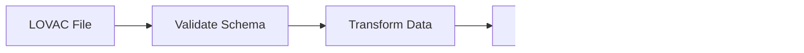

# External Integrations Architecture

> **Last Updated:** 2026-02-19

## Overview

Zero Logement Vacant integrates with multiple French government systems and third-party services to gather housing data, validate addresses, send communications, and synchronize user data.

## Integration Diagram


## Real-Time Integrations

### Cerema DF Portal

**Purpose:** User and establishment synchronization

| Aspect | Details |
|--------|---------|
| **Type** | REST API |
| **Auth** | Username/Password → Bearer Token |
| **Frequency** | Every 30 minutes (cron) |
| **Direction** | Pull |

#### Endpoints

| Endpoint | Method | Description |
|----------|--------|-------------|
| `/api/api-token-auth/` | POST | Get authentication token |
| `/api/structures` | GET | List structures (establishments) |
| `/api/utilisateurs` | GET | List users |
| `/api/groupes` | GET | List groups |
| `/api/perimetres` | GET | List perimeters |

#### Data Flow


#### Error Handling

- Token refresh on 401
- Exponential backoff on rate limits
- State file for resume on failure

---

### BAN (Base Adresse Nationale)

**Purpose:** Address geocoding and validation

| Aspect | Details |
|--------|---------|
| **Type** | REST API |
| **Auth** | None (public) |
| **Frequency** | On-demand |
| **Direction** | Query |
| **Endpoint** | https://api-adresse.data.gouv.fr |

#### Endpoints

| Endpoint | Method | Description |
|----------|--------|-------------|
| `/search/` | GET | Search addresses by text |
| `/search/csv/` | POST | Bulk geocoding via CSV |

#### Request Example

```typescript
// services/ban/ban-api.ts
async function searchAddress(query: string, inseeCode: string) {
  const response = await fetch(
    `https://api-adresse.data.gouv.fr/search/?q=${query}&citycode=${inseeCode}`
  );
  return response.json();
}
```

#### Response Structure

```json
{
  "features": [
    {
      "properties": {
        "label": "1 Rue de la Paix, 75001 Paris",
        "score": 0.95,
        "housenumber": "1",
        "street": "Rue de la Paix",
        "postcode": "75001",
        "city": "Paris",
        "citycode": "75101"
      },
      "geometry": {
        "coordinates": [2.3308, 48.8682]
      }
    }
  ]
}
```

#### Caching

- Results cached in `ban_addresses` table
- TTL: Indefinite (addresses rarely change)
- Lookup before API call

---

### Brevo (Email Service)

**Purpose:** Transactional email delivery

| Aspect | Details |
|--------|---------|
| **Type** | REST API |
| **Auth** | API Key |
| **Frequency** | On-demand |
| **Direction** | Push |

#### Email Types

| Type | Template | Trigger |
|------|----------|---------|
| Password Reset | Template ID | User request |
| Account Activation | Template ID | User creation |
| 2FA Code | Template ID | Login with 2FA |
| Campaign Export | Template ID | Export ready |

#### Implementation

```typescript
// services/mailService/brevoService.ts
const brevo = new Brevo.TransactionalEmailsApi();
brevo.setApiKey(Brevo.TransactionalEmailsApiApiKeys.apiKey, config.brevo.apiKey);

async function sendEmail(to: string, templateId: number, params: object) {
  await brevo.sendTransacEmail({
    to: [{ email: to }],
    templateId,
    params
  });
}
```

---

## Batch Data Imports

### LOVAC (Vacant Housing Data)

**Purpose:** Import vacant housing records

| Aspect | Details |
|--------|---------|
| **Source** | CEREMA |
| **Format** | CSV, JSONL |
| **Frequency** | Annual |
| **Records** | ~2M housing units |

#### Data Fields

- Local ID (housing identifier)
- Address components
- Vacancy status
- Owner information
- Building characteristics

#### Import Process



---

### Fichiers Fonciers

**Purpose:** Land registry and property ownership data

| Aspect | Details |
|--------|---------|
| **Source** | CEREMA/DGFIP |
| **Format** | CSV |
| **Frequency** | Annual |
| **Records** | ~50M parcels |

#### Data Types

- Property ownership
- Building footprints
- Land parcels
- Tax valuations

---

### DPE (Energy Performance Certificates)

**Purpose:** Energy consumption data for buildings

| Aspect | Details |
|--------|---------|
| **Source** | ADEME |
| **Format** | JSONL |
| **Frequency** | Continuous updates |
| **Records** | ~10M certificates |

#### Data Fields

- DPE rating (A-G)
- Energy consumption (kWh/m²/year)
- GHG emissions
- Heating system type

---

### INSEE Data

**Purpose:** Statistical and geographic reference data

| Aspect | Details |
|--------|---------|
| **Source** | INSEE |
| **Format** | CSV, XLSX, Parquet |
| **Frequency** | Annual |

#### Data Types

| Dataset | Description |
|---------|-------------|
| COG | Code Officiel Géographique (commune codes) |
| Grille Densité | Population density classification |
| Recensement | Population census data |
| Table Appartenance | Geographic hierarchy |

---

### DGFIP Data

**Purpose:** Fiscal and taxation data

| Aspect | Details |
|--------|---------|
| **Source** | DGFIP |
| **Format** | XLSX, CSV |
| **Frequency** | Annual |

#### Data Types

| Dataset | Description |
|---------|-------------|
| Fiscalité Locale | Local taxation data |
| Délibérations | Tax deliberations |
| Zonage TLV | Tax-linked area classification |

---

## File Storage (S3/Cellar)

**Purpose:** Document and file storage

| Aspect | Details |
|--------|---------|
| **Provider** | Clever Cloud Cellar (S3-compatible) |
| **Auth** | Access Key/Secret Key |
| **Use Cases** | Campaign documents, log archives, data exports |

#### Bucket Structure

```
cellar-bucket/
├── campaigns/
│   └── {campaignId}/
│       └── campaign-{date}.zip
├── documents/
│   └── {documentId}/
│       └── {filename}
└── logs/
    └── monthly/
        └── {year}/
            └── zlv-logs-{month}.json.gz
```

#### Upload Pattern

```typescript
const s3Client = new S3Client({
  endpoint: config.s3.endpoint,
  region: config.s3.region,
  credentials: {
    accessKeyId: config.s3.accessKeyId,
    secretAccessKey: config.s3.secretAccessKey
  }
});

await s3Client.send(new PutObjectCommand({
  Bucket: config.s3.bucket,
  Key: `documents/${documentId}/${filename}`,
  Body: fileBuffer,
  ContentType: mimeType,
  ACL: 'authenticated-read'
}));
```

---

## Monitoring Integrations

### Sentry (Error Tracking)

```typescript
// Backend
Sentry.init({
  dsn: config.sentry.dsn,
  environment: config.app.environment,
  integrations: [
    new Sentry.Integrations.Express({ app }),
    new Sentry.Integrations.Postgres()
  ]
});

// Frontend
Sentry.init({
  dsn: config.sentry.dsn,
  integrations: [
    Sentry.replayIntegration(),
    Sentry.browserTracingIntegration()
  ]
});
```

### PostHog (Product Analytics)

```typescript
// Frontend only
posthog.init(config.posthog.key, {
  api_host: config.posthog.host,
  capture_pageview: true
});

// Track events
posthog.capture('housing_viewed', { housingId });
```

## Integration Patterns

### Retry with Exponential Backoff

```typescript
async function fetchWithRetry<T>(
  fn: () => Promise<T>,
  maxRetries = 3
): Promise<T> {
  for (let attempt = 0; attempt < maxRetries; attempt++) {
    try {
      return await fn();
    } catch (error) {
      if (attempt === maxRetries - 1) throw error;
      await sleep(Math.pow(2, attempt) * 1000);
    }
  }
}
```

### Circuit Breaker

```typescript
const breaker = new CircuitBreaker(externalApiCall, {
  timeout: 5000,
  errorThresholdPercentage: 50,
  resetTimeout: 30000
});

breaker.fire(params).catch(handleFallback);
```

### Rate Limiting

```typescript
const rateLimiter = new Bottleneck({
  maxConcurrent: 5,
  minTime: 200  // 5 requests per second
});

await rateLimiter.schedule(() => apiCall());
```

## Security Considerations

| Integration | Auth Method | Secret Storage |
|-------------|-------------|----------------|
| Cerema | Bearer Token | Env vars |
| BAN | None | N/A |
| Brevo | API Key | Env vars |
| S3/Cellar | Access Key/Secret | Env vars |
| Sentry | DSN | Env vars |
| PostHog | API Key | Env vars |

All secrets are stored in environment variables and never committed to source control.
