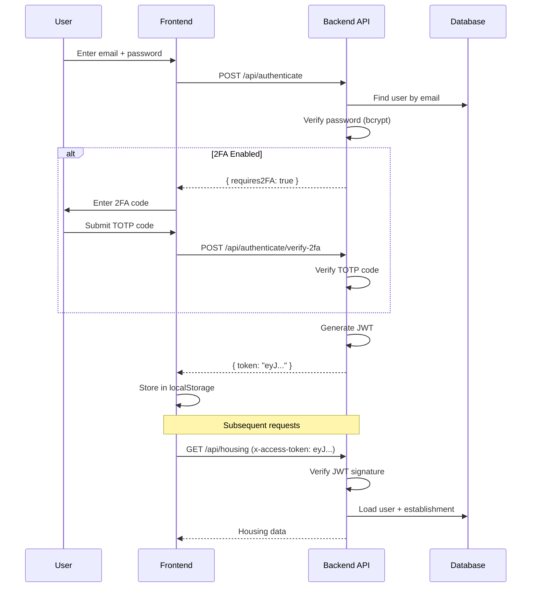
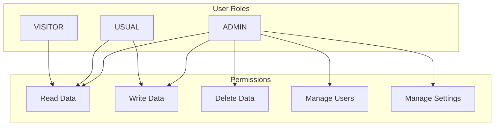
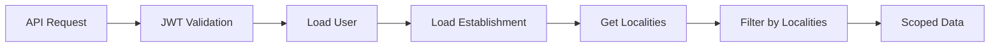
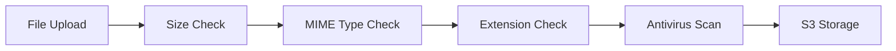

# Security Architecture

> **Last Updated:** 2026-02-19

## Overview

Zero Logement Vacant handles sensitive housing and personal data from French government sources. This document describes the security architecture, authentication mechanisms, and data protection measures.

## Security Principles

1. **Defense in Depth:** Multiple layers of security controls
2. **Least Privilege:** Minimal access required for operations
3. **Data Minimization:** Only collect and store necessary data
4. **Encryption Everywhere:** Data encrypted in transit and at rest
5. **Audit Trail:** All changes logged for accountability

## Authentication Architecture

### Authentication Flow



### JWT Configuration

```typescript
// Token structure
interface TokenPayload {
  userId: string;           // User UUID
  establishmentId: string;  // Establishment UUID
  iat: number;              // Issued at (Unix timestamp)
  exp: number;              // Expiration (7 days default)
}

// Token settings
const jwtConfig = {
  algorithm: 'HS256',
  expiresIn: '7d',
  secret: process.env.AUTH_SECRET  // Min 256 bits
};
```

### Password Security

```typescript
// Password hashing
const SALT_ROUNDS = 12;
const hash = await bcrypt.hash(password, SALT_ROUNDS);

// Password verification
const isValid = await bcrypt.compare(password, storedHash);
```

### Two-Factor Authentication

- **Method:** TOTP (Time-based One-Time Password)
- **Standard:** RFC 6238
- **Code validity:** 30 seconds
- **Backup codes:** 10 one-time use codes
- **Required for:** Admin users

```typescript
// 2FA verification
const totp = new OTPAuth.TOTP({
  issuer: 'ZLV',
  label: user.email,
  algorithm: 'SHA1',
  digits: 6,
  period: 30,
  secret: user.twoFactorSecret
});

const isValid = totp.validate({ token: userCode, window: 1 });
```

## Authorization

### Role-Based Access Control (RBAC)



### Role Permissions

| Permission | ADMIN | USUAL | VISITOR |
|------------|-------|-------|---------|
| View housing | ✓ | ✓ | ✓ |
| Edit housing | ✓ | ✓ | ✗ |
| Create campaigns | ✓ | ✓ | ✗ |
| Delete data | ✓ | ✗ | ✗ |
| Manage users | ✓ | ✗ | ✗ |
| Manage settings | ✓ | ✗ | ✗ |

### Middleware Implementation

```typescript
// Role check middleware
function hasRole(allowedRoles: UserRole[]) {
  return (req: Request, res: Response, next: NextFunction) => {
    if (!allowedRoles.includes(req.user.role)) {
      throw new ForbiddenError('Insufficient permissions');
    }
    next();
  };
}

// Usage
router.delete('/users/:id', hasRole([UserRole.ADMIN]), userController.remove);
```

## Data Protection

### Row-Level Security (RLS)

Data is scoped to the user's establishment:

```typescript
// Repository pattern with establishment scoping
async function findHousing(establishmentId: string, filters: HousingFilters) {
  return db('housing')
    .join('establishments_localities', 'housing.insee_code', 'establishments_localities.geo_code')
    .where('establishments_localities.establishment_id', establishmentId)
    .andWhere(filters);
}
```

### Data Access Flow



### Soft Deletes

Sensitive data uses soft deletes for audit trails:

```sql
-- Tables with soft delete
ALTER TABLE users ADD COLUMN deleted_at TIMESTAMP;
ALTER TABLE housing ADD COLUMN deleted_at TIMESTAMP;
ALTER TABLE owners ADD COLUMN deleted_at TIMESTAMP;

-- Query pattern
SELECT * FROM users WHERE deleted_at IS NULL;
```

## Input Validation

### Schema Validation (Yup)

```typescript
// Validation schema
const housingUpdateSchema = yup.object({
  status: yup.string().oneOf(['vacant', 'occupied', 'unknown']).required(),
  occupancy: yup.string().oneOf(['RS', 'RP', 'RV']),
  notes: yup.string().max(5000)
});

// Middleware
router.put(
  '/housing/:id',
  validatorNext.body(housingUpdateSchema),
  housingController.update
);
```

### SQL Injection Prevention

```typescript
// Parameterized queries with Knex
await db('housing')
  .where({ id })  // Parameterized
  .update({ status: newStatus });

// Never use string interpolation
// BAD: db.raw(`SELECT * FROM housing WHERE id = '${id}'`)
```

### XSS Prevention

```typescript
// React auto-escapes by default
return <div>{userInput}</div>;  // Safe

// Dangerous - avoid unless necessary
return <div dangerouslySetInnerHTML={{ __html: sanitized }} />;
```

## File Upload Security

### Validation Pipeline



### Implementation

```typescript
// File validation
const allowedMimeTypes = [
  'application/pdf',
  'image/jpeg',
  'image/png',
  'application/vnd.openxmlformats-officedocument.spreadsheetml.sheet'
];

const maxFileSize = 10 * 1024 * 1024; // 10MB

// Multer configuration
const upload = multer({
  limits: { fileSize: maxFileSize },
  fileFilter: (req, file, cb) => {
    if (!allowedMimeTypes.includes(file.mimetype)) {
      return cb(new InvalidFileTypeError(file.mimetype));
    }
    cb(null, true);
  }
});

// ClamAV scan
const scanResult = await clamscan.scanFile(file.path);
if (scanResult.isInfected) {
  throw new FileInfectedError();
}
```

## Network Security

### HTTPS Configuration

- All traffic over TLS 1.2+
- HSTS enabled (1 year max-age)
- Secure cookies (SameSite, Secure flags)

### Security Headers (Helmet)

```typescript
app.use(helmet({
  contentSecurityPolicy: {
    directives: {
      defaultSrc: ["'self'"],
      scriptSrc: ["'self'", "'unsafe-inline'"],
      styleSrc: ["'self'", "'unsafe-inline'"],
      imgSrc: ["'self'", "data:", "https:"],
      connectSrc: ["'self'", "https://api-adresse.data.gouv.fr"],
      fontSrc: ["'self'"],
      objectSrc: ["'none'"],
      frameAncestors: ["'none'"]
    }
  },
  hsts: {
    maxAge: 31536000,
    includeSubDomains: true,
    preload: true
  },
  referrerPolicy: { policy: 'strict-origin-when-cross-origin' },
  noSniff: true,
  xssFilter: true
}));
```

### Rate Limiting

```typescript
const rateLimiter = rateLimit({
  windowMs: 5 * 60 * 1000,  // 5 minutes
  max: 100,                  // 100 requests per window
  standardHeaders: true,
  legacyHeaders: false
});

// Applied to all routes
app.use(rateLimiter);

// Stricter limits for auth endpoints
const authLimiter = rateLimit({
  windowMs: 60 * 1000,  // 1 minute
  max: 10               // 10 requests
});

router.post('/authenticate', authLimiter, accountController.signIn);
```

### CORS Configuration

```typescript
app.use(cors({
  origin: config.app.frontendUrl,
  credentials: false,  // No cookies cross-origin
  methods: ['GET', 'POST', 'PUT', 'DELETE', 'OPTIONS'],
  allowedHeaders: ['Content-Type', 'x-access-token']
}));
```

## Data Encryption

### At Rest

| Data | Encryption | Provider |
|------|------------|----------|
| PostgreSQL | AES-256 | Clever Cloud |
| Redis | TLS | Clever Cloud |
| S3/Cellar | AES-256 | Clever Cloud |

### In Transit

| Connection | Protocol |
|------------|----------|
| Client → API | TLS 1.3 |
| API → Database | TLS 1.2 |
| API → Redis | TLS 1.2 |
| API → S3 | TLS 1.2 |

## GDPR Compliance

### Personal Data Categories

| Category | Examples | Legal Basis |
|----------|----------|-------------|
| Owner identity | Name, address | Legitimate interest |
| Contact info | Email, phone | Consent |
| Housing data | Address, status | Public interest |
| User accounts | Email, role | Contract |

### Data Subject Rights

| Right | Implementation |
|-------|----------------|
| Access | Export functionality |
| Rectification | Edit endpoints |
| Erasure | Soft delete + anonymization |
| Portability | JSON/CSV export |

### Data Retention

| Data Type | Retention | Action |
|-----------|-----------|--------|
| User accounts | Active + 3 years | Anonymize |
| Housing data | Indefinite | Archive |
| Logs | 1 year | Delete |
| Session tokens | 7 days | Auto-expire |

## Audit Logging

### Event Sourcing

All changes are logged as events:

```typescript
// Event types
type EventType =
  | 'HousingCreated'
  | 'HousingUpdated'
  | 'HousingStatusChanged'
  | 'OwnerUpdated'
  | 'CampaignCreated'
  | 'UserLogin';

// Event structure
interface Event {
  id: string;
  type: EventType;
  entityId: string;
  entityType: 'Housing' | 'Owner' | 'Campaign';
  oldValue: object;
  newValue: object;
  userId: string;
  timestamp: Date;
}
```

### Log Structure

```json
{
  "timestamp": "2024-01-15T10:30:00Z",
  "level": "info",
  "event": "HousingUpdated",
  "userId": "uuid-user",
  "establishmentId": "uuid-establishment",
  "entityId": "uuid-housing",
  "changes": {
    "status": { "old": "vacant", "new": "occupied" }
  },
  "ip": "192.168.1.1",
  "userAgent": "Mozilla/5.0..."
}
```

## Security Monitoring

### Sentry Integration

```typescript
Sentry.init({
  dsn: config.sentry.dsn,
  environment: config.app.environment,
  beforeSend(event) {
    // Scrub sensitive data
    if (event.request?.headers) {
      delete event.request.headers['x-access-token'];
    }
    return event;
  }
});
```

### Alerts

| Event | Severity | Action |
|-------|----------|--------|
| Failed logins (5+) | Warning | Email alert |
| SQL errors | Error | Sentry alert |
| Rate limit exceeded | Warning | Log |
| Invalid JWT | Info | Log |

## Security Checklist

- [x] HTTPS enforced
- [x] JWT with secure secret
- [x] Password hashing (bcrypt)
- [x] 2FA for admins
- [x] Input validation (Yup)
- [x] SQL injection prevention (Knex)
- [x] XSS prevention (React)
- [x] CSRF protection (SameSite cookies)
- [x] Rate limiting
- [x] Security headers (Helmet)
- [x] File upload validation
- [x] Antivirus scanning
- [x] Audit logging
- [x] Data encryption at rest
- [x] TLS for all connections
