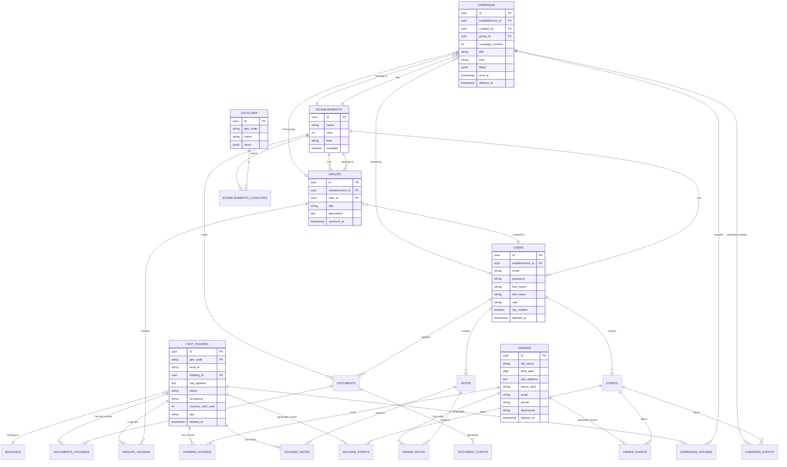
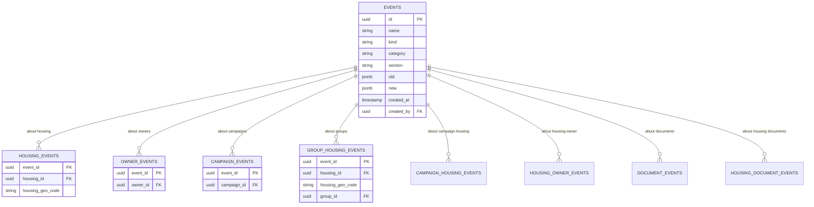
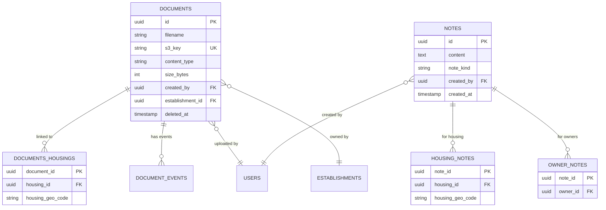

# Database Schema

> **Last Updated:** 2026-02-19
>
> PostgreSQL database with 193 migrations, partitioned housing table, and event sourcing.

---

## Overview

- **Database:** PostgreSQL 14+
- **Extensions:** uuid-ossp, PostGIS, unaccent, pg_trgm
- **Tables:** ~30 core tables
- **Partitioning:** `fast_housing` partitioned by `geo_code` (department)

---

## Entity Relationship Diagram

### Core Domain



### Events & Audit Trail



### Documents & Notes



---

## Table Reference

### Core Tables

| Table | Description | PK | Soft Delete |
|-------|-------------|----|----|
| `fast_housing` | Vacant housing records | `(geo_code, id)` | ✓ |
| `owners` | Property owners | `id` | ✓ |
| `campaigns` | Outreach campaigns | `id` | ✓ |
| `groups` | Housing groups | `id` | - |
| `establishments` | Local authorities | `id` | - |
| `users` | User accounts | `id` | ✓ |
| `localities` | Geographic areas | `id` | - |
| `buildings` | Building data | `id` | - |
| `events` | Audit trail | `id` | - |
| `notes` | Text notes | `id` | - |
| `documents` | File uploads | `id` | ✓ |

### Junction Tables

| Table | Links | PK |
|-------|-------|-----|
| `owners_housing` | owners ↔ housing | `(owner_id, housing_id, housing_geo_code)` |
| `campaigns_housing` | campaigns ↔ housing | `(campaign_id, housing_id, housing_geo_code)` |
| `groups_housing` | groups ↔ housing | `(group_id, housing_id, housing_geo_code)` |
| `establishments_localities` | establishments ↔ localities | `(establishment_id, locality_id)` |
| `housing_notes` | notes ↔ housing | `(note_id, housing_id, housing_geo_code)` |
| `owner_notes` | notes ↔ owners | `(note_id, owner_id)` |
| `documents_housings` | documents ↔ housing | `(document_id, housing_id, housing_geo_code)` |

### Event Junction Tables

| Table | Tracks Events For |
|-------|------------------|
| `housing_events` | Housing changes |
| `owner_events` | Owner changes |
| `campaign_events` | Campaign changes |
| `group_housing_events` | Group membership |
| `campaign_housing_events` | Campaign membership |
| `housing_owner_events` | Ownership changes |
| `document_events` | Document actions |
| `housing_document_events` | Document-housing links |

---

## Key Tables Detail

### fast_housing

Main housing table, **partitioned by geo_code** (department).

```sql
CREATE TABLE fast_housing (
    id UUID NOT NULL,
    geo_code VARCHAR(5) NOT NULL,      -- Partition key
    invariant VARCHAR(12),
    local_id VARCHAR(20),
    building_id UUID,

    -- Address
    raw_address TEXT[],
    house_number VARCHAR(10),
    street VARCHAR(255),
    postal_code VARCHAR(5),
    city VARCHAR(100),
    latitude DOUBLE PRECISION,
    longitude DOUBLE PRECISION,

    -- Characteristics
    cadastral_classification INTEGER,
    uncomfortable BOOLEAN,
    vacancy_start_year INTEGER,
    housing_kind VARCHAR(50),
    rooms_count INTEGER,
    living_area INTEGER,
    building_year INTEGER,

    -- Status
    status INTEGER,
    occupancy VARCHAR(20),

    -- Energy
    energy_consumption VARCHAR(10),
    dpe VARCHAR(1),

    -- Metadata
    data_years INTEGER[],
    created_at TIMESTAMP,
    updated_at TIMESTAMP,
    deleted_at TIMESTAMP,

    PRIMARY KEY (geo_code, id)
) PARTITION BY LIST (geo_code);

-- Partitions: 01-19, 2A, 2B, 21-95, 971-976
```

### owners

```sql
CREATE TABLE owners (
    id UUID PRIMARY KEY DEFAULT uuid_generate_v4(),

    -- Identity
    full_name VARCHAR(255) NOT NULL,
    birth_date DATE,
    administrator VARCHAR(255),

    -- Address
    raw_address TEXT[],
    address_dgfip TEXT[],
    additional_address VARCHAR(255),

    -- Classification
    owner_kind VARCHAR(50),
    kind_class VARCHAR(50),
    entity VARCHAR(100),

    -- Contact
    email VARCHAR(255),
    phone VARCHAR(20),

    -- External IDs
    siren VARCHAR(14),
    idpersonne VARCHAR(50),

    -- Metadata
    data_source VARCHAR(50),
    created_at TIMESTAMP DEFAULT NOW(),
    updated_at TIMESTAMP,
    deleted_at TIMESTAMP
);
```

### owners_housing

Links owners to housing with rank (1 = primary owner).

```sql
CREATE TABLE owners_housing (
    owner_id UUID NOT NULL REFERENCES owners(id) ON DELETE CASCADE,
    housing_id UUID NOT NULL,
    housing_geo_code VARCHAR(5) NOT NULL,

    rank INTEGER,           -- 1 = primary owner, >1 = co-owner
    relative_location VARCHAR(50),
    locprop VARCHAR(10),

    PRIMARY KEY (owner_id, housing_id, housing_geo_code),
    FOREIGN KEY (housing_geo_code, housing_id)
        REFERENCES fast_housing(geo_code, id) ON DELETE CASCADE
);

-- Unique primary owner per housing
CREATE UNIQUE INDEX ON owners_housing (housing_id) WHERE rank = 1;
```

### events

Event sourcing for audit trail.

```sql
CREATE TABLE events (
    id UUID PRIMARY KEY DEFAULT uuid_generate_v4(),

    name VARCHAR(100) NOT NULL,     -- Event name
    kind VARCHAR(50) NOT NULL,      -- Event type
    category VARCHAR(50),
    section VARCHAR(50),
    contact_kind VARCHAR(50),
    conflict BOOLEAN,

    old JSONB,                      -- Previous values
    new JSONB,                      -- New values

    created_at TIMESTAMP DEFAULT NOW(),
    created_by UUID REFERENCES users(id)
);

CREATE INDEX ON events(name);
CREATE INDEX ON events(created_at);
```

---

## Partitioning Strategy

`fast_housing` is partitioned by `geo_code` (INSEE department code):

```sql
-- Partition per department
CREATE TABLE fast_housing_01 PARTITION OF fast_housing
    FOR VALUES IN ('01');

CREATE TABLE fast_housing_02 PARTITION OF fast_housing
    FOR VALUES IN ('02');

-- ... up to 95 + DOM-TOM

CREATE TABLE fast_housing_2a PARTITION OF fast_housing
    FOR VALUES IN ('2A');  -- Corse-du-Sud

CREATE TABLE fast_housing_2b PARTITION OF fast_housing
    FOR VALUES IN ('2B');  -- Haute-Corse
```

**Benefits:**
- Faster queries scoped to department
- Parallel maintenance operations
- Easier data archival per region

**Constraint:**
- Primary key must include partition key: `(geo_code, id)`
- All FKs to housing include `housing_geo_code`

---

## Indexes

### Performance-Critical Indexes

```sql
-- Housing lookups
CREATE INDEX idx_housing_local_id ON fast_housing(local_id);
CREATE INDEX idx_housing_status ON fast_housing(status);
CREATE INDEX idx_housing_geo_code_data_years ON fast_housing(geo_code, data_years);

-- Owner lookups
CREATE INDEX idx_owners_idpersonne ON owners(idpersonne);
CREATE INDEX idx_owners_full_name ON owners USING gin(full_name gin_trgm_ops);

-- Relationships
CREATE INDEX idx_owners_housing_housing ON owners_housing(housing_id);
CREATE INDEX idx_owners_housing_rank ON owners_housing(housing_id, rank);

-- Campaigns
CREATE INDEX idx_campaigns_establishment ON campaigns(establishment_id);
CREATE INDEX idx_campaigns_housing ON campaigns_housing(campaign_id);

-- Events
CREATE INDEX idx_events_created_at ON events(created_at);
CREATE INDEX idx_housing_events_housing ON housing_events(housing_id);
```

---

## Soft Delete Pattern

Tables with soft delete:
- `fast_housing`
- `owners`
- `users`
- `campaigns`
- `documents`

```sql
-- Query pattern (always filter)
SELECT * FROM owners WHERE deleted_at IS NULL;

-- Soft delete
UPDATE owners SET deleted_at = NOW() WHERE id = '...';

-- Restore
UPDATE owners SET deleted_at = NULL WHERE id = '...';

-- Hard delete (rare, admin only)
DELETE FROM owners WHERE id = '...' AND deleted_at IS NOT NULL;
```

---

## Extensions

```sql
-- UUID generation
CREATE EXTENSION IF NOT EXISTS "uuid-ossp";

-- Geospatial queries
CREATE EXTENSION IF NOT EXISTS "postgis";

-- Accent-insensitive search (French)
CREATE EXTENSION IF NOT EXISTS "unaccent";

-- Fuzzy text matching
CREATE EXTENSION IF NOT EXISTS "pg_trgm";
```

---

## Common Queries

### Housing with Primary Owner

```sql
SELECT h.*, o.full_name as owner_name
FROM fast_housing h
JOIN owners_housing oh ON oh.housing_id = h.id
    AND oh.housing_geo_code = h.geo_code
    AND oh.rank = 1
JOIN owners o ON o.id = oh.owner_id
WHERE h.deleted_at IS NULL
    AND o.deleted_at IS NULL
    AND h.geo_code = '75';
```

### Housing in Campaign

```sql
SELECT h.*
FROM fast_housing h
JOIN campaigns_housing ch ON ch.housing_id = h.id
    AND ch.housing_geo_code = h.geo_code
WHERE ch.campaign_id = '...'
    AND h.deleted_at IS NULL;
```

### Recent Events for Housing

```sql
SELECT e.*
FROM events e
JOIN housing_events he ON he.event_id = e.id
WHERE he.housing_id = '...'
ORDER BY e.created_at DESC
LIMIT 20;
```

---

## Migrations

```bash
# Run pending migrations
yarn workspace @zerologementvacant/server migrate

# Rollback last migration
yarn workspace @zerologementvacant/server migrate:rollback

# Check status
yarn workspace @zerologementvacant/server migrate:status

# Create new migration
yarn workspace @zerologementvacant/server migrate:make <name>
```

Migration files: `server/src/infra/database/migrations/`

---

## Auto-Generation (Optional)

Generate schema documentation with [`tbls`](https://github.com/k1LoW/tbls):

```bash
# Install
brew install k1LoW/tap/tbls

# Generate docs
tbls doc $DATABASE_URL docs/database

# Output: docs/database/README.md + per-table docs + SVG diagrams
```

Or with [`SchemaSpy`](https://schemaspy.org/):

```bash
java -jar schemaspy.jar \
  -t pgsql \
  -host localhost \
  -db zlv \
  -u postgres \
  -o docs/database
```
