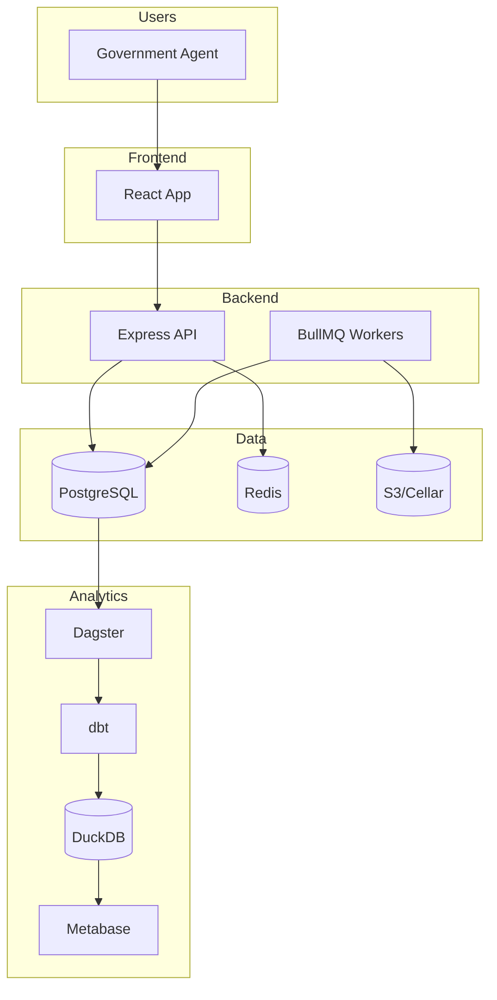

# Architecture Documentation

> **Zero Logement Vacant - Comprehensive Architecture Documentation**
>
> Last Updated: 2026-02-19

## Overview

This documentation provides a complete technical overview of the Zero Logement Vacant (ZLV) application architecture. ZLV is a French government platform for tracking and reducing vacant housing.

## Quick Start

| I want to... | Read |
|--------------|------|
| Understand the system | [System Overview](00-system-overview.md) |
| Work on the React app | [Frontend Architecture](01-frontend-architecture.md) |
| Work on the API | [Backend Architecture](02-backend-architecture.md) |
| Understand job processing | [Queue Architecture](03-queue-architecture.md) |
| Work on analytics | [Data Warehouse Architecture](04-data-warehouse-architecture.md) |
| Run data imports | [Scripts Architecture](05-scripts-architecture.md) |
| Deploy the app | [Infrastructure](06-infrastructure.md) |
| Integrate external systems | [Integrations](07-integrations.md) |
| Review security | [Security Architecture](08-security.md) |

## Document Index

### Core Architecture

| Document | Description |
|----------|-------------|
| [00-system-overview.md](00-system-overview.md) | High-level architecture, technology stack, data flow |
| [01-frontend-architecture.md](01-frontend-architecture.md) | React app, Redux, RTK Query, components |
| [02-backend-architecture.md](02-backend-architecture.md) | Express API, database schema, authentication |
| [03-queue-architecture.md](03-queue-architecture.md) | BullMQ workers, job processing |

### Data & Analytics

| Document | Description |
|----------|-------------|
| [04-data-warehouse-architecture.md](04-data-warehouse-architecture.md) | Dagster, dbt, DuckDB, Metabase |
| [05-scripts-architecture.md](05-scripts-architecture.md) | Data import scripts, cron jobs |

### Operations

| Document | Description |
|----------|-------------|
| [06-infrastructure.md](06-infrastructure.md) | Clever Cloud deployment, CI/CD |
| [07-integrations.md](07-integrations.md) | External APIs, data sources |
| [08-security.md](08-security.md) | Authentication, authorization, data protection |

## Architecture Diagram



## Technology Stack

| Layer | Technologies |
|-------|--------------|
| **Frontend** | React 18, TypeScript, Redux Toolkit, RTK Query, DSFR |
| **Backend** | Express.js, TypeScript, Knex.js, PostgreSQL |
| **Queue** | BullMQ, Redis |
| **Analytics** | Dagster, dbt, DuckDB, MotherDuck, Metabase |
| **Infrastructure** | Clever Cloud, GitHub Actions |

## Contributing

When updating architecture:

1. Update the relevant document(s)
2. Update diagrams if structure changes
3. Update the "Last Updated" date
4. Review cross-references between documents

### Diagram Standards

Use Mermaid for all diagrams:

- **C4 Context:** For system context
- **Flowchart:** For architecture and data flow
- **Sequence:** For process flows
- **ER Diagram:** For database schema
- **Class Diagram:** For code structure

### Documentation Guidelines

- Use clear, concise language
- Include code examples where helpful
- Keep diagrams up-to-date
- Cross-reference related documents
- Mark sections requiring user changes with `<!-- MANUAL -->`

## Related Documentation

| Document | Location |
|----------|----------|
| Development Guide | [/AGENTS.md](../../AGENTS.md) |
| Frontend Patterns | [/frontend/AGENTS.md](../../frontend/AGENTS.md) |
| Backend Patterns | [/server/AGENTS.md](../../server/AGENTS.md) |
| Architecture Decisions | [/docs/decisions/](../decisions/) |
| Deployment Guides | [/docs/guides/](../guides/) |

## Updating Documentation

To regenerate or update this documentation, use the Claude Code skill:

```
# Initialize full documentation
User: Generate architecture documentation

# Update specific section
User: Update backend architecture documentation

# Refresh after major changes
User: Update architecture documentation
```

The skill will analyze the current codebase and update documentation accordingly.
