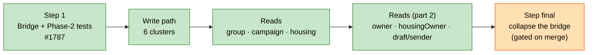
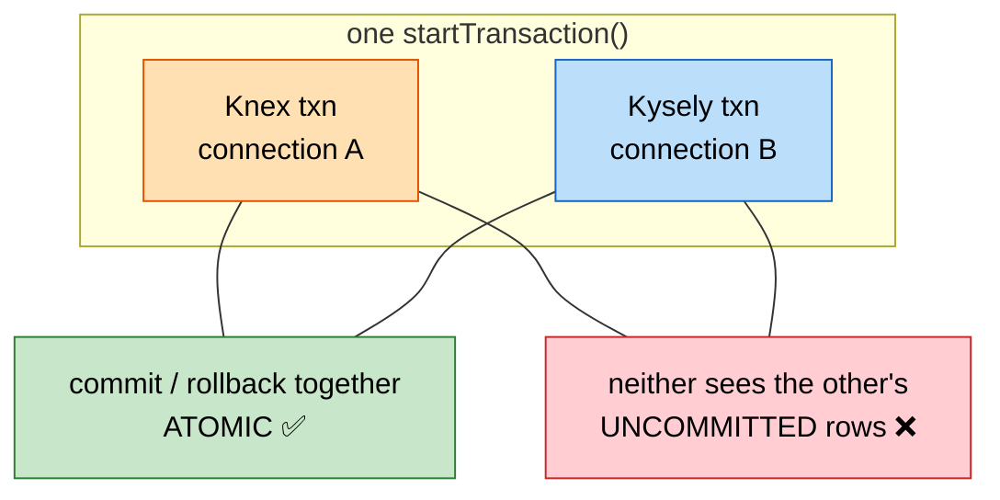
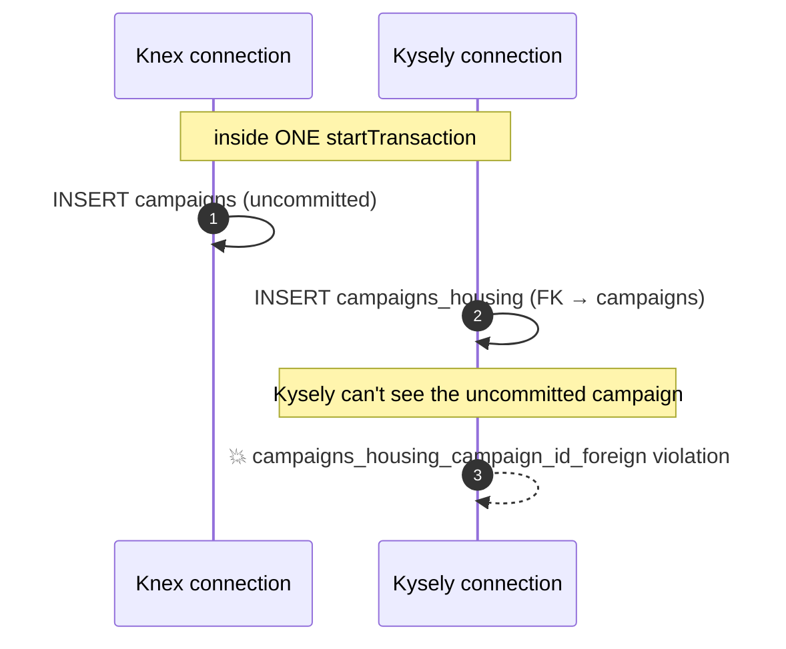
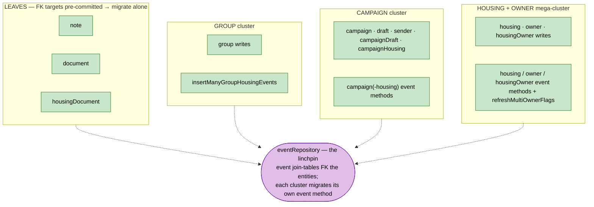
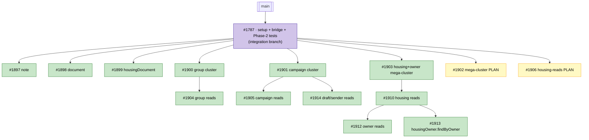
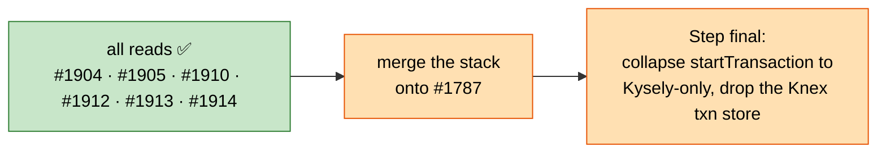

# Knex → Kysely Migration — Big Picture & Status

> One-page map of the server's Knex→Kysely migration: what it is, why it's structured the way it is, what's shipped, and what's left. Diagrams render on GitHub, Notion and VS Code.
>
> **Status:** entire **write path** and **all core-repository reads** migrated. Only **Step final** (collapse the dual-engine bridge) remains — and it's gated on merging the PR stack. Full removal of the `knex` dependency is out of scope (seeds, LOVAC import, migrations and test factories keep Knex).

---

## 1. The goal in one sentence

Replace **Knex** with **[Kysely](https://kysely.dev/)** (typed SQL) across the server, **without changing behaviour**, in **small independently-reviewable PRs**, each kept green by the existing characterization tests.

---

## 2. Progress at a glance

| Phase | Scope | Status |
|---|---|---|
| **Step 1 — Bridge** | Dual-engine `startTransaction`, DATE parsing, camelCase plugin, Phase-2 characterization tests | ✅ Done (#1787) |
| **Write path** | All repository writes → Kysely, migrated as FK-coupled clusters | ✅ Done (6 PRs) |
| **Reads (part 1)** | group, campaign, housing (the big one) + note/document/housingDocument | ✅ Done (5 PRs) |
| **Reads (part 2)** | owner (#1912), `housingOwner.findByOwner` (#1913), draft + sender (#1914) | ✅ Done (3 PRs) |
| **Step final** | Collapse `startTransaction` to Kysely-only (drop the Knex transaction store). *Not* full `knex` removal — seeds/LOVAC/migrations/factories keep it. | ⬜ Gated on merging the stack |

---

## 3. The one idea that shapes everything: the dual-engine bridge

Knex and Kysely each own a **separate connection pool**. A single DB transaction lives on **one connection**, so it can't span both engines. The **bridge** makes one `startTransaction` open a Knex transaction *and* a Kysely transaction and commit them **together**.

**The catch we discovered the hard way:** the bridge gives atomic commit but **NOT cross-engine visibility**. If a repo's Kysely write references a row a **Knex sibling inserts in the same transaction**, you get a live foreign-key violation — not just the documented commit-window risk.

**Consequence:** you can migrate a repo **independently** only when its FK targets are already committed before the transaction (true for the "leaf" repos). Otherwise the FK-coupled set must migrate **together**. This is why the work is organised as *clusters*, not one-repo-at-a-time. (Captured as a durable project note so it isn't rediscovered.)

---

## 4. Transaction clusters — what had to move together

A cluster = the repos whose writes must commit atomically **and** reference each other's rows inside one `startTransaction`. Leaves migrate alone; clusters migrate as a unit (repo writes **+** their event-table method).

Why `campaignHousing` couldn't be a leaf, but `note` could: `campaigns_housing → campaigns` is written in the same transaction as the (then-Knex) `campaigns` insert; `note`'s FK targets (`users`, `housing`) were already committed.

---

## 5. PR map & merge order

Every PR targets the integration branch `feat/kysely-setup` (#1787). **Reads stack on their write branch** (they touch the same repo file), so they can't be independent.

**Merge order:** `#1787` → the six write PRs (any order) → each stacked reads PR after its write PR. Specifically: `#1910` before `#1912`/`#1913` (they add `parseHousingRecordRow` on top of it), and `#1901` before `#1914`. The two PLAN PRs (#1902, #1906) are docs and can merge anytime.

---

## 6. Per-repository status

| Repository | Writes | Reads | Where |
|---|---|---|---|
| signupLink / resetLink / precision | ✅ | ✅ | #1787 |
| **note** | ✅ | ✅ | #1897 |
| **document** | ✅ | ✅ | #1898 |
| **housingDocument** | ✅ | ✅ | #1899 |
| **group** | ✅ #1900 | ✅ #1904 | — |
| **campaign / draft / sender / campaignDraft / campaignHousing** | ✅ #1901 | campaign ✅ #1905 · draft/sender ✅ #1914 | — |
| **housing** | ✅ #1903 | ✅ #1910 | the big one |
| **owner** | ✅ #1903 | ✅ #1912 (find/get/findOne/count/stream, FTS, housings-include) | stacked on #1910 |
| **housingOwner** | ✅ #1903 | ✅ #1913 `findByOwner` | stacked on #1910 |
| **eventRepository** | ✅ per-cluster event methods | n/a | linchpin, migrated piecemeal with clusters |

---

## 7. Notable engineering findings (baked into the PRs)

- **FK-visibility limit of the bridge** → clusters, not repos. (§3)
- **Nested-JSON CamelCase bug** — Kysely's `CamelCasePlugin` recursively camelCased keys *inside* `to_json(...)` / `json_build_object(...)`, so the snake_case DBO parsers (`fromUserDBO`, `fromDocumentDBO`) silently returned `undefined` for every multi-word field. Fixed with `maintainNestedObjectKeys: true`. It was a **latent production bug** in the already-shipped note/document/housingDocument creator reads — their looser tests only asserted `id`/`email` (camel-invariant), so it slipped through; the strict housing/group read tests caught it.
- **DATE columns** return `YYYY-MM-DD` strings (pg type parser) to avoid the CET off-by-one; `date`-typed columns (`owners_housing.start_date`) are passed through as-is.
- **Streaming** (`housing.stream`) uses Kysely's cursor stream, wired via `pg-cursor`.
- **`text[]` equality filters** (e.g. `ownerRepository.findOne` on `address_dgfip`) must bind the array via a `sql\`col = ${arr}\`` fragment — a plain `.where(col, '=', array)` makes Kysely emit `text[] = record` and blows up at runtime.
- **camelCase read rows vs snake writes.** Reads add a camelCase `parseXRow` reading `Selectable<DB['table']>` (Kysely returns camelCase columns) beside the kept snake `parseXApi`; the two are not interchangeable. The classic trap: `parseHousingOwnerRow` reading `row.housing_geo_code` returns `undefined`, which then surfaced as a null-constraint violation when writing housing-owner events.
- **`joinDocumentWithCreator` → correlated subquery.** Draft/sender reads reproduce the Knex document+creator leftJoin as a Kysely correlated scalar subquery (`selectDocumentWithCreator`) that emits the same `jsonb_build_object(... 'creator', json_build_object(...))` blob and resolves to `NULL` when the FK is unset. The non-null branch (a real document with its nested creator) had **zero read-path coverage** before — the alias keys and nested-JSON handling had only ever been exercised with null documents, the exact blind spot behind the CamelCase bug above — so #1914 adds a `findOne` test that asserts the hydrated document + creator.
- **`paginate()` default.** `ownerRepository.find` relied on `paginate()` defaulting to `{ page: 1, perPage: 50 }`; the Kysely rewrite must reproduce that default so unpaginated calls stay capped at 50 rows.
- Every PR **keeps the full Knex export surface** (table accessors, `*DBO` types, `format*`/`parse*`) so seeds, the LOVAC import, the test factory, and still-Knex readers keep working.

---

## 8. What's left (the final stretch)

All repository writes **and** reads are migrated. The only remaining work is **Step final**, and it is **gated on the PR stack merging** — no single branch holds every migration, so the bridge can only be collapsed once they're all on the integration branch.

**Step final — scope and non-scope:**

- **In scope:** once every transactional write is Kysely, simplify `server/src/infra/database/transaction.ts` — `startTransaction` drops its Knex side (`db.transaction`, the `AsyncLocalStorage` Knex store, `withinTransaction`) and becomes a plain `kysely.transaction().execute(...)`. This is a mechanical simplification, verifiable by the existing characterization tests.
- **Out of scope:** removing the `knex` dependency itself. Seeds (demo/dev/prod), the LOVAC import scripts, the Knex migration files, and the test factories all still use raw Knex and the intentionally-kept repository accessors. Dropping `knex` would mean rewriting all of those — a separate, much larger effort with no behaviour benefit.
- **Prerequisite:** it can't start until #1897–#1914 are merged onto #1787, because the FK-visibility constraint (§3) means a half-migrated tree still needs the Knex transaction side alive.

Detailed, executable plans for the largest pieces already shipped: [`plans/2026-07-10-kysely-housing-reads.md`](./superpowers/plans/2026-07-10-kysely-housing-reads.md) (consumed by #1910) and [`plans/2026-07-10-kysely-housing-owner-mega-cluster.md`](./superpowers/plans/2026-07-10-kysely-housing-owner-mega-cluster.md).
