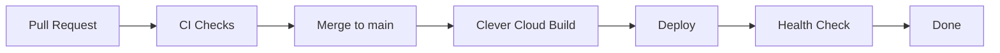

# Deployment & Rollback Runbook

> Procedures for deploying and rolling back Zero Logement Vacant

---

## 1. Deployment Overview

### Deployment Flow



### Environments

| Environment | Branch | URL | Auto-deploy |
|-------------|--------|-----|-------------|
| Production | `main` | zerologementvacant.beta.gouv.fr | Yes |
| Staging | `main` | <staging-url> | Yes |

---

## 2. Standard Deployment

### Pre-Deployment Checklist

- [ ] All CI checks passing on PR
- [ ] Code reviewed and approved
- [ ] No P1/P2 incidents ongoing
- [ ] Migration tested locally (if any)
- [ ] Feature flags configured (if needed)

### Deploy Process

```bash
# 1. Merge PR to main (via GitHub)
# Triggers automatic deployment to Clever Cloud

# 2. Monitor deployment
clever activity

# 3. Watch logs during deployment
clever logs -f

# 4. Verify deployment
curl -s https://zerologementvacant.beta.gouv.fr/api | jq .
```

### Post-Deployment Verification

```bash
# Health check
curl -s https://zerologementvacant.beta.gouv.fr/api

# Check for errors in Sentry
# Open: https://sentry.io/organizations/<your-org>/issues/

# Verify key flows
# - Login works
# - Housing list loads
# - Campaigns accessible
```

---

## 3. Manual Deployment

### Deploy Specific Commit

```bash
# List recent commits
git log --oneline -10

# Deploy specific commit
clever deploy --force <commit-sha>

# Example
clever deploy --force abc1234
```

### Deploy with Clean Build

```bash
# Clear cache and rebuild
clever restart --without-cache
```

### Deploy to Staging Only

```bash
# Set staging as target
clever link <staging-app-id>

# Deploy
clever deploy

# Switch back to production
clever link <production-app-id>
```

---

## 4. Rollback Procedures

### Quick Rollback (< 5 minutes)

```bash
# 1. Find previous working commit
git log --oneline -10

# 2. Deploy previous commit
clever deploy --force <previous-commit-sha>

# 3. Verify rollback
curl -s https://zerologementvacant.beta.gouv.fr/api | jq .
```

### Rollback with Database Migration

If the deployment included a database migration:

```bash
# 1. First rollback the application
clever deploy --force <previous-commit-sha>

# 2. Then rollback the migration
DATABASE_URL=$POSTGRESQL_ADDON_URI yarn workspace @zerologementvacant/server migrate:rollback

# 3. Verify database state
DATABASE_URL=$POSTGRESQL_ADDON_URI yarn workspace @zerologementvacant/server migrate:status
```

### Emergency Rollback (P1 Incident)

```bash
# 1. Immediate rollback to last known good
clever deploy --force <last-known-good-sha>

# 2. If that fails, restart with previous env
clever restart

# 3. If still failing, scale down and investigate
clever scale --instances 0  # Stop all traffic

# 4. Fix the issue, then scale back up
clever scale --instances 1
```

---

## 5. Database Migrations

### Pre-Migration Checklist

- [ ] Migration tested locally
- [ ] Migration is backward-compatible
- [ ] Rollback migration exists
- [ ] Backup taken (for destructive changes)

### Safe Migration Patterns

**Adding a column:**
```sql
-- Safe: nullable column
ALTER TABLE housing ADD COLUMN new_field VARCHAR(255);

-- Then backfill in batches
UPDATE housing SET new_field = 'default' WHERE new_field IS NULL LIMIT 10000;
```

**Adding an index:**
```sql
-- Safe: concurrent index
CREATE INDEX CONCURRENTLY idx_name ON table(column);
```

**Removing a column:**
```sql
-- Step 1: Stop using column in code (deploy)
-- Step 2: Wait for all instances to update
-- Step 3: Drop column in next migration
ALTER TABLE housing DROP COLUMN old_field;
```

### Migration Rollback

```bash
# Rollback last migration
DATABASE_URL=$POSTGRESQL_ADDON_URI yarn workspace @zerologementvacant/server migrate:rollback

# Verify
DATABASE_URL=$POSTGRESQL_ADDON_URI yarn workspace @zerologementvacant/server migrate:status
```

---

## 6. Feature Flags

### Environment Variable Flags

```bash
# Enable/disable feature via env var
clever env set FEATURE_NEW_DASHBOARD=true
clever restart

# Disable feature
clever env set FEATURE_NEW_DASHBOARD=false
clever restart
```

### Gradual Rollout Pattern

```bash
# 1. Deploy with feature disabled
FEATURE_X_ENABLED=false

# 2. Enable for specific establishments (in code)
# 3. Monitor metrics
# 4. Enable globally
FEATURE_X_ENABLED=true
```

---

## 7. Zero-Downtime Deployment

### Clever Cloud Handles This Automatically

1. New instance starts with new code
2. Health check passes
3. Traffic routed to new instance
4. Old instance terminated

### Ensure Health Check Works

```typescript
// The root endpoint must return 200
app.get('/', (req, res) => {
  res.json({ status: 'healthy', version: '1.0.0' });
});
```

### If Deployment Seems Stuck

```bash
# Check deployment status
clever activity

# Check logs for startup errors
clever logs --before "5 minutes ago"

# Force restart
clever restart
```

---

## 8. Deployment Troubleshooting

### Build Fails

```bash
# Check build logs
clever logs --before "10 minutes ago" | grep -i "error\|failed"

# Common issues:
# - Missing dependency: Check package.json
# - TypeScript error: Run `yarn typecheck` locally
# - Memory issue: Increase build instance size
```

### App Crashes on Start

```bash
# Check startup logs
clever logs | head -100

# Common issues:
# - Missing env var: clever env | grep MISSING_VAR
# - Port binding: Ensure PORT env var is used
# - Database connection: Check POSTGRESQL_ADDON_URI
```

### Health Check Fails

```bash
# Verify health endpoint locally
curl http://localhost:3001/api

# Check if app is listening on correct port
clever logs | grep -i "listening\|port"

# Ensure health endpoint is not behind auth
```

---

## 9. Deployment Schedule

### Recommended Times

| Day | Time (Paris) | Risk |
|-----|--------------|------|
| Mon-Thu | 10:00-16:00 | Low |
| Friday | 10:00-14:00 | Medium |
| Friday afternoon | Avoid | High |
| Weekend | Emergency only | High |

### High-Traffic Periods to Avoid

- Month-end reporting periods
- After major announcements
- During known user training sessions

---

## 10. Quick Reference

```bash
# Deploy
clever deploy                    # Deploy current branch
clever deploy --force <sha>      # Deploy specific commit

# Rollback
git log --oneline -5             # Find previous commit
clever deploy --force <sha>      # Rollback to commit

# Monitor
clever activity                  # Deployment history
clever logs -f                   # Live logs
clever status                    # App status

# Environment
clever env                       # List env vars
clever env set KEY=value         # Set env var
clever env rm KEY                # Remove env var

# Restart
clever restart                   # Normal restart
clever restart --without-cache   # Clean restart

# Scale
clever scale --instances 2       # Add instances
clever scale --flavor M          # Change size
```
