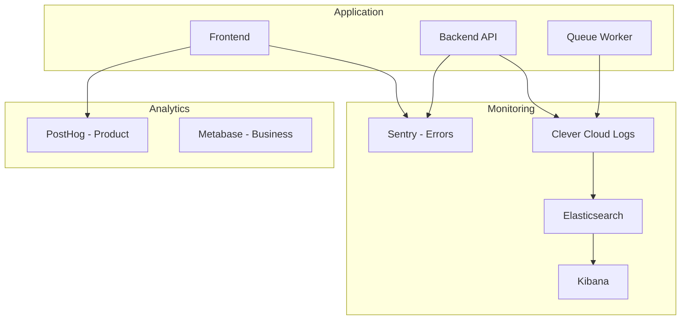

# Monitoring & Alerts Runbook

> Monitoring setup and alert response for Zero Logement Vacant

---

## 1. Monitoring Stack Overview



---

## 2. Sentry (Error Tracking)

### Access

- **URL:** https://sentry.io/organizations/<your-org>/
- **Projects:** `zlv-frontend`, `zlv-backend`

### Alert Configuration

| Alert | Condition | Severity | Action |
|-------|-----------|----------|--------|
| High error rate | > 10 errors/min | P2 | Investigate immediately |
| New error | First occurrence | P3 | Review within 4h |
| Error spike | 3x normal rate | P2 | Investigate within 1h |
| Unhandled rejection | Any | P3 | Fix in next sprint |

### Responding to Sentry Alerts

```bash
# 1. Open Sentry issue
# 2. Check stack trace
# 3. Identify affected users/endpoints
# 4. Check recent deployments

clever activity | head -5

# 5. If related to deployment, consider rollback
```

### Sentry Best Practices

```typescript
// Add context to errors
Sentry.setUser({ id: user.id, email: user.email });
Sentry.setTag('establishment', establishment.id);
Sentry.setContext('request', { endpoint, params });

// Capture with extra info
Sentry.captureException(error, {
  extra: { housingId, action: 'update' }
});
```

---

## 3. Logs (Clever Cloud → Elasticsearch)

### Log Drain Setup

Configured in Clever Cloud console:
- **Destination:** Elasticsearch cluster
- **Format:** JSON

### Accessing Logs

```bash
# Real-time logs
clever logs -f

# Historical logs (last hour)
clever logs --before "1 hour ago"

# Filter by keyword
clever logs | grep -i "error"
```

### Kibana Queries

```
# Errors in last hour
level:error AND @timestamp:[now-1h TO now]

# Specific endpoint
message:"/api/housing" AND level:error

# Specific user
userId:"<uuid>"

# Slow requests (if logged)
duration:>2000
```

### Log Levels

| Level | When to Use | Example |
|-------|-------------|---------|
| `error` | Failures requiring attention | DB connection failed |
| `warn` | Unexpected but handled | Retry succeeded |
| `info` | Normal operations | Request completed |
| `debug` | Development details | Query parameters |

---

## 4. Health Checks

### Endpoints

| Service | Endpoint | Expected |
|---------|----------|----------|
| Backend | `GET /api` | `{ status: "healthy" }` |
| Queue | `GET /` | `{ status: "healthy" }` |

### Automated Monitoring

```bash
# Simple health check script
#!/bin/bash
HEALTH=$(curl -s https://zerologementvacant.beta.gouv.fr/api | jq -r '.status')
if [ "$HEALTH" != "healthy" ]; then
  # Send alert (Slack, email, etc.)
  echo "Health check failed!"
fi
```

### External Monitoring (Recommended Setup)

| Tool | Purpose | Frequency |
|------|---------|-----------|
| UptimeRobot | Availability | 1 min |
| Checkly | Synthetic tests | 5 min |
| Clever Cloud | Instance health | Continuous |

---

## 5. Performance Monitoring

### Key Metrics

| Metric | Target | Alert Threshold |
|--------|--------|-----------------|
| Response time (p50) | < 200ms | > 500ms |
| Response time (p95) | < 1s | > 2s |
| Error rate | < 0.1% | > 1% |
| CPU usage | < 70% | > 90% |
| Memory usage | < 80% | > 90% |

### Database Metrics

```sql
-- Connection count
SELECT count(*) FROM pg_stat_activity;

-- Active queries
SELECT count(*) FROM pg_stat_activity WHERE state = 'active';

-- Database size
SELECT pg_size_pretty(pg_database_size(current_database()));

-- Cache hit ratio (should be > 99%)
SELECT
  sum(heap_blks_hit) / (sum(heap_blks_hit) + sum(heap_blks_read)) as ratio
FROM pg_statio_user_tables;
```

### Redis Metrics

```bash
redis-cli -u $REDIS_URL INFO stats | grep -E "connected_clients|used_memory_human|total_commands"
```

---

## 6. Alert Response Procedures

### P1 Alert (Service Down)

```
1. Acknowledge alert (< 5 min)
2. Check status: clever status
3. Check logs: clever logs | tail -50
4. If app crashed: clever restart
5. If DB issue: Check PostgreSQL
6. If not resolved in 15 min: Escalate
7. Communicate status every 15 min
8. Post-mortem after resolution
```

### P2 Alert (High Error Rate)

```
1. Acknowledge alert (< 15 min)
2. Check Sentry for error details
3. Identify affected endpoint/feature
4. Check recent deployments
5. If deployment-related: Rollback
6. If not: Hotfix or disable feature
7. Communicate if user-facing
```

### P3 Alert (New Error Type)

```
1. Review within 4 hours
2. Assess impact and frequency
3. Create ticket if fix needed
4. Prioritize for next sprint
```

---

## 7. Dashboard Setup

### Recommended Kibana Dashboards

**1. Operations Dashboard**
- Request rate over time
- Error rate over time
- Response time percentiles
- Top errors by count

**2. Database Dashboard**
- Connection count
- Query duration histogram
- Slow queries list
- Table sizes

**3. Queue Dashboard**
- Jobs processed
- Job failures
- Queue depth
- Processing time

### Creating Kibana Visualizations

```
# Error rate over time
Visualization: Line chart
Index: zlv-logs-*
Y-axis: Count
X-axis: @timestamp (Date Histogram)
Split series: level.keyword (Terms)
Filter: level:error
```

---

## 8. Alerting Rules

### Clever Cloud Alerts

Configure in Clever Cloud console:
- Instance restart
- Deployment failure
- High resource usage

### Custom Alerts (Recommended)

```yaml
# Example alert configuration (conceptual)
alerts:
  - name: High Error Rate
    condition: error_rate > 1%
    window: 5 minutes
    severity: P2
    notify:
      - slack: #zlv-alerts
      - email: oncall@example.com

  - name: API Down
    condition: health_check_failed
    window: 2 minutes
    severity: P1
    notify:
      - slack: #zlv-alerts
      - pagerduty: zlv-team

  - name: Database Connections High
    condition: pg_connections > 80%
    window: 5 minutes
    severity: P2
    notify:
      - slack: #zlv-alerts
```

---

## 9. Log Retention & Archival

### Retention Policy

| Location | Retention | Purpose |
|----------|-----------|---------|
| Clever Cloud | 7 days | Real-time debugging |
| Elasticsearch | 30 days | Search and analysis |
| S3 Archive | 1 year | Compliance, audits |

### Monthly Archive Process

Automated via cron:

```bash
# First of each month at 3 AM
0 3 1 * * $ROOT/server/src/scripts/logs/export-monthly-logs.sh
```

Manual export:
```bash
./server/src/scripts/logs/export-monthly-logs.sh 2024-01
```

---

## 10. On-Call Procedures

### On-Call Rotation

| Role | Responsibility |
|------|----------------|
| Primary | First response, initial triage |
| Secondary | Backup, escalation point |
| Tech Lead | Major decisions, P1 escalation |

### On-Call Checklist

**Start of shift:**
- [ ] Check current alerts
- [ ] Review recent deployments
- [ ] Check ongoing incidents
- [ ] Verify access to all tools

**During shift:**
- [ ] Respond to alerts within SLA
- [ ] Document actions taken
- [ ] Escalate if needed
- [ ] Communicate status updates

**End of shift:**
- [ ] Handoff open issues
- [ ] Update incident notes
- [ ] Log any maintenance done

---

## 11. Quick Reference

### URLs

| Tool | URL |
|------|-----|
| Sentry | https://sentry.io/organizations/<your-org>/ |
| Clever Cloud | https://console.clever-cloud.com/ |
| Metabase | [Internal URL] |

### Commands

```bash
# Logs
clever logs
clever logs -f
clever logs | grep error

# Status
clever status
curl https://zerologementvacant.beta.gouv.fr/api

# Restart
clever restart

# Activity
clever activity
```

### Contacts

| Role | Contact |
|------|---------|
| On-call | [Rotation schedule] |
| Tech Lead | [Contact info] |
| Clever Cloud Support | support@clever-cloud.com |
