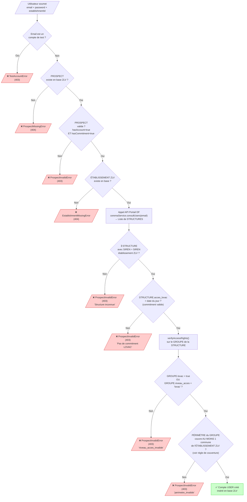
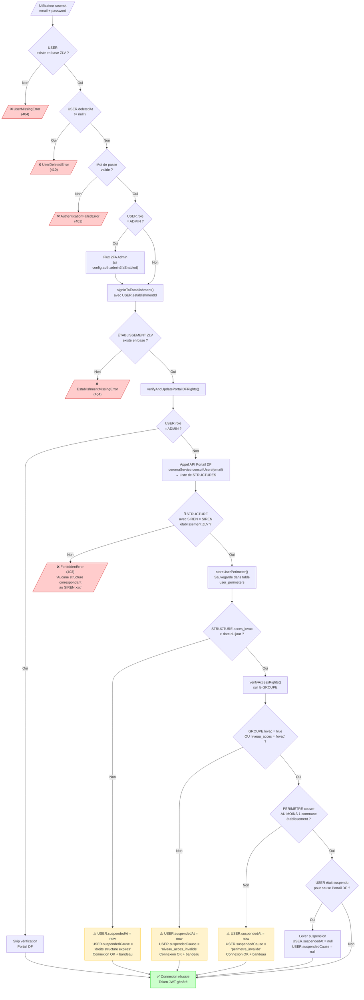
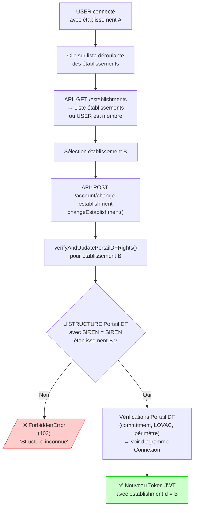
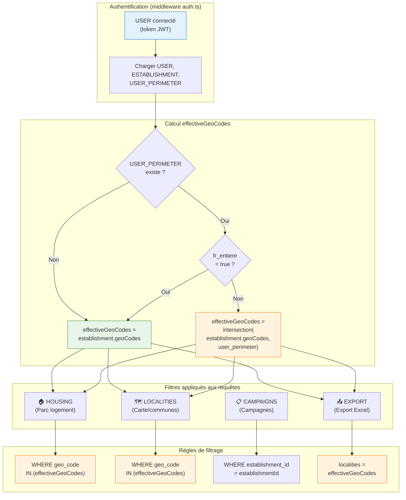

# Arbre de décision - Vérification des droits Portail DF

## 1. Création de compte

Copier le code ci-dessous dans [Mermaid Live Editor](https://mermaid.live) pour générer le graphique.



---

## 2. Connexion (mono-établissement)



---

## 3. Changement d'établissement (multi-établissement)



---

## Glossaire des entités

| Entité | Source | Description |
|--------|--------|-------------|
| **USER** | Base ZLV | Utilisateur de l'application ZLV |
| **PROSPECT** | Base ZLV | Demande de création de compte en attente |
| **ÉTABLISSEMENT ZLV** | Base ZLV | Collectivité/EPCI avec ses geoCodes (codes INSEE communes) |
| **STRUCTURE Portail DF** | API Portail DF | Organisation sur Portail DF, identifiée par SIREN, possède `acces_lovac` (date) |
| **GROUPE Portail DF** | API Portail DF | Sous-ensemble d'une structure avec `lovac` (bool), `niveau_acces`, et un périmètre |
| **PÉRIMÈTRE** | API Portail DF | Zone géographique : `comm[]`, `dep[]`, `reg[]`, `fr_entiere` (bool) |

---

## Correspondance ZLV ↔ Portail DF

```
ÉTABLISSEMENT ZLV
├── id: UUID
├── siren: "123456789"  ←──────────────┐
└── geoCodes: ["67482", "67043", ...]  │  Correspondance par SIREN
                                       │
STRUCTURE Portail DF  ─────────────────┘
├── siren: "123456789"
├── acces_lovac: "2025-12-31" (date expiration commitment)
└── GROUPE(S) Portail DF
    ├── lovac: true/false
    ├── niveau_acces: "lovac" | "dvf" | ...
    └── PÉRIMÈTRE
        ├── comm: ["67482", "67218", ...]  (communes)
        ├── dep: ["67", "68", ...]          (départements)
        ├── reg: ["44", ...]                (régions)
        └── fr_entiere: false               (France entière)
```

---

## Règle de couverture du périmètre

Une commune de l'établissement est **couverte** par le périmètre si **AU MOINS UNE** des conditions suivantes est vraie :

```
isCommuneInPerimeter(communeCode, perimeter) = true si :
│
├─ perimeter.fr_entiere = true
│  → Accès France entière, toutes communes couvertes
│
├─ communeCode ∈ perimeter.comm
│  → Commune directement listée (ex: "67482")
│
├─ getDepartment(communeCode) ∈ perimeter.dep
│  → Département de la commune listé (ex: "67" pour "67482")
│
└─ getRegion(getDepartment(communeCode)) ∈ perimeter.reg
   → Région du département listée (ex: "44" Grand Est)
```

**Validation du périmètre** : Le périmètre est valide si **AU MOINS UNE** commune de l'établissement est couverte :

```javascript
// server/src/services/ceremaService/perimeterService.ts:181-183
const hasValidPerimeter = establishmentGeoCodes.some((geoCode) =>
  isCommuneInPerimeter(geoCode, ceremaUser.perimeter!)
);
```

> ⚠️ **Important** : Il suffit d'**une seule** commune couverte pour valider le périmètre, pas toutes !

---

## Légende des couleurs

| Couleur | Signification |
|---------|---------------|
| 🟢 Vert | Succès (compte créé / connexion réussie) |
| 🔴 Rouge | Erreur bloquante (création/connexion refusée) |
| 🟡 Jaune | Avertissement (connexion autorisée avec bandeau) |

---

## Causes de suspension Portail DF

| Cause | Entité | Champ vérifié | Condition d'erreur |
|-------|--------|---------------|-------------------|
| `droits structure expires` | STRUCTURE | `acces_lovac` | Date expirée (< aujourd'hui) |
| `niveau_acces_invalide` | GROUPE | `lovac` ET `niveau_acces` | `lovac=false` ET `niveau_acces≠'lovac'` |
| `perimetre_invalide` | GROUPE.PÉRIMÈTRE | `comm`, `dep`, `reg`, `fr_entiere` | Aucune commune établissement couverte |
| `droits utilisateur expires` | USER Portail DF | Date expiration user | Date expirée |
| `cgu vides` | USER Portail DF | CGU validées | CGU non validées |

---

## Différences Création vs Connexion

| Vérification | Entité.Champ | Création | Connexion |
|--------------|--------------|----------|-----------|
| SIREN non trouvé | STRUCTURE.siren | ❌ Bloqué (403) | ❌ Bloqué (403) |
| Commitment expiré | STRUCTURE.acces_lovac | ❌ Bloqué (403) | ⚠️ Suspendu + bandeau |
| Niveau accès invalide | GROUPE.lovac/niveau_acces | ❌ Bloqué (403) | ⚠️ Suspendu + bandeau |
| Périmètre invalide | GROUPE.PÉRIMÈTRE | ❌ Bloqué (403) | ⚠️ Suspendu + bandeau |

---

## Cas multi-établissement

Un utilisateur peut être membre de **plusieurs établissements ZLV**. Chaque établissement peut correspondre à une **STRUCTURE Portail DF différente** (SIREN différent).

```
USER ZLV
├── Membre de Établissement A (SIREN: 111111111)
│   └── Vérifié contre STRUCTURE Portail DF (SIREN: 111111111)
│
└── Membre de Établissement B (SIREN: 222222222)
    └── Vérifié contre STRUCTURE Portail DF (SIREN: 222222222)
```

**Lors du changement d'établissement** :
1. L'utilisateur clique sur la liste déroulante
2. Sélectionne un autre établissement
3. `changeEstablishment()` appelle `verifyAndUpdatePortailDFRights()` pour le **nouvel établissement**
4. La vérification cherche une STRUCTURE avec le **SIREN du nouvel établissement**
5. Si trouvée : vérification des droits (commitment, LOVAC, périmètre)
6. Si non trouvée : **Connexion refusée** (403)

---

## 4. Filtrage des données par périmètre utilisateur

Le filtrage des données se fait en deux niveaux :
1. **Niveau établissement** : geoCodes de l'établissement ZLV
2. **Niveau utilisateur** : périmètre Portail DF de l'utilisateur (intersection avec les geoCodes établissement)



### Calcul des effectiveGeoCodes

À chaque requête authentifiée, le middleware `auth.ts` calcule les `effectiveGeoCodes` :

```typescript
// server/src/middlewares/auth.ts
request.effectiveGeoCodes = filterGeoCodesByPerimeter(
  establishment.geoCodes,
  userPerimeter
);
```

La fonction `filterGeoCodesByPerimeter()` :
- Si **pas de périmètre** : retourne tous les geoCodes de l'établissement
- Si **fr_entiere = true** : retourne tous les geoCodes de l'établissement
- Sinon : retourne l'**intersection** des geoCodes établissement avec le périmètre utilisateur

### Détail des filtres par entité

| Entité | Table | Filtre appliqué | Exemple SQL |
|--------|-------|-----------------|-------------|
| **HOUSING** | `housing` | `geo_code IN effectiveGeoCodes` | `WHERE geo_code IN ('67482', '67043')` |
| **LOCALITIES** | `localities` | `geo_code IN effectiveGeoCodes` | `WHERE geo_code IN ('67482', '67043')` |
| **CAMPAIGNS** | `campaigns` | `establishment_id = X` | `WHERE establishment_id = 'uuid'` |
| **GROUPS** | `groups` | `establishment_id = X` | `WHERE establishment_id = 'uuid'` |
| **OWNERS** | `owners` | Via jointure HOUSING | `JOIN housing ON ... WHERE geo_code IN (...)` |
| **EVENTS** | `events` | Via HOUSING ou CAMPAIGN | Filtré via entité parente |
| **EXPORT** | - | `localities = effectiveGeoCodes` | Filtre dans le stream |

### Exceptions : Admins et Visitors

Les utilisateurs avec le rôle **ADMIN** ou **VISITOR** ne sont **pas filtrés** par le périmètre utilisateur. Ils voient toutes les données de l'établissement (ou tous établissements pour ADMIN).

```typescript
// Dans housingController.ts, localityController.ts, etc.
const isAdminOrVisitor = [UserRole.ADMIN, UserRole.VISITOR].includes(role);
const filters = {
  localities: isAdminOrVisitor
    ? rawFilters.localities  // Pas de filtrage périmètre
    : effectiveGeoCodes      // Filtrage par périmètre
};
```

### Chaîne de filtrage complète

```
USER (token JWT)
    │
    ▼
MIDDLEWARE auth.ts
    │
    ├── Charge USER_PERIMETER depuis user_perimeters
    │
    ├── Calcule effectiveGeoCodes
    │   = intersection(establishment.geoCodes, user_perimeter)
    │
    ▼
effectiveGeoCodes[] ────────────────┐
    │                               │
    │   ┌───────────────────────────┼───────────────────────┐
    │   ▼                           ▼                       ▼
    │ ┌─────────────┐         ┌─────────────┐         ┌─────────────┐
    │ │   HOUSING   │         │  LOCALITIES │         │   EXPORT    │
    │ │ geo_code IN │         │ geo_code IN │         │ localities  │
    │ │ effective   │         │ effective   │         │ = effective │
    │ └─────────────┘         └─────────────┘         └─────────────┘
    │
    └── establishmentId ────────────┐
                                    │
                    ┌───────────────┼───────────────┐
                    ▼               ▼               ▼
             ┌───────────┐   ┌───────────┐   ┌───────────┐
             │ CAMPAIGNS │   │  GROUPS   │   │  DRAFTS   │
             │ estab_id  │   │ estab_id  │   │ estab_id  │
             └───────────┘   └───────────┘   └───────────┘
```

### Stockage du périmètre utilisateur

À la connexion, le périmètre Portail DF de l'utilisateur est stocké dans la table `user_perimeters` :

```
TABLE user_perimeters
├── user_id: UUID (FK → users.id)
├── geo_codes: text[]    (codes INSEE communes)
├── departments: text[]  (codes départements)
├── regions: text[]      (codes régions)
├── fr_entiere: boolean
├── updated_at: timestamp
└── INDEX GIN sur geo_codes, departments, regions
```

### Fichiers implémentant le filtrage

| Fichier | Rôle |
|---------|------|
| `server/src/middlewares/auth.ts` | Calcul de `effectiveGeoCodes` |
| `server/src/models/UserPerimeterApi.ts` | Fonction `filterGeoCodesByPerimeter()` |
| `server/src/controllers/housingController.ts` | Filtrage HOUSING par périmètre |
| `server/src/controllers/localityController.ts` | Filtrage LOCALITIES (carte) par périmètre |
| `server/src/controllers/housingExportController.ts` | Filtrage EXPORT par périmètre |
| `server/src/repositories/localityRepository.ts` | Support filtre `geoCodes` |

---

## Fichiers sources

| Fichier | Rôle |
|---------|------|
| `server/src/controllers/userController.ts` | Création de compte |
| `server/src/controllers/accountController.ts` | Connexion, changement établissement |
| `server/src/services/ceremaService/perimeterService.ts` | Vérification droits, règle de couverture |
| `server/src/services/ceremaService/ceremaService.ts` | Appel API Portail DF |
| `frontend/src/components/modals/SuspendedUserModal/SuspendedUserModal.tsx` | Bandeau de suspension |

---

## Export PDF

Pour chaque diagramme :
1. Copier le code Mermaid
2. Aller sur [https://mermaid.live](https://mermaid.live)
3. Coller le code dans l'éditeur
4. Cliquer sur "Actions" → "Export as PNG" ou "Export as SVG"
5. Convertir en PDF si nécessaire
