```mermaid
flowchart TD
    C1[/"Utilisateur soumet<br/>email + password + establishmentId"/]
    C2{Email est un<br/>compte de test ?}
    C3[/"❌ TestAccountError<br/>(403)"/]
    C4{"PROSPECT<br/>existe en base ZLV ?"}
    C5[/"❌ ProspectMissingError<br/>(404)"/]
    C6{"PROSPECT<br/>valide ?<br/>hasAccount=true<br/>ET hasCommitment=true"}
    C7[/"❌ ProspectInvalidError<br/>(403)"/]
    C8{"ÉTABLISSEMENT ZLV<br/>existe en base ?"}
    C9[/"❌ EstablishmentMissingError<br/>(404)"/]
    C10["Appel API Portail DF<br/>ceremaService.consultUsers(email)<br/>→ Liste de STRUCTURES"]
    C11{"∃ STRUCTURE<br/>avec SIREN = SIREN<br/>établissement ZLV ?"}
    C12[/"❌ ProspectInvalidError<br/>(403)<br/>'Structure inconnue'"/]
    C13{"STRUCTURE.acces_lovac<br/>> date du jour ?<br/>(commitment valide)"}
    C14[/"❌ ProspectInvalidError<br/>(403)<br/>'Pas de commitment LOVAC'"/]
    C15["verifyAccessRights()<br/>sur le GROUPE de la STRUCTURE"]
    C16{"GROUPE.lovac = true<br/>OU GROUPE.niveau_acces = 'lovac' ?"}
    C17[/"❌ ProspectInvalidError<br/>(403)<br/>'niveau_acces_invalide'"/]
    C18{"PÉRIMÈTRE du GROUPE<br/>couvre AU MOINS 1 commune<br/>de l'ÉTABLISSEMENT ZLV ?<br/>(voir règle de couverture)"}
    C19[/"❌ ProspectInvalidError<br/>(403)<br/>'perimetre_invalide'"/]
    C20["✅ Compte USER créé<br/>inséré en base ZLV"]

    C1 --> C2
    C2 -->|Oui| C3
    C2 -->|Non| C4
    C4 -->|Non| C5
    C4 -->|Oui| C6
    C6 -->|Non| C7
    C6 -->|Oui| C8
    C8 -->|Non| C9
    C8 -->|Oui| C10
    C10 --> C11
    C11 -->|Non| C12
    C11 -->|Oui| C13
    C13 -->|Non| C14
    C13 -->|Oui| C15
    C15 --> C16
    C16 -->|Non| C17
    C16 -->|Oui| C18
    C18 -->|Non| C19
    C18 -->|Oui| C20

    style C3 fill:#ffcccc,stroke:#cc0000
    style C5 fill:#ffcccc,stroke:#cc0000
    style C7 fill:#ffcccc,stroke:#cc0000
    style C9 fill:#ffcccc,stroke:#cc0000
    style C12 fill:#ffcccc,stroke:#cc0000
    style C14 fill:#ffcccc,stroke:#cc0000
    style C17 fill:#ffcccc,stroke:#cc0000
    style C19 fill:#ffcccc,stroke:#cc0000
    style C20 fill:#ccffcc,stroke:#00cc00
```

```mermaid
flowchart TD
    L1[/"Utilisateur soumet<br/>email + password"/]
    L2{"USER<br/>existe en base ZLV ?"}
    L3[/"❌ UserMissingError<br/>(404)"/]
    L4{"USER.deletedAt<br/>!= null ?"}
    L5[/"❌ UserDeletedError<br/>(410)"/]
    L6{Mot de passe<br/>valide ?}
    L7[/"❌ AuthenticationFailedError<br/>(401)"/]
    L8{"USER.role<br/>= ADMIN ?"}
    L9["Flux 2FA Admin<br/>(si config.auth.admin2faEnabled)"]
    L10["signInToEstablishment()<br/>avec USER.establishmentId"]
    L11{"ÉTABLISSEMENT ZLV<br/>existe en base ?"}
    L12[/"❌ EstablishmentMissingError<br/>(404)"/]
    L13["verifyAndUpdatePortailDFRights()"]
    L14{"USER.role<br/>= ADMIN ?"}
    L15["Skip vérification<br/>Portail DF"]
    L16["Appel API Portail DF<br/>ceremaService.consultUsers(email)<br/>→ Liste de STRUCTURES"]
    L17{"∃ STRUCTURE<br/>avec SIREN = SIREN<br/>établissement ZLV ?"}
    L18[/"❌ ForbiddenError<br/>(403)<br/>'Aucune structure correspondant<br/>au SIREN xxx'"/]
    L19["storeUserPerimeter()<br/>Sauvegarde dans table<br/>user_perimeters"]
    L20{"STRUCTURE.acces_lovac<br/>> date du jour ?"}
    L21["⚠️ USER.suspendedAt = now<br/>USER.suspendedCause =<br/>'droits structure expires'<br/>Connexion OK + bandeau"]
    L22["verifyAccessRights()<br/>sur le GROUPE"]
    L23{"GROUPE.lovac = true<br/>OU niveau_acces = 'lovac' ?"}
    L24["⚠️ USER.suspendedAt = now<br/>USER.suspendedCause =<br/>'niveau_acces_invalide'<br/>Connexion OK + bandeau"]
    L25{"PÉRIMÈTRE couvre<br/>AU MOINS 1 commune<br/>établissement ?"}
    L26["⚠️ USER.suspendedAt = now<br/>USER.suspendedCause =<br/>'perimetre_invalide'<br/>Connexion OK + bandeau"]
    L27{"USER était suspendu<br/>pour cause Portail DF ?"}
    L28["Lever suspension<br/>USER.suspendedAt = null<br/>USER.suspendedCause = null"]
    L29["✅ Connexion réussie<br/>Token JWT généré"]

    L1 --> L2
    L2 -->|Non| L3
    L2 -->|Oui| L4
    L4 -->|Oui| L5
    L4 -->|Non| L6
    L6 -->|Non| L7
    L6 -->|Oui| L8
    L8 -->|Oui| L9
    L8 -->|Non| L10
    L9 --> L10
    L10 --> L11
    L11 -->|Non| L12
    L11 -->|Oui| L13
    L13 --> L14
    L14 -->|Oui| L15
    L15 --> L29
    L14 -->|Non| L16
    L16 --> L17
    L17 -->|Non| L18
    L17 -->|Oui| L19
    L19 --> L20
    L20 -->|Non| L21
    L21 --> L29
    L20 -->|Oui| L22
    L22 --> L23
    L23 -->|Non| L24
    L24 --> L29
    L23 -->|Oui| L25
    L25 -->|Non| L26
    L26 --> L29
    L25 -->|Oui| L27
    L27 -->|Oui| L28
    L28 --> L29
    L27 -->|Non| L29

    style L3 fill:#ffcccc,stroke:#cc0000
    style L5 fill:#ffcccc,stroke:#cc0000
    style L7 fill:#ffcccc,stroke:#cc0000
    style L12 fill:#ffcccc,stroke:#cc0000
    style L18 fill:#ffcccc,stroke:#cc0000
    style L21 fill:#fff3cd,stroke:#ffc107
    style L24 fill:#fff3cd,stroke:#ffc107
    style L26 fill:#fff3cd,stroke:#ffc107
    style L29 fill:#ccffcc,stroke:#00cc00
```

```mermaid
flowchart TD
    M1["USER connecté<br/>avec établissement A"]
    M2["Clic sur liste déroulante<br/>des établissements"]
    M3["API: GET /establishments<br/>→ Liste établissements<br/>où USER est membre"]
    M4["Sélection établissement B"]
    M5["API: POST /account/change-establishment<br/>changeEstablishment()"]
    M6["verifyAndUpdatePortailDFRights()<br/>pour établissement B"]
    M7{"∃ STRUCTURE Portail DF<br/>avec SIREN = SIREN<br/>établissement B ?"}
    M8[/"❌ ForbiddenError<br/>(403)<br/>'Structure inconnue'"/]
    M9["Vérifications Portail DF<br/>(commitment, LOVAC, périmètre)<br/>→ voir diagramme Connexion"]
    M10["✅ Nouveau Token JWT<br/>avec establishmentId = B"]

    M1 --> M2
    M2 --> M3
    M3 --> M4
    M4 --> M5
    M5 --> M6
    M6 --> M7
    M7 -->|Non| M8
    M7 -->|Oui| M9
    M9 --> M10

    style M8 fill:#ffcccc,stroke:#cc0000
    style M10 fill:#ccffcc,stroke:#00cc00
```

# Decision Tree - Portail DF Rights Verification

## 1. Account Creation

Copy the code below into [Mermaid Live Editor](https://mermaid.live) to generate the diagram.



---

## 2. Login (single-establishment)



---

## 3. Establishment Switch (multi-establishment)



---

## Entity Glossary

| Entity | Source | Description |
|--------|--------|-------------|
| **USER** | ZLV Database | ZLV application user |
| **PROSPECT** | ZLV Database | Pending account creation request |
| **ZLV ESTABLISHMENT** | ZLV Database | Local authority/EPCI with its geoCodes (INSEE commune codes) |
| **Portail DF STRUCTURE** | Portail DF API | Organization on Portail DF, identified by SIREN, has `acces_lovac` (date) |
| **Portail DF GROUP** | Portail DF API | Subset of a structure with `lovac` (bool), `niveau_acces`, and a perimeter |
| **PERIMETER** | Portail DF API | Geographic area: `comm[]`, `dep[]`, `reg[]`, `fr_entiere` (bool) |

---

## ZLV ↔ Portail DF Mapping

```
ZLV ESTABLISHMENT
├── id: UUID
├── siren: "123456789"  ←──────────────┐
└── geoCodes: ["67482", "67043", ...]  │  Match by SIREN
                                       │
Portail DF STRUCTURE  ─────────────────┘
├── siren: "123456789"
├── acces_lovac: "2025-12-31" (commitment expiration date)
└── GROUP(S) Portail DF
    ├── lovac: true/false
    ├── niveau_acces: "lovac" | "dvf" | ...
    └── PERIMETER
        ├── comm: ["67482", "67218", ...]  (communes)
        ├── dep: ["67", "68", ...]          (departments)
        ├── reg: ["44", ...]                (regions)
        └── fr_entiere: false               (entire France)
```

---

## Perimeter Coverage Rule

A commune in the establishment is **covered** by the perimeter if **AT LEAST ONE** of the following conditions is true:

```
isCommuneInPerimeter(communeCode, perimeter) = true if:
│
├─ perimeter.fr_entiere = true
│  → Full France access, all communes covered
│
├─ communeCode ∈ perimeter.comm
│  → Commune directly listed (e.g.: "67482")
│
├─ getDepartment(communeCode) ∈ perimeter.dep
│  → Commune's department listed (e.g.: "67" for "67482")
│
└─ getRegion(getDepartment(communeCode)) ∈ perimeter.reg
   → Department's region listed (e.g.: "44" Grand Est)
```

**Perimeter validation**: The perimeter is valid if **AT LEAST ONE** commune of the establishment is covered:

```javascript
// server/src/services/ceremaService/perimeterService.ts:181-183
const hasValidPerimeter = establishmentGeoCodes.some((geoCode) =>
  isCommuneInPerimeter(geoCode, ceremaUser.perimeter!)
);
```

> ⚠️ **Important**: Only **one** covered commune is needed to validate the perimeter, not all of them!

---

## Color Legend

| Color | Meaning |
|-------|---------|
| 🟢 Green | Success (account created / login successful) |
| 🔴 Red | Blocking error (creation/login denied) |
| 🟡 Yellow | Warning (login allowed with banner) |

---

## Portail DF Suspension Causes

| Cause | Entity | Field Checked | Error Condition |
|-------|--------|---------------|-----------------|
| `droits structure expires` | STRUCTURE | `acces_lovac` | Date expired (< today) |
| `niveau_acces_invalide` | GROUP | `lovac` AND `niveau_acces` | `lovac=false` AND `niveau_acces≠'lovac'` |
| `perimetre_invalide` | GROUP.PERIMETER | `comm`, `dep`, `reg`, `fr_entiere` | No establishment commune covered |
| `droits utilisateur expires` | Portail DF USER | User expiration date | Date expired |
| `cgu vides` | Portail DF USER | CGU validated | CGU not validated |

---

## Creation vs Login Differences

| Verification | Entity.Field | Creation | Login |
|--------------|--------------|----------|-------|
| SIREN not found | STRUCTURE.siren | ❌ Blocked (403) | ❌ Blocked (403) |
| Commitment expired | STRUCTURE.acces_lovac | ❌ Blocked (403) | ⚠️ Suspended + banner |
| Invalid access level | GROUP.lovac/niveau_acces | ❌ Blocked (403) | ⚠️ Suspended + banner |
| Invalid perimeter | GROUP.PERIMETER | ❌ Blocked (403) | ⚠️ Suspended + banner |

---

## Multi-Establishment Case

A user can be a member of **multiple ZLV establishments**. Each establishment may correspond to a **different Portail DF STRUCTURE** (different SIREN).

```
ZLV USER
├── Member of Establishment A (SIREN: 111111111)
│   └── Verified against Portail DF STRUCTURE (SIREN: 111111111)
│
└── Member of Establishment B (SIREN: 222222222)
    └── Verified against Portail DF STRUCTURE (SIREN: 222222222)
```

**During establishment switch**:
1. User clicks on the dropdown
2. Selects another establishment
3. `changeEstablishment()` calls `verifyAndUpdatePortailDFRights()` for the **new establishment**
4. Verification looks for a STRUCTURE with the **new establishment's SIREN**
5. If found: rights verification (commitment, LOVAC, perimeter)
6. If not found: **Login denied** (403)

---

## 4. Data Filtering by User Perimeter

Data filtering is done at two levels:
1. **Establishment level**: ZLV establishment geoCodes
2. **User level**: User's Portail DF perimeter (intersection with establishment geoCodes)


### Computing effectiveGeoCodes

On every authenticated request, the `auth.ts` middleware computes `effectiveGeoCodes`:

```typescript
// server/src/middlewares/auth.ts
request.effectiveGeoCodes = filterGeoCodesByPerimeter(
  establishment.geoCodes,
  userPerimeter
);
```

The `filterGeoCodesByPerimeter()` function:
- If **no perimeter**: returns all establishment geoCodes
- If **fr_entiere = true**: returns all establishment geoCodes
- Otherwise: returns the **intersection** of establishment geoCodes with user perimeter

### Filter Details by Entity

| Entity | Table | Applied Filter | SQL Example |
|--------|-------|----------------|-------------|
| **HOUSING** | `housing` | `geo_code IN effectiveGeoCodes` | `WHERE geo_code IN ('67482', '67043')` |
| **LOCALITIES** | `localities` | `geo_code IN effectiveGeoCodes` | `WHERE geo_code IN ('67482', '67043')` |
| **CAMPAIGNS** | `campaigns` | Hide if any housing outside perimeter | `WHERE NOT EXISTS (SELECT 1 FROM campaigns_housing WHERE housing_geo_code NOT IN effectiveGeoCodes)` |
| **GROUPS** | `groups` | Hide if any housing outside perimeter | `WHERE NOT EXISTS (SELECT 1 FROM groups_housing WHERE housing_geo_code NOT IN effectiveGeoCodes)` |
| **OWNERS** | `owners` | Via HOUSING join | `JOIN housing ON ... WHERE geo_code IN (...)` |
| **EVENTS** | `events` | Via HOUSING or CAMPAIGN | Filtered via parent entity |
| **EXPORT** | - | `localities = effectiveGeoCodes` | Filter in the stream |

> ⚠️ **Important**: Groups and campaigns are hidden if they contain **at least one** housing outside the user's perimeter. This ensures users only see groups/campaigns they have full access to.

### Exceptions: Admins and Visitors

Users with **ADMIN** or **VISITOR** role are **not filtered** by user perimeter. They see all establishment data (or all establishments for ADMIN).

```typescript
// In housingController.ts, localityController.ts, etc.
const isAdminOrVisitor = [UserRole.ADMIN, UserRole.VISITOR].includes(role);
const filters = {
  localities: isAdminOrVisitor
    ? rawFilters.localities  // No perimeter filtering
    : effectiveGeoCodes      // Perimeter filtering
};
```

### Complete Filtering Chain

```
USER (token JWT)
    │
    ▼
MIDDLEWARE auth.ts
    │
    ├── Load USER_PERIMETER from user_perimeters
    │
    ├── Compute effectiveGeoCodes
    │   = intersection(establishment.geoCodes, user_perimeter)
    │
    ▼
effectiveGeoCodes[] ─────────────────────────────────────────────────────────┐
    │                                                                        │
    │   ┌────────────────────┬────────────────────┬────────────────────┐     │
    │   ▼                    ▼                    ▼                    ▼     │
    │ ┌─────────────┐  ┌─────────────┐  ┌─────────────┐  ┌─────────────┐    │
    │ │   HOUSING   │  │  LOCALITIES │  │   EXPORT    │  │   DRAFTS    │    │
    │ │ geo_code IN │  │ geo_code IN │  │ localities  │  │ estab_id    │    │
    │ │ effective   │  │ effective   │  │ = effective │  │             │    │
    │ └─────────────┘  └─────────────┘  └─────────────┘  └─────────────┘    │
    │                                                                        │
    │   ┌────────────────────────────────────────┐                          │
    │   ▼                                        ▼                          │
    │ ┌─────────────────────────┐  ┌─────────────────────────┐              │
    │ │       CAMPAIGNS         │  │         GROUPS          │              │
    │ │  Hide if ∃ housing      │  │  Hide if ∃ housing      │              │
    │ │  NOT IN effectiveGeo    │  │  NOT IN effectiveGeo    │              │
    │ └─────────────────────────┘  └─────────────────────────┘              │
    │                                                                        │
```

### User Perimeter Storage

On **every login**, the user's Portail DF perimeter is stored/updated in the `user_perimeters` table via `refreshAuthorizedEstablishments()` in `accountController.ts`:

```typescript
// server/src/controllers/accountController.ts
if (currentCeremaUser?.perimeter) {
  const perimeter = currentCeremaUser.perimeter;
  await userPerimeterRepository.upsert({
    userId: user.id,
    geoCodes: perimeter.comm || [],
    departments: perimeter.dep || [],
    regions: perimeter.reg || [],
    frEntiere: perimeter.fr_entiere || false,
    updatedAt: new Date().toJSON()
  });
}
```

```
TABLE user_perimeters
├── user_id: UUID (FK → users.id)
├── geo_codes: text[]    (INSEE commune codes)
├── departments: text[]  (department codes)
├── regions: text[]      (region codes)
├── fr_entiere: boolean
├── updated_at: timestamp
└── GIN INDEX on geo_codes, departments, regions
```

### Files Implementing Filtering

| File | Role |
|------|------|
| `server/src/controllers/accountController.ts` | Save user perimeter from Portail DF on login |
| `server/src/repositories/userPerimeterRepository.ts` | CRUD operations for `user_perimeters` table |
| `server/src/middlewares/auth.ts` | Compute `effectiveGeoCodes` |
| `server/src/models/UserPerimeterApi.ts` | `filterGeoCodesByPerimeter()` function |
| `server/src/controllers/housingController.ts` | HOUSING filtering by perimeter |
| `server/src/controllers/localityController.ts` | LOCALITIES (map) filtering by perimeter |
| `server/src/controllers/housingExportController.ts` | EXPORT filtering by perimeter |
| `server/src/controllers/campaignController.ts` | CAMPAIGNS filtering by perimeter |
| `server/src/controllers/groupController.ts` | GROUPS filtering by perimeter |
| `server/src/repositories/localityRepository.ts` | `geoCodes` filter support |
| `server/src/repositories/campaignRepository.ts` | `geoCodes` filter support (hide if any housing outside) |
| `server/src/repositories/groupRepository.ts` | `geoCodes` filter support (hide if any housing outside) |

---

## Source Files

| File | Role |
|------|------|
| `server/src/controllers/userController.ts` | Account creation |
| `server/src/controllers/accountController.ts` | Login, establishment switch |
| `server/src/services/ceremaService/perimeterService.ts` | Rights verification, coverage rule |
| `server/src/services/ceremaService/ceremaService.ts` | Portail DF API call |
| `frontend/src/components/modals/SuspendedUserModal/SuspendedUserModal.tsx` | Suspension banner |

---

## PDF Export

For each diagram:
1. Copy the Mermaid code
2. Go to [https://mermaid.live](https://mermaid.live)
3. Paste the code in the editor
4. Click "Actions" → "Export as PNG" or "Export as SVG"
5. Convert to PDF if needed
