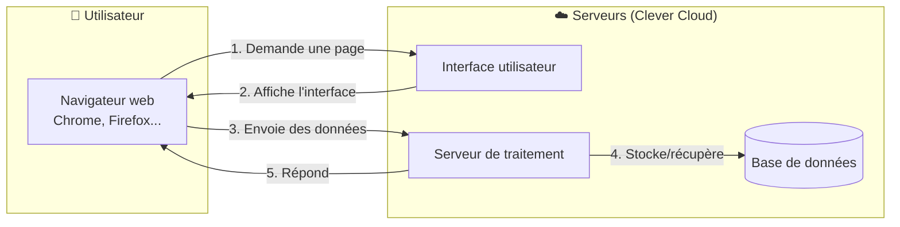
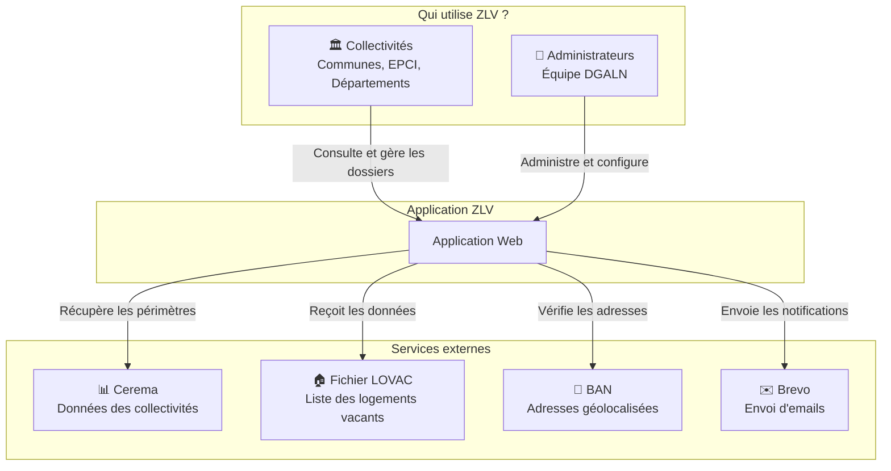
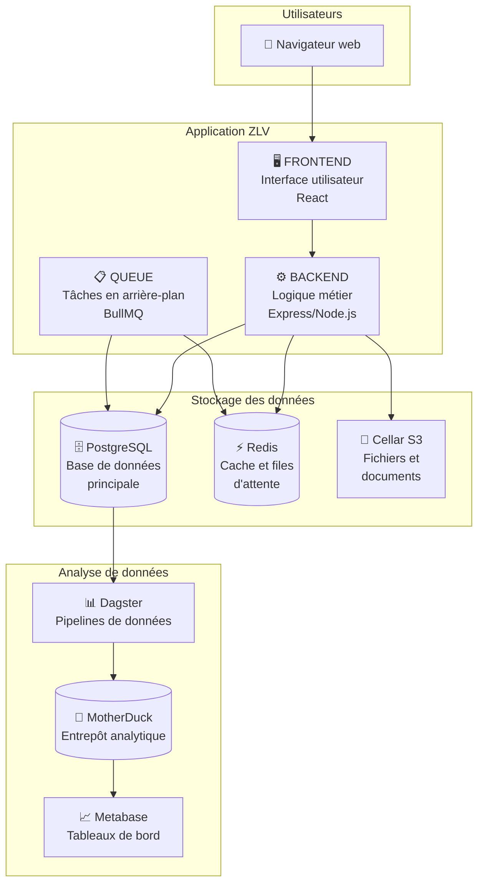
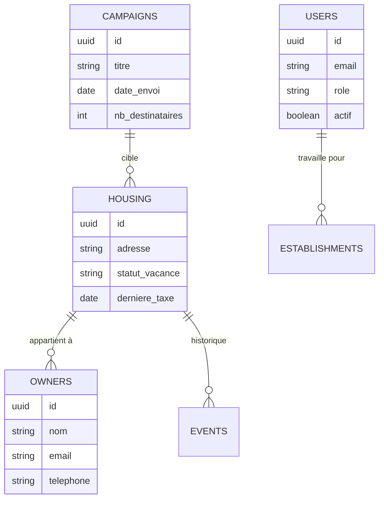
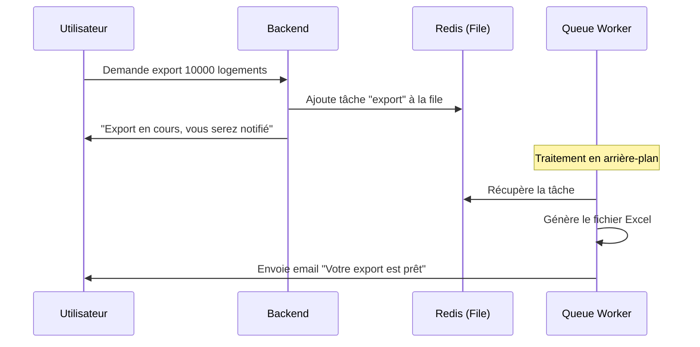
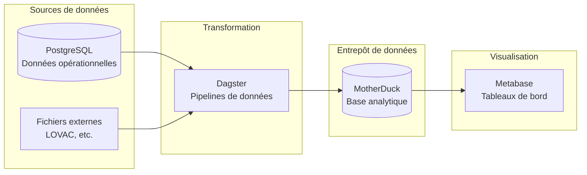

# Dossier d'Architecture Technique (DAT)
# Zéro Logement Vacant

**Version:** 1.0
**Date:** 26 février 2026
**Auteur:** Loïc Guillois

---

## Table des matières

1. [Introduction](#1-introduction)
2. [Vue d'ensemble du système](#2-vue-densemble-du-système)
3. [Les composants de l'application](#3-les-composants-de-lapplication)
4. [L'interface utilisateur (Frontend)](#4-linterface-utilisateur-frontend)
5. [Le serveur (Backend)](#5-le-serveur-backend)
6. [La base de données](#6-la-base-de-données)
7. [Les traitements en arrière-plan](#7-les-traitements-en-arrière-plan)
8. [L'analyse de données (Analytics)](#8-lanalyse-de-données-analytics)
9. [Les services externes](#9-les-services-externes)
10. [La sécurité](#10-la-sécurité)
11. [Liens et ressources](#11-liens-et-ressources)
12. [Glossaire](#12-glossaire)

---

# 1. Introduction

## 1.1 Qu'est-ce que Zéro Logement Vacant ?

**Zéro Logement Vacant (ZLV)** est une application web développée par le Ministère de la Transition Écologique. Elle permet aux collectivités territoriales françaises (mairies, intercommunalités, départements) de :

- **Identifier** les logements vacants sur leur territoire
- **Contacter** les propriétaires de ces logements
- **Suivre** les démarches engagées pour remettre ces logements sur le marché
- **Mesurer** l'efficacité des actions menées

> **Pourquoi c'est important ?** En France, il existe environ 3 millions de logements vacants alors que de nombreuses personnes peinent à se loger. L'application ZLV aide les collectivités à agir concrètement pour réduire cette vacance.

## 1.2 Objectif de ce document

Ce document explique **comment l'application est construite techniquement**. Il décrit :

- Les différentes parties qui composent l'application
- Comment ces parties communiquent entre elles
- Où et comment les données sont stockées
- Comment l'application est sécurisée

## 1.3 À qui s'adresse ce document ?

Ce document est destiné à toute personne souhaitant comprendre le fonctionnement technique de ZLV :

- Les développeurs qui travaillent sur le projet
- Les équipes qui maintiennent l'application en production
- Les responsables techniques et décideurs
- Les auditeurs de sécurité

## 1.4 Vocabulaire utilisé

Avant d'aller plus loin, voici quelques termes techniques expliqués simplement :

| Terme | Explication simple |
|-------|-------------------|
| **Application web** | Un logiciel accessible via un navigateur internet (comme Chrome, Firefox) |
| **Serveur** | Un ordinateur distant qui fait tourner l'application et stocke les données |
| **Base de données** | Un système qui stocke toutes les informations de l'application de manière organisée |
| **API** | Une "porte d'entrée" qui permet à différents programmes de communiquer entre eux |
| **Frontend** | La partie visible de l'application, ce que l'utilisateur voit et clique |
| **Backend** | La partie invisible qui traite les données et applique les règles métier |

---

# 2. Vue d'ensemble du système

## 2.1 Comment fonctionne l'application ?

L'application ZLV fonctionne sur le principe **client-serveur**, un modèle très courant pour les applications web modernes :



**En pratique :**

1. L'utilisateur ouvre son navigateur et accède à l'adresse de ZLV
2. Le navigateur télécharge l'interface de l'application
3. Quand l'utilisateur effectue une action (recherche, modification...), une demande est envoyée au serveur
4. Le serveur traite la demande, consulte ou modifie la base de données si nécessaire
5. Le serveur renvoie le résultat qui s'affiche dans le navigateur

## 2.2 Où est hébergée l'application ?

L'application est hébergée sur **Clever Cloud**, une plateforme d'hébergement française.

**Qu'est-ce qu'une plateforme d'hébergement (PaaS) ?**

Plutôt que d'acheter et gérer nos propres serveurs physiques, nous utilisons les serveurs de Clever Cloud. C'est comme louer un appartement meublé plutôt que de construire sa maison : Clever Cloud s'occupe de l'infrastructure (électricité, climatisation, sécurité physique), nous nous occupons de l'application.

**Avantages :**

- Pas de matériel à acheter ni à maintenir
- Mise à l'échelle automatique si le nombre d'utilisateurs augmente
- Sauvegardes automatiques
- Hébergement en France (conformité RGPD)

## 2.3 Les acteurs du système



**Les utilisateurs :**

- **Collectivités territoriales** : Les principaux utilisateurs. Ils consultent les logements vacants de leur territoire, contactent les propriétaires et suivent les dossiers.
- **Administrateurs DGALN** : L'équipe du ministère qui gère la plateforme, les comptes utilisateurs et la configuration.

**Les services externes :**

- **Cerema** : Fournit la liste des collectivités et leurs périmètres géographiques
- **Fichier LOVAC** : Fichier officiel listant les logements vacants en France
- **BAN (Base Adresse Nationale)** : Permet de vérifier et géolocaliser les adresses
- **Brevo** : Service d'envoi d'emails pour les notifications

---

# 3. Les composants de l'application

## 3.1 Vue d'ensemble des composants

L'application ZLV est composée de plusieurs "briques" logicielles, chacune ayant un rôle précis :



## 3.2 Explication de chaque composant

### Le Frontend (Interface utilisateur)

> **Rôle :** C'est ce que l'utilisateur voit et avec quoi il interagit.

Quand vous ouvrez ZLV dans votre navigateur, le Frontend affiche :
- Les formulaires de recherche
- Les listes de logements
- Les cartes géographiques
- Les boutons et menus

**Technologie utilisée :** React (une bibliothèque JavaScript très populaire pour créer des interfaces web modernes et réactives)

### Le Backend (Serveur)

> **Rôle :** C'est le "cerveau" de l'application. Il traite toutes les demandes.

Quand vous cliquez sur "Rechercher" dans ZLV, le Backend :
- Reçoit votre demande
- Vérifie que vous avez le droit de faire cette action
- Consulte la base de données
- Applique les règles métier (filtres, calculs...)
- Renvoie les résultats

**Technologie utilisée :** Node.js avec Express (un environnement JavaScript côté serveur)

### La Base de données PostgreSQL

> **Rôle :** Stocker toutes les données de l'application de manière permanente et organisée.

La base de données contient :
- Les informations sur les logements vacants
- Les coordonnées des propriétaires
- Les comptes utilisateurs
- L'historique des actions et campagnes

**Pourquoi PostgreSQL ?** C'est une base de données robuste, gratuite et très utilisée. Elle permet de gérer de grandes quantités de données avec fiabilité.

### Redis (Cache et files d'attente)

> **Rôle :** Accélérer l'application et gérer les tâches en attente.

Redis est une base de données ultra-rapide qui stocke des informations temporaires :
- **Cache** : Les données fréquemment consultées sont gardées en mémoire pour un accès instantané
- **Files d'attente** : Les tâches à traiter (comme l'envoi de 1000 emails) sont mises en file et traitées progressivement

### La Queue (Tâches en arrière-plan)

> **Rôle :** Exécuter des tâches longues sans bloquer l'utilisateur.

Certaines opérations prennent du temps (générer un rapport de 10 000 lignes, envoyer des centaines d'emails). Plutôt que de faire attendre l'utilisateur, ces tâches sont :
1. Mises en file d'attente
2. Traitées en arrière-plan
3. L'utilisateur est notifié une fois terminé

### Cellar S3 (Stockage de fichiers)

> **Rôle :** Stocker les fichiers volumineux.

Les documents téléchargés par les utilisateurs (justificatifs, exports PDF, photos) sont stockés dans Cellar, un service de stockage de fichiers compatible S3 fourni par Clever Cloud.

---

# 4. L'interface utilisateur (Frontend)

## 4.1 Technologies utilisées

| Technologie | Rôle |
|-------------|------|
| **React** | Bibliothèque pour construire l'interface. Permet de créer des composants réutilisables (boutons, formulaires, listes) |
| **TypeScript** | Version améliorée de JavaScript qui détecte les erreurs avant exécution |
| **DSFR** | Design System de l'État Français - assure une apparence cohérente avec les autres sites gouvernementaux |
| **MapLibre** | Affichage des cartes interactives |
| **React Query** | Gestion des données provenant du serveur |

## 4.2 Organisation du code

```
frontend/
├── src/
│   ├── components/     # Éléments réutilisables (boutons, formulaires...)
│   ├── views/          # Pages complètes de l'application
│   ├── hooks/          # Logique partagée entre composants
│   └── services/       # Communication avec le serveur
```

## 4.3 Fonctionnalités principales

- **Authentification** : Connexion sécurisée avec email/mot de passe et double authentification (2FA)
- **Tableau de bord** : Vue d'ensemble des logements vacants et des actions en cours
- **Recherche** : Filtres avancés pour trouver des logements spécifiques
- **Cartographie** : Visualisation géographique des logements sur une carte
- **Gestion des campagnes** : Envoi de courriers groupés aux propriétaires
- **Export** : Téléchargement des données en Excel ou PDF

---

# 5. Le serveur (Backend)

## 5.1 Rôle du Backend

Le Backend est le cœur technique de l'application. Il :

1. **Authentifie** les utilisateurs (vérifie identité et droits)
2. **Valide** les données entrantes (empêche les erreurs et attaques)
3. **Traite** les demandes (applique les règles métier)
4. **Communique** avec la base de données
5. **Répond** au Frontend avec les données demandées

## 5.2 Technologies utilisées

| Technologie | Rôle |
|-------------|------|
| **Node.js** | Environnement d'exécution JavaScript côté serveur |
| **Express** | Framework web qui simplifie la création d'API |
| **TypeScript** | Typage statique pour plus de fiabilité |
| **Knex** | Outil pour interagir avec la base de données |
| **Yup** | Validation des données entrantes |

## 5.3 Organisation du code

```
server/
├── src/
│   ├── controllers/    # Reçoit les requêtes et renvoie les réponses
│   ├── services/       # Logique métier (règles de gestion)
│   ├── repositories/   # Accès aux données (requêtes SQL)
│   ├── models/         # Structure des données
│   └── middlewares/    # Vérifications intermédiaires (auth, validation)
```

## 5.4 API REST

Le Backend expose une **API REST** : un ensemble de "portes d'entrée" pour accéder aux fonctionnalités.

**Qu'est-ce qu'une API REST ?**

C'est une convention pour que deux programmes communiquent via Internet. Chaque "porte" (appelée endpoint) a une adresse et accepte certaines actions :

- `GET /api/housing` : Récupérer la liste des logements
- `POST /api/campaigns` : Créer une nouvelle campagne
- `PUT /api/housing/123` : Modifier le logement n°123
- `DELETE /api/owners/456` : Supprimer le propriétaire n°456

---

# 6. La base de données

## 6.1 Rôle de la base de données

La base de données **PostgreSQL** est le "coffre-fort" de l'application. Elle stocke de manière permanente et organisée :

- **Les logements** : Adresse, caractéristiques, statut de vacance
- **Les propriétaires** : Coordonnées, historique des contacts
- **Les utilisateurs** : Comptes, droits d'accès
- **Les campagnes** : Courriers envoyés, suivi des réponses
- **L'historique** : Toutes les modifications pour traçabilité

## 6.2 Principales tables



## 6.3 Sécurité des données

- **Sauvegardes quotidiennes** : Les données sont sauvegardées chaque jour automatiquement
- **Conservation 30 jours** : Possibilité de restaurer les données des 30 derniers jours
- **Chiffrement** : Les communications avec la base sont chiffrées (SSL)
- **Accès restreint** : Seule l'application peut accéder à la base

---

# 7. Les traitements en arrière-plan

## 7.1 Pourquoi des traitements en arrière-plan ?

Certaines opérations sont trop longues pour être exécutées immédiatement :
- Envoyer 500 emails prend plusieurs minutes
- Générer un export Excel de 50 000 lignes est lent
- Synchroniser des données avec un service externe peut échouer

Plutôt que de bloquer l'utilisateur, ces tâches sont mises en **file d'attente** et traitées en arrière-plan.

## 7.2 Fonctionnement



## 7.3 Types de tâches

| Tâche | Description | Durée typique |
|-------|-------------|---------------|
| Export de données | Génération de fichiers Excel/CSV | 1-5 minutes |
| Envoi de campagne | Envoi d'emails groupés | 5-30 minutes |
| Import LOVAC | Intégration des nouvelles données | 30-60 minutes |
| Synchronisation Cerema | Mise à jour des périmètres | 10-20 minutes |

---

# 8. L'analyse de données (Analytics)

## 8.1 Objectif

En plus du fonctionnement quotidien, ZLV produit des **statistiques et indicateurs** pour :
- Mesurer l'impact des actions menées
- Identifier les tendances (évolution de la vacance)
- Produire des rapports pour le ministère
- Aider les collectivités dans leurs décisions

## 8.2 Architecture Analytics



> **Pourquoi une architecture séparée pour l'analyse ?**
>
> Les requêtes analytiques (calculs sur des millions de lignes) sont différentes des requêtes opérationnelles (afficher 20 logements). Les séparer permet de ne pas ralentir l'application tout en permettant des analyses poussées.

## 8.3 Outils utilisés

| Outil | Rôle |
|-------|------|
| **Dagster** | Orchestre les pipelines de données (extraction, transformation, chargement) |
| **dbt** | Transforme les données brutes en tables prêtes pour l'analyse |
| **MotherDuck/DuckDB** | Base de données optimisée pour l'analyse rapide de gros volumes |
| **Metabase** | Création de tableaux de bord et graphiques interactifs |

---

# 9. Les services externes

## 9.1 Services utilisés

L'application ZLV ne fonctionne pas seule. Elle s'appuie sur plusieurs services externes :

### API Cerema (Périmètres des collectivités)

> **Rôle :** Fournir la liste des collectivités et leurs périmètres géographiques.

Quand une collectivité s'inscrit sur ZLV, le système récupère automatiquement auprès du Cerema :
- La liste des communes concernées
- Les codes INSEE associés
- Le type de collectivité (commune, EPCI, département)

### Base Adresse Nationale (BAN)

> **Rôle :** Vérifier et géolocaliser les adresses.

Pour chaque adresse de logement, la BAN fournit :
- L'adresse normalisée (orthographe officielle)
- Les coordonnées GPS
- Le code INSEE de la commune

### Brevo (ex-Sendinblue)

> **Rôle :** Envoyer les emails de l'application.

Brevo gère l'envoi de :
- Emails de création de compte
- Réinitialisation de mot de passe
- Notifications aux utilisateurs
- Courriers aux propriétaires

### Sentry

> **Rôle :** Détecter et signaler les erreurs.

Quand une erreur se produit dans l'application, Sentry :
- Capture automatiquement l'erreur
- Alerte l'équipe technique
- Fournit les informations pour corriger le problème

---

# 10. La sécurité

## 10.1 Authentification et autorisation

### Comment les utilisateurs se connectent ?

1. **Identifiant et mot de passe** : L'utilisateur saisit son email et mot de passe
2. **Double authentification (2FA)** : Un code temporaire est demandé (optionnel mais recommandé)
3. **Token JWT** : Une fois connecté, un "jeton" sécurisé permet de rester authentifié

### Qui peut faire quoi ?

Chaque utilisateur a un **rôle** qui définit ses droits :

| Rôle | Droits |
|------|--------|
| **Utilisateur** | Consulter et modifier les logements de sa collectivité |
| **Administrateur local** | + Gérer les utilisateurs de sa collectivité |
| **Administrateur national** | + Accès à toutes les collectivités, configuration système |

## 10.2 Protection des données

### Chiffrement

- **En transit** : Toutes les communications utilisent HTTPS (données chiffrées entre le navigateur et le serveur)
- **Au repos** : Les données sensibles sont chiffrées dans la base de données

### Conformité RGPD

- Les données sont hébergées en France
- Les utilisateurs peuvent demander l'export ou la suppression de leurs données
- Les accès sont tracés et auditables

### Sécurité applicative

L'application est protégée contre les attaques courantes :
- **Injection SQL** : Les requêtes sont paramétrées
- **XSS** : Les entrées utilisateur sont nettoyées
- **CSRF** : Les tokens sécurisent les formulaires

## 10.3 Surveillance

L'application est surveillée en permanence :
- **Logs** : Toutes les actions sont enregistrées
- **Alertes** : L'équipe est notifiée en cas d'anomalie
- **Monitoring** : Suivi en temps réel des performances

---

# 11. Liens et ressources

## 11.1 URLs de l'application

| Environnement | URL | Description |
|---------------|-----|-------------|
| **Production** | https://zerologementvacant.beta.gouv.fr | Application utilisée par les collectivités |
| **Staging** | https://zerologementvacant-staging.incubateur.net | Environnement de test/démo |
| **API Documentation** | http://localhost:3001/api-docs | Documentation Swagger (développement) |
| **Spec OpenAPI** | `/api-docs.json` | Spécification OpenAPI au format JSON |

## 11.2 Ressources du projet

| Ressource | URL | Description |
|-----------|-----|-------------|
| **Code source** | https://github.com/MTES-MCT/zero-logement-vacant | Repository GitHub du projet |
| **Fiche produit** | https://beta.gouv.fr/startups/zero-logement-vacant.html | Présentation sur beta.gouv.fr |
| **CI/CD** | https://github.com/MTES-MCT/zero-logement-vacant/actions | Workflows GitHub Actions |
| **Gestionnaire de secrets** | https://vaultwarden.incubateur.net/ | Vaultwarden (mots de passe partagés) |

## 11.3 Documentation API (Swagger)

L'API ZLV dispose d'une documentation interactive au format OpenAPI/Swagger :

**En développement :**
- Interface Swagger UI : `http://localhost:3001/api-docs`
- Spécification JSON : `http://localhost:3001/api-docs.json`

**En production :**
- Désactivé par défaut pour des raisons de sécurité
- Activation possible via la variable d'environnement `ENABLE_SWAGGER=true`

**Fonctionnalités de la documentation :**
- Liste de tous les endpoints disponibles
- Paramètres et schémas de requêtes/réponses
- Possibilité de tester les endpoints directement
- Authentification JWT supportée

## 11.4 Workflows CI/CD

Le projet utilise GitHub Actions pour l'intégration et le déploiement continus :

| Workflow | Fichier | Déclencheur | Rôle |
|----------|---------|-------------|------|
| Pull Request | `pull-request.yml` | PR ouverte | Lint, tests, type-check |
| Main | `main.yml` | Push sur main | Tests complets |
| E2E | `e2e.yml` | Push sur main | Tests end-to-end Cypress |
| Deploy | `deploy.yml` | Push sur main | Déploiement sur Clever Cloud |
| Release | `release.yml` | Tag créé | Création de release |
| CodeQL | `codeql-analysis.yml` | Hebdomadaire | Analyse de sécurité du code |
| **Documentation** | `generate-docs.yml` | PR sur `docs/technical/**` | Génération des PDFs |

## 11.5 Génération automatique de la documentation

La documentation technique (DAT, DE, DI) est automatiquement générée en PDF à chaque pull request modifiant les fichiers dans `docs/technical/`.

**Fonctionnement :**

1. Le workflow `generate-docs.yml` se déclenche automatiquement
2. Les diagrammes Mermaid sont convertis en images PNG
3. Les fichiers Markdown sont convertis en PDF via Pandoc/XeLaTeX
4. Les PDFs sont uploadés comme artefacts GitHub

**Versioning :**

- Format : `1.0.X` où X est le numéro de run GitHub Actions
- La version est automatiquement mise à jour dans les documents
- Possibilité de spécifier une version manuellement via `workflow_dispatch`

**Artefacts :**

| Propriété | Valeur |
|-----------|--------|
| Nom | `technical-documentation-vX.X.X` |
| Contenu | DAT, DE, DI en PDF |
| Rétention | **90 jours** |
| Téléchargement | Via l'onglet "Actions" de la PR |

**Déclenchement manuel :**

Le workflow peut aussi être déclenché manuellement depuis GitHub Actions → "Generate Technical Documentation" → "Run workflow".

---

# 12. Glossaire

| Terme | Définition |
|-------|------------|
| **API** | Application Programming Interface - Interface permettant à des programmes de communiquer |
| **Backend** | Partie serveur de l'application (invisible pour l'utilisateur) |
| **BAN** | Base Adresse Nationale - Référentiel officiel des adresses françaises |
| **Cache** | Mémoire temporaire rapide pour accélérer les accès aux données |
| **Cerema** | Centre d'études et d'expertise qui gère les données des collectivités |
| **DGALN** | Direction Générale de l'Aménagement, du Logement et de la Nature |
| **DSFR** | Design System de l'État Français |
| **Frontend** | Partie visible de l'application (interface utilisateur) |
| **HTTPS** | Protocole sécurisé de communication web |
| **JWT** | JSON Web Token - Jeton sécurisé d'authentification |
| **LOVAC** | Fichier des LOgements VAcants |
| **PaaS** | Platform as a Service - Hébergement cloud clé en main |
| **PostgreSQL** | Système de base de données relationnelle |
| **Redis** | Base de données en mémoire pour le cache |
| **REST** | Style d'architecture pour les API web |
| **RGPD** | Règlement Général sur la Protection des Données |
| **S3** | Standard de stockage de fichiers dans le cloud |
| **SSL/TLS** | Protocoles de chiffrement des communications |
| **ZLV** | Zéro Logement Vacant |

---

*Document généré le 26 février 2026*
