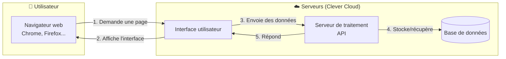
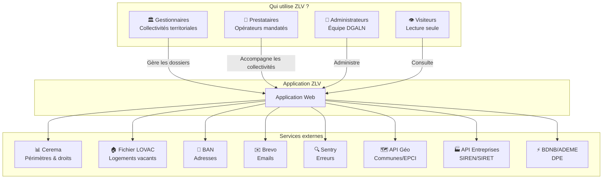
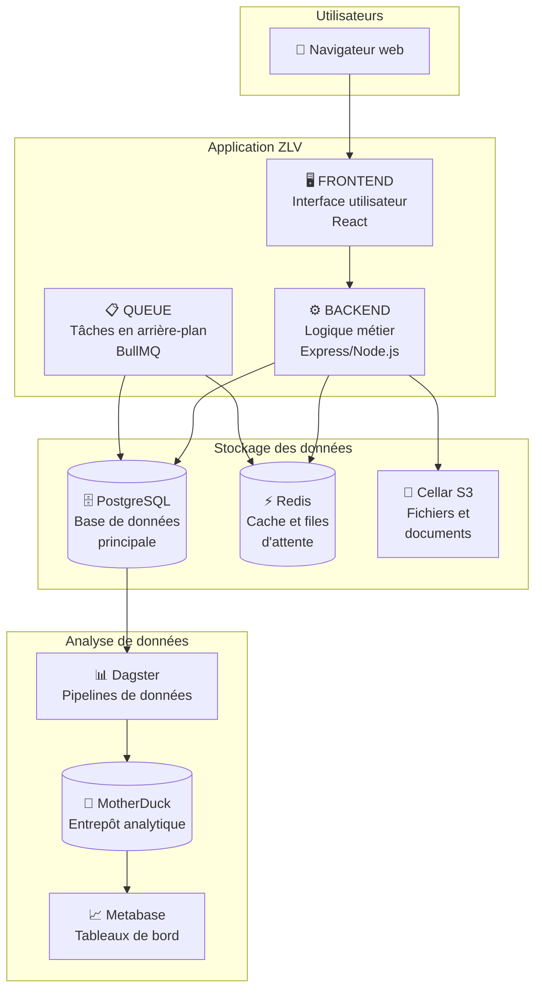
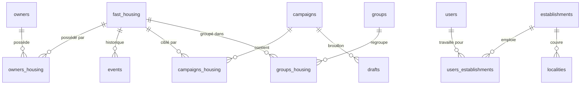
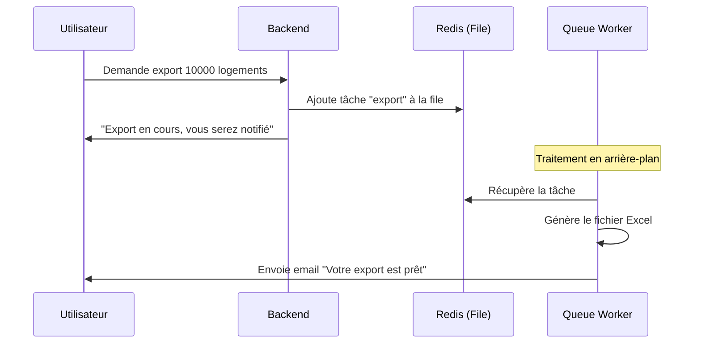
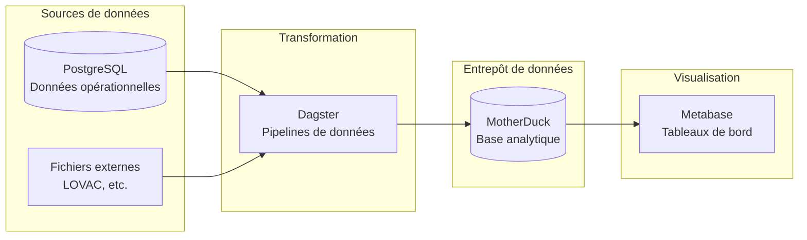

# Dossier d'Architecture Technique (DAT)
# Zéro Logement Vacant

**Version:** 1.0
**Date:** 24 mars 2026
**Auteur:** Équipe Zéro Logement Vacant

---

## Table des matières

1. [Introduction](#1-introduction)
2. [Vue d'ensemble du système](#2-vue-densemble-du-système)
3. [Les composants de l'application](#3-les-composants-de-lapplication)
4. [L'interface utilisateur (Frontend)](#4-linterface-utilisateur-frontend)
5. [Le serveur (Backend)](#5-le-serveur-backend)
6. [La base de données](#6-la-base-de-données)
7. [Les traitements en arrière-plan](#7-les-traitements-en-arrière-plan)
8. [L'analyse de données (Analytics)](#8-lanalyse-de-données-analytics)
9. [Les services externes](#9-les-services-externes)
10. [La sécurité](#10-la-sécurité)
11. [Liens et ressources](#11-liens-et-ressources)
12. [Glossaire](#12-glossaire)

---

\newpage

# 1. Introduction

## 1.1 Qu'est-ce que Zéro Logement Vacant ?

**Zéro Logement Vacant (ZLV)** est une application web développée par le Ministère de la Transition Écologique. Elle permet aux collectivités territoriales françaises (mairies, intercommunalités, départements) de :

- **Identifier** les logements vacants sur leur territoire
- **Contacter** les propriétaires de ces logements
- **Suivre** les démarches engagées pour remettre ces logements sur le marché
- **Mesurer** l'efficacité des actions menées

> **Pourquoi c'est important ?** En France, il existe environ 3 millions de logements vacants alors que de nombreuses personnes peinent à se loger. L'application ZLV aide les collectivités à agir concrètement pour réduire cette vacance.

## 1.2 Objectif de ce document

Ce document explique **comment l'application est construite techniquement**. Il décrit :

- Les différentes parties qui composent l'application
- Comment ces parties communiquent entre elles
- Où et comment les données sont stockées
- Comment l'application est sécurisée

## 1.3 À qui s'adresse ce document ?

Ce document est destiné à toute personne souhaitant comprendre le fonctionnement technique de ZLV :

- Les développeurs qui travaillent sur le projet
- Les équipes qui maintiennent l'application en production
- Les responsables techniques et décideurs
- Les auditeurs de sécurité

## 1.4 Vocabulaire utilisé

Avant d'aller plus loin, voici quelques termes techniques expliqués simplement :

| Terme | Explication simple |
|-------|-------------------|
| **Application web** | Un logiciel accessible via un navigateur internet (comme Chrome, Firefox) |
| **Serveur** | Un ordinateur distant qui fait tourner l'application et stocke les données |
| **Base de données** | Un système qui stocke toutes les informations de l'application de manière organisée |
| **API** | Une "porte d'entrée" qui permet à différents programmes de communiquer entre eux |
| **Frontend** | La partie visible de l'application, ce que l'utilisateur voit et clique |
| **Backend** | La partie invisible qui traite les données et applique les règles métier |
| **Entrepôt de données** | Un système centralisé qui collecte et organise des données provenant de différentes sources pour faciliter l'analyse et la prise de décision |
| **HDS** | Hébergeur de Données de Santé - certification française garantissant un niveau de sécurité élevé pour l'hébergement de données sensibles |

---

# 2. Vue d'ensemble du système

## 2.1 Comment fonctionne l'application ?

L'application ZLV fonctionne sur le principe **client-serveur**, un modèle très courant pour les applications web modernes :


```mermaid
flowchart LR
    subgraph Utilisateur["👤 Utilisateur"]
        Browser[Navigateur web<br/>Chrome, Firefox...]
    end

    subgraph Cloud["☁️ Serveurs (Clever Cloud)"]
        Frontend[Interface utilisateur]
        Backend[Serveur de traitement<br/>API]
        DB[(Base de données)]
    end

    Browser -->|1. Demande une page| Frontend
    Frontend -->|2. Affiche l'interface| Browser
    Frontend -->|3. Envoie des données| Backend
    Backend -->|4. Stocke/récupère| DB
    Backend -->|5. Répond| Frontend
```

**En pratique :**

1. L'utilisateur ouvre son navigateur et accède à l'adresse de ZLV
2. Le navigateur télécharge l'interface de l'application
3. Quand l'utilisateur effectue une action (recherche, modification...), une demande est envoyée au serveur
4. Le serveur traite la demande, consulte ou modifie la base de données si nécessaire
5. Le serveur renvoie le résultat qui s'affiche dans le navigateur

## 2.2 Où est hébergée l'application ?

L'application est hébergée sur **Clever Cloud**, une plateforme d'hébergement française [recommandée par beta.gouv.fr](https://doc.incubateur.net/communaute/gerer-son-produit/gestion-au-quotidien/tech/infra).

**Qu'est-ce qu'une plateforme d'hébergement (PaaS) ?**

Plutôt que d'acheter et gérer nos propres serveurs physiques, nous utilisons les serveurs de Clever Cloud. C'est comme louer un appartement meublé plutôt que de construire sa maison : Clever Cloud s'occupe de l'infrastructure (électricité, climatisation, sécurité physique), nous nous occupons de l'application.

**Avantages :**

- **Aucune infrastructure physique** : Pas de matériel à acheter ni à maintenir
- **Scalabilité automatique** : Mise à l'échelle si le nombre d'utilisateurs augmente
- **Sauvegardes automatiques** : Protection des données sans intervention manuelle
- **Souveraineté des données** : Hébergement en France (conformité RGPD)
- **Certification HDS** : Garantit un niveau de sécurité élevé pour les données sensibles, avec des exigences strictes en matière de confidentialité, intégrité et traçabilité

## 2.3 Les acteurs du système


```mermaid
flowchart TB
    subgraph Utilisateurs["Qui utilise ZLV ?"]
        Gest[🏛️ Gestionnaires<br/>Collectivités territoriales]
        Prest[🏢 Prestataires<br/>Opérateurs mandatés]
        Admin[👔 Administrateurs<br/>Équipe DGALN]
        Visitor[👁️ Visiteurs<br/>Lecture seule]
    end

    subgraph Systeme["Application ZLV"]
        App[Application Web]
    end

    subgraph Externes["Services externes"]
        Cerema[📊 Cerema<br/>Périmètres & droits]
        LOVAC[🏠 Fichier LOVAC<br/>Logements vacants]
        BAN[📍 BAN<br/>Adresses]
        Brevo[✉️ Brevo<br/>Emails]
        Sentry[🔍 Sentry<br/>Erreurs]
        GeoAPI[🗺️ API Géo<br/>Communes/EPCI]
        EntAPI[🏭 API Entreprises<br/>SIREN/SIRET]
        BDNB[⚡ BDNB/ADEME<br/>DPE]
    end

    Gest -->|Gère les dossiers| App
    Prest -->|Accompagne les collectivités| App
    Admin -->|Administre| App
    Visitor -->|Consulte| App
    App --> Cerema
    App --> LOVAC
    App --> BAN
    App --> Brevo
    App --> Sentry
    App --> GeoAPI
    App --> EntAPI
    App --> BDNB
```

**Les utilisateurs :**

- **Gestionnaires** : Agents des collectivités territoriales (communes, EPCI, départements). Ils consultent les logements vacants de leur territoire, contactent les propriétaires et suivent les dossiers.
- **Prestataires** : Opérateurs mandatés par les collectivités (ex: SOLIHA, agences d'urbanisme) pour accompagner les propriétaires dans leurs démarches.
- **Administrateurs DGALN** : L'équipe du ministère qui gère la plateforme, les comptes utilisateurs et la configuration.
- **Visiteurs** : Comptes en lecture seule pour les partenaires souhaitant consulter les données sans pouvoir les modifier.

**Les services externes :**

- **Cerema (Portail DF)** : Fournit la liste des collectivités, leurs périmètres géographiques et les droits d'accès des utilisateurs
- **Fichier LOVAC** : Fichier officiel (DGFIP) listant les logements vacants en France, importé annuellement
- **BAN (Base Adresse Nationale)** : Vérifie et géolocalise les adresses des logements
- **Brevo** : Service d'envoi d'emails transactionnels (notifications, campagnes)
- **Sentry** : Surveillance des erreurs applicatives en temps réel
- **API Géo** : Données géographiques officielles (communes, EPCI, départements, régions)
- **API Recherche Entreprises** : Informations sur les établissements publics (SIREN, SIRET)
- **BDNB / ADEME** : Diagnostics de Performance Énergétique (DPE) des bâtiments

---

# 3. Les composants de l'application

## 3.1 Vue d'ensemble des composants

L'application ZLV est composée de plusieurs "briques" logicielles, chacune ayant un rôle précis :


```mermaid
flowchart TB
    subgraph Users["Utilisateurs"]
        User[👤 Navigateur web]
    end

    subgraph Application["Application ZLV"]
        Frontend[🖥️ FRONTEND<br/>Interface utilisateur<br/>React]
        Backend[⚙️ BACKEND<br/>Logique métier<br/>Express/Node.js]
        Queue[📋 QUEUE<br/>Tâches en arrière-plan<br/>BullMQ]
    end

    subgraph Stockage["Stockage des données"]
        Postgres[(🗄️ PostgreSQL<br/>Base de données<br/>principale)]
        Redis[(⚡ Redis<br/>Cache et files<br/>d'attente)]
        S3[📁 Cellar S3<br/>Fichiers et<br/>documents]
    end

    subgraph Analytics["Analyse de données"]
        Dagster[📊 Dagster<br/>Pipelines de données]
        DuckDB[(🦆 MotherDuck<br/>Entrepôt analytique)]
        Metabase[📈 Metabase<br/>Tableaux de bord]
    end

    User --> Frontend
    Frontend --> Backend
    Backend --> Postgres
    Backend --> Redis
    Backend --> S3
    Queue --> Redis
    Queue --> Postgres
    Postgres --> Dagster
    Dagster --> DuckDB
    DuckDB --> Metabase
```

## 3.2 Explication de chaque composant

### 3.2.1 Le Frontend (Interface utilisateur)

> **Rôle :** C'est ce que l'utilisateur voit et avec quoi il interagit.

Quand vous ouvrez ZLV dans votre navigateur, le Frontend affiche :

- **Formulaires de recherche** : Filtres pour trouver des logements
- **Listes de logements** : Tableaux avec les données des logements vacants
- **Cartes géographiques** : Visualisation des logements sur une carte
- **Navigation** : Boutons et menus pour accéder aux fonctionnalités

**Technologie utilisée :** React (une bibliothèque JavaScript très populaire pour créer des interfaces web modernes et réactives)

### 3.2.2 Le Backend (Serveur)

> **Rôle :** C'est le "cerveau" de l'application. Il traite toutes les demandes.

Quand vous cliquez sur "Rechercher" dans ZLV, le Backend :

- **Réception** : Reçoit votre demande
- **Autorisation** : Vérifie que vous avez le droit de faire cette action
- **Requête** : Consulte la base de données
- **Traitement** : Applique les règles métier (filtres, calculs...)
- **Réponse** : Renvoie les résultats au Frontend

**Technologie utilisée :** Node.js avec Express (un environnement JavaScript côté serveur)

### 3.2.3 La Base de données PostgreSQL

> **Rôle :** Stocker toutes les données de l'application de manière permanente et organisée.

La base de données contient :

- **Logements** : Informations sur les logements vacants (adresse, caractéristiques, statut)
- **Propriétaires** : Coordonnées et historique des contacts
- **Utilisateurs** : Comptes et droits d'accès
- **Historique** : Actions et campagnes réalisées

**Pourquoi PostgreSQL ?** C'est une base de données robuste, gratuite et très utilisée. Elle permet de gérer de grandes quantités de données avec fiabilité.

### 3.2.4 Redis (Cache et files d'attente)

> **Rôle :** Accélérer l'application et gérer les tâches en attente.

Redis est une base de données ultra-rapide qui stocke des informations temporaires :

- **Cache** : Les données fréquemment consultées sont gardées en mémoire pour un accès instantané
- **Files d'attente** : Les tâches à traiter (comme l'envoi de 1000 emails) sont mises en file et traitées progressivement

### 3.2.5 La Queue (Tâches en arrière-plan)

> **Rôle :** Exécuter des tâches longues sans bloquer l'utilisateur.

Certaines opérations prennent du temps (générer un rapport de 10 000 lignes, envoyer des centaines d'emails). Plutôt que de faire attendre l'utilisateur, ces tâches sont :

1. **Mise en file** : La tâche est ajoutée à la file d'attente
2. **Traitement** : Un worker la traite en arrière-plan
3. **Notification** : L'utilisateur est informé une fois terminé

### 3.2.6 Cellar S3 (Stockage de fichiers)

> **Rôle :** Stocker les fichiers volumineux.

Les documents téléchargés par les utilisateurs (exports de campagnes Excel et PDF, photos, documents...) sont stockés dans Cellar, un service de stockage de fichiers compatible S3 fourni par Clever Cloud.

## 3.3 Organisation du code source (Monorepo)

### 3.3.1 Qu'est-ce qu'un monorepo ?

Un **monorepo** (mono-repository) est une approche où tout le code du projet est regroupé dans un seul dépôt Git, plutôt que d'avoir plusieurs dépôts séparés pour le frontend, le backend, etc.

**Avantages :**

- **Cohérence** : Une seule version du code, pas de problèmes de synchronisation entre dépôts
- **Partage de code** : Les types et utilitaires sont partagés facilement entre frontend et backend
- **Refactoring simplifié** : Un changement peut impacter plusieurs parties en une seule PR
- **CI/CD unifié** : Un seul pipeline pour tout le projet

### 3.3.2 Nx : L'orchestrateur de build

**[Nx](https://nx.dev/)** est un outil qui gère les projets monorepo. Il orchestre la compilation, les tests et le déploiement de chaque partie de l'application.

**Ce que fait Nx :**

- **Détection des dépendances** : Comprend quels projets dépendent de quels autres
- **Cache intelligent** : Ne recompile que ce qui a changé (économise du temps en CI)
- **Exécution parallèle** : Lance plusieurs tâches en même temps quand c'est possible
- **Graphe de dépendances** : Visualise les relations entre projets

**Commandes courantes :**

```bash
# Lancer les tests du serveur
yarn nx test server

# Compiler le frontend
yarn nx build frontend

# Voir le graphe des dépendances
yarn nx graph
```

### 3.3.3 Structure du projet

```
zero-logement-vacant/
├── frontend/              # Application React (interface utilisateur)
├── server/                # API Express (logique métier)
├── queue/                 # Worker BullMQ (tâches en arrière-plan)
├── e2e/                   # Tests end-to-end Cypress
├── analytics/             # Scripts d'analyse de données (Python/Dagster)
└── packages/              # Code partagé entre les applications
    ├── models/            # Types et DTOs partagés
    ├── schemas/           # Schémas de validation (Yup)
    ├── utils/             # Fonctions utilitaires
    ├── draft/             # Modèles de brouillons
    └── healthcheck/       # Vérification de santé des services
```

**Pourquoi des packages partagés ?**

Quand le frontend et le backend manipulent les mêmes données (ex: un logement), ils doivent avoir la même définition de ce qu'est un logement. Les packages partagés (`packages/models`) garantissent cette cohérence.

---

# 4. L'interface utilisateur (Frontend)

## 4.1 Technologies utilisées

| Technologie | Rôle |
|-------------|------|
| **React** | Bibliothèque pour construire l'interface. Permet de créer des composants réutilisables (boutons, formulaires, listes) |
| **TypeScript** | Version améliorée de JavaScript qui détecte les erreurs avant exécution |
| **[DSFR](https://www.systeme-de-design.gouv.fr/)** | Design System de l'État Français - assure une apparence cohérente avec les autres sites gouvernementaux |
| **MapLibre** | Affichage des cartes interactives |
| **React Query** | Gestion des données provenant du serveur |

## 4.2 Organisation du code

```
frontend/
├── src/
│   ├── components/     # Éléments réutilisables (boutons, formulaires...)
│   ├── views/          # Pages complètes de l'application
│   ├── hooks/          # Logique partagée entre composants
│   └── services/       # Communication avec le serveur
```

## 4.3 Fonctionnalités principales

- **Authentification** : Connexion sécurisée avec email/mot de passe et double authentification (2FA) pour les administrateurs
- **Tableau de bord** : Vue d'ensemble des logements vacants et des actions en cours
- **Recherche** : Filtres avancés pour trouver des logements spécifiques
- **Cartographie** : Visualisation géographique des logements sur une carte
- **Gestion des campagnes** : Envoi de courriers groupés aux propriétaires
- **Export** : Téléchargement des données en Excel ou PDF

---

# 5. Le serveur (Backend)

## 5.1 Rôle du Backend

Le Backend est le cœur technique de l'application. Il :

1. **Authentifie** les utilisateurs (vérifie identité et droits)
2. **Valide** les données entrantes (empêche les erreurs et attaques)
3. **Traite** les demandes (applique les règles métier)
4. **Communique** avec la base de données
5. **Répond** au Frontend avec les données demandées

## 5.2 Technologies utilisées

| Technologie | Rôle |
|-------------|------|
| **Node.js** | Environnement d'exécution JavaScript côté serveur |
| **Express** | Framework web qui simplifie la création d'API |
| **TypeScript** | Typage statique pour plus de fiabilité |
| **Knex** | Outil pour interagir avec la base de données |
| **Yup** | Validation des données entrantes |

## 5.3 Organisation du code

```
server/
├── src/
│   ├── controllers/    # Reçoit les requêtes et renvoie les réponses
│   ├── services/       # Logique métier (règles de gestion)
│   ├── repositories/   # Accès aux données (requêtes SQL)
│   ├── models/         # Structure des données
│   └── middlewares/    # Vérifications intermédiaires (auth, validation)
```

## 5.4 API REST

Le Backend expose une **API REST** : un ensemble de "portes d'entrée" pour accéder aux fonctionnalités.

**Qu'est-ce qu'une API REST ?**

C'est une convention pour que deux programmes communiquent via Internet. Chaque "porte" (appelée endpoint) a une adresse et accepte certaines actions :

- `GET /api/housing` : Récupérer la liste des logements
- `POST /api/campaigns` : Créer une nouvelle campagne
- `PUT /api/housing/123` : Modifier le logement n°123
- `DELETE /api/owners/456` : Supprimer le propriétaire n°456

---

# 6. La base de données

## 6.1 Rôle de la base de données

La base de données **PostgreSQL** est le "coffre-fort" de l'application. Elle stocke de manière permanente et organisée :

- **Les logements** : Adresse, caractéristiques, statut de vacance
- **Les propriétaires** : Coordonnées, historique des contacts
- **Les utilisateurs** : Comptes, droits d'accès
- **Les campagnes** : Courriers envoyés, suivi des réponses
- **Les événements** : Historique des actions sur les logements pour traçabilité

## 6.2 Schéma relationnel


```mermaid
erDiagram
    fast_housing ||--o{ owners_housing : "possédé par"
    owners ||--o{ owners_housing : "possède"
    fast_housing ||--o{ events : "historique"
    campaigns ||--o{ campaigns_housing : "contient"
    fast_housing ||--o{ campaigns_housing : "ciblé par"
    users ||--o{ users_establishments : "travaille pour"
    establishments ||--o{ users_establishments : "emploie"
    establishments ||--o{ localities : "couvre"
    campaigns ||--o{ drafts : "brouillon"
    groups ||--o{ groups_housing : "regroupe"
    fast_housing ||--o{ groups_housing : "groupé dans"
```

## 6.3 Tables par domaine

### 6.3.1 Logements

| Table | Description | Colonnes principales |
|-------|-------------|---------------------|
| **fast_housing** | Logements vacants (partitionnée par département) | `id`, `invariant`, `local_id`, `geo_code`, `address_dgfip`, `vacancy_start_year`, `status`, `sub_status`, `occupancy`, `living_area`, `rooms_count`, `building_year`, `energy_consumption_bdnb` |
| **owners_housing** | Lien logement-propriétaire | `owner_id`, `housing_id`, `rank`, `property_right`, `start_date`, `end_date` |
| **localities** | Communes | `id`, `geo_code`, `name`, `locality_kind`, `tax_kind`, `tax_rate` |

### 6.3.2 Propriétaires

| Table | Description | Colonnes principales |
|-------|-------------|---------------------|
| **owners** | Propriétaires de logements | `id`, `full_name`, `birth_date`, `email`, `phone`, `address_dgfip`, `kind_class`, `siren`, `idpersonne` |
| **owners_duplicates** | Doublons identifiés entre propriétaires | `source_id`, `target_id`, `confidence_score` |

### 6.3.3 Utilisateurs et établissements

| Table | Description | Colonnes principales |
|-------|-------------|---------------------|
| **users** | Comptes utilisateurs | `id`, `email`, `password`, `first_name`, `last_name`, `role`, `activated_at`, `suspended_at`, `two_factor_enabled_at` |
| **establishments** | Collectivités (EPCI, communes, départements) | `id`, `siren`, `siret`, `name`, `kind`, `kind_admin`, `localities_geo_code`, `source` |
| **users_establishments** | Lien utilisateur-établissement | `user_id`, `establishment_id` |
| **establishments_localities** | Lien établissement-communes | `establishment_id`, `locality_id` |
| **geo_perimeters** | Périmètres géographiques personnalisés | `id`, `name`, `kind`, `geom`, `establishment_id` |

### 6.3.4 Campagnes et courriers

| Table | Description | Colonnes principales |
|-------|-------------|---------------------|
| **campaigns** | Campagnes de courriers | `id`, `title`, `status`, `group_id`, `created_at`, `sent_at`, `housing_count`, `owner_count`, `return_count` |
| **campaigns_housing** | Logements ciblés par campagne | `campaign_id`, `housing_id`, `owner_id` |
| **drafts** | Brouillons de courriers | `id`, `body`, `subject`, `sender_id`, `logo`, `written_at`, `written_from` |
| **senders** | Expéditeurs (service + signataires) | `id`, `name`, `service`, `first_name`, `last_name`, `address`, `signatory_*` |

### 6.3.5 Groupes et parc

| Table | Description | Colonnes principales |
|-------|-------------|---------------------|
| **groups** | Groupes de logements (parc) | `id`, `title`, `description`, `user_id`, `establishment_id`, `exported_at` |
| **groups_housing** | Logements dans un groupe | `group_id`, `housing_id` |

### 6.3.6 Événements et historique

| Table | Description | Colonnes principales |
|-------|-------------|---------------------|
| **events** | Événements (modifications, actions) | `id`, `type`, `name`, `old`, `new`, `created_at`, `created_by` |
| **housing_events** | Lien événement-logement | `event_id`, `housing_id` |
| **owner_events** | Lien événement-propriétaire | `event_id`, `owner_id` |
| **notes** | Notes sur les logements | `id`, `content`, `created_at`, `created_by` |

### 6.3.7 Configuration et paramètres

| Table | Description | Colonnes principales |
|-------|-------------|---------------------|
| **settings** | Paramètres par établissement | `id`, `establishment_id`, `inbox_enabled` |
| **contact_points** | Points de contact (guichets) | `id`, `title`, `address`, `email`, `phone`, `opening`, `geo_codes` |

### 6.3.8 Documents et fichiers

| Table | Description | Colonnes principales |
|-------|-------------|---------------------|
| **documents** | Métadonnées des fichiers uploadés | `id`, `name`, `type`, `url`, `created_at` |
| **documents_housings** | Lien document-logement | `document_id`, `housing_id` |

## 6.4 Sécurité des données

- **Sauvegardes quotidiennes** : Clever Cloud génère automatiquement une sauvegarde chaque jour vers 2h du matin
- **Conservation 7 jours** : Les sauvegardes sont conservées pendant 7 jours glissants
- **Chiffrement** : Les communications avec la base sont chiffrées (SSL/TLS)
- **Accès restreint** : Seule l'application peut accéder à la base (pas d'accès public)

---

# 7. Les traitements en arrière-plan

## 7.1 Pourquoi des traitements en arrière-plan ?

Certaines opérations sont trop longues pour être exécutées immédiatement :

- **Envoi d'emails** : Envoyer 500 emails prend plusieurs minutes
- **Exports volumineux** : Générer un export Excel de 50 000 lignes est lent
- **Synchronisation externe** : Les services tiers peuvent échouer ou être lents

Plutôt que de bloquer l'utilisateur, ces tâches sont mises en **file d'attente** et traitées en arrière-plan.

## 7.2 Fonctionnement


```mermaid
sequenceDiagram
    participant U as Utilisateur
    participant B as Backend
    participant R as Redis (File)
    participant Q as Queue Worker

    U->>B: Demande export 10000 logements
    B->>R: Ajoute tâche "export" à la file
    B->>U: "Export en cours, vous serez notifié"

    Note over Q: Traitement en arrière-plan
    Q->>R: Récupère la tâche
    Q->>Q: Génère le fichier Excel
    Q->>U: Envoie email "Votre export est prêt"
```

## 7.3 Types de tâches

| Tâche | Description | Durée typique |
|-------|-------------|---------------|
| Export de données | Génération de fichiers Excel/CSV | 1-5 minutes |
| Envoi de campagne | Envoi d'emails groupés | 5-30 minutes |
| Import LOVAC | Intégration des nouvelles données | 30-60 minutes |
| Synchronisation Cerema | Mise à jour des périmètres | 10-20 minutes |

---

# 8. L'analyse de données (Analytics)

## 8.1 Objectif

En plus du fonctionnement quotidien, ZLV produit des **statistiques et indicateurs** pour :

- **Mesurer l'impact** : Évaluer l'efficacité des actions menées par les collectivités
- **Identifier les tendances** : Suivre l'évolution de la vacance dans le temps
- **Produire des rapports** : Fournir des données consolidées au ministère
- **Aider à la décision** : Orienter les stratégies des collectivités

## 8.2 Architecture Analytics


```mermaid
flowchart LR
    subgraph Sources["Sources de données"]
        PG[(PostgreSQL<br/>Données opérationnelles)]
        Files[Fichiers externes<br/>LOVAC, etc.]
    end

    subgraph ETL["Transformation"]
        Dagster[Dagster<br/>Pipelines de données]
    end

    subgraph Entrepot["Entrepôt de données"]
        DuckDB[(MotherDuck<br/>Base analytique)]
    end

    subgraph Visualisation["Visualisation"]
        Metabase[Metabase<br/>Tableaux de bord]
    end

    PG --> Dagster
    Files --> Dagster
    Dagster --> DuckDB
    DuckDB --> Metabase
```

> **Pourquoi une architecture séparée pour l'analyse ?**
>
> Les requêtes analytiques (calculs sur des millions de lignes) sont différentes des requêtes opérationnelles (afficher 20 logements). Les séparer permet de ne pas ralentir l'application tout en permettant des analyses poussées.

## 8.3 Outils utilisés

| Outil | Rôle |
|-------|------|
| **Dagster** | Orchestre les pipelines de données (extraction, transformation, chargement) |
| **dbt** | Transforme les données brutes en tables prêtes pour l'analyse |
| **MotherDuck/DuckDB** | Base de données optimisée pour l'analyse rapide de gros volumes |
| **Metabase** | Création de tableaux de bord et graphiques interactifs |

---

# 9. Les services externes

## 9.1 Services utilisés

L'application ZLV ne fonctionne pas seule. Elle s'appuie sur plusieurs services externes :

### 9.1.1 API Cerema (Périmètres des collectivités)

> **Rôle :** Fournir la liste des collectivités et leurs périmètres géographiques.

Quand une collectivité s'inscrit sur ZLV, le système récupère automatiquement auprès du Cerema :

- **Communes** : La liste des communes concernées par le périmètre
- **Codes INSEE** : Les identifiants officiels associés
- **Type** : La nature de la collectivité (commune, EPCI, département)

### 9.1.2 Base Adresse Nationale (BAN)

> **Rôle :** Vérifier et géolocaliser les adresses.

Pour chaque adresse de logement, la BAN fournit :

- **Adresse normalisée** : Orthographe officielle et structurée
- **Coordonnées GPS** : Latitude et longitude pour la cartographie
- **Code INSEE** : Identifiant de la commune

### 9.1.3 Brevo (ex-Sendinblue)

> **Rôle :** Envoyer les emails de l'application.

Brevo gère l'envoi de :

- **Création de compte** : Email de bienvenue et activation
- **Mot de passe** : Réinitialisation sécurisée
- **Notifications** : Alertes aux utilisateurs
- **Campagnes** : Courriers aux propriétaires

### 9.1.4 Sentry

> **Rôle :** Détecter et signaler les erreurs.

Quand une erreur se produit dans l'application, Sentry :

- **Capture** : Enregistre automatiquement l'erreur et son contexte
- **Alerte** : Notifie l'équipe technique en temps réel
- **Diagnostic** : Fournit les informations pour corriger le problème

---

# 10. La sécurité

## 10.1 Authentification et autorisation

### 10.1.1 Comment les utilisateurs se connectent ?

1. **Identifiant et mot de passe** : L'utilisateur saisit son email et mot de passe
2. **Double authentification (2FA)** : Un code temporaire est demandé (optionnel mais recommandé)
3. **Token JWT** : Une fois connecté, un "jeton" sécurisé permet de rester authentifié

### 10.1.2 Qui peut faire quoi ?

Chaque utilisateur a un **rôle** qui définit ses droits :

| Rôle | Droits |
|------|--------|
| **Utilisateur** | Consulter et modifier les logements de sa collectivité |
| **Administrateur local** | + Gérer les utilisateurs de sa collectivité |
| **Administrateur national** | + Accès à toutes les collectivités, configuration système |

## 10.2 Protection des données

### 10.2.1 Chiffrement

- **En transit** : Toutes les communications utilisent HTTPS (données chiffrées entre le navigateur et le serveur)
- **Au repos** : Les données sensibles sont chiffrées dans la base de données

### 10.2.2 Conformité RGPD

- **Hébergement souverain** : Les données sont stockées en France
- **Droits des utilisateurs** : Export et suppression des données sur demande
- **Traçabilité** : Tous les accès sont enregistrés et auditables

### 10.2.3 Sécurité applicative

L'application est protégée contre les attaques courantes :
- **Injection SQL** : Les requêtes sont paramétrées
- **XSS** : Les entrées utilisateur sont nettoyées
- **CSRF** : Les tokens sécurisent les formulaires

## 10.3 Surveillance

L'application est surveillée en permanence :
- **Logs** : Toutes les actions sont enregistrées
- **Alertes** : L'équipe est notifiée en cas d'anomalie (Sentry)
- **Monitoring** : Suivi en temps réel des performances

### 10.3.1 Infrastructure de logs (externe à l'application)

La gestion des logs repose sur des **add-ons Clever Cloud**, externes à l'application elle-même :

```
┌─────────────────────────────────────────────────────────────┐
│                     Clever Cloud                            │
│  ┌──────────┐      ┌─────────┐      ┌──────────────────┐   │
│  │ Backend  │─────▶│  Drain  │─────▶│   Elasticsearch  │   │
│  │ Frontend │      │         │      │   (add-on CC)    │   │
│  │ Queue    │      └─────────┘      └────────┬─────────┘   │
│  └──────────┘                                │             │
│       ▲                                      ▼             │
│       │                              ┌──────────────┐      │
│       │                              │    Kibana    │      │
│       │                              │ (add-on CC)  │      │
│       │                              └──────────────┘      │
└───────┼─────────────────────────────────────────────────────┘
        │
   Logs applicatifs
```

| Composant | Type | Rôle |
|-----------|------|------|
| **Drain** | Configuration Clever Cloud | Redirige les logs vers Elasticsearch |
| **Elasticsearch** | Add-on Clever Cloud | Stocke et indexe les logs (rétention 30 jours) |
| **Kibana** | Add-on Clever Cloud | Interface de recherche et tableaux de bord |

> **Note importante** : Ces composants ne font pas partie du code applicatif. Ce sont des services managés fournis par l'hébergeur. Voir le [DE - Dossier d'Exploitation](./DE-Dossier-Exploitation.md) section 8 pour les procédures de consultation et d'archivage des logs.

---

# 11. Liens et ressources

## 11.1 URLs de l'application

| Environnement | URL | Description |
|---------------|-----|-------------|
| **Production** | https://zerologementvacant.beta.gouv.fr | Application utilisée par les collectivités |
| **Staging** | https://zerologementvacant-staging.incubateur.net | Environnement de test/démo |
| **API Documentation** | http://localhost:3001/api-docs | Documentation Swagger (développement) |
| **Spec OpenAPI** | `/api-docs.json` | Spécification OpenAPI au format JSON |

## 11.2 Ressources du projet

| Ressource | URL | Description |
|-----------|-----|-------------|
| **Code source** | https://github.com/MTES-MCT/zero-logement-vacant | Repository GitHub du projet |
| **Fiche produit** | https://beta.gouv.fr/startups/zero-logement-vacant.html | Présentation sur beta.gouv.fr |
| **CI/CD** | https://github.com/MTES-MCT/zero-logement-vacant/actions | Workflows GitHub Actions |
| **Gestionnaire de secrets** | https://vaultwarden.incubateur.net/ | Vaultwarden (mots de passe partagés) |
| **API Portail Foncier** | https://datafoncier-dev.osc-fr1.scalingo.io/api/schema/swagger-ui/ | Swagger API de gestion des permissions d'accès aux données foncières |

## 11.3 Documentation API (Swagger)

L'API ZLV dispose d'une documentation interactive au format OpenAPI/Swagger :

**En développement :**

- **Interface Swagger UI** : `http://localhost:3001/api-docs`
- **Spécification JSON** : `http://localhost:3001/api-docs.json`

**En production :**

- Désactivé par défaut pour des raisons de sécurité
- Activation possible via la variable d'environnement `SWAGGER_ENABLED=true`
- Activé automatiquement sur les review apps (`IS_REVIEW_APP=true`)

**Fonctionnalités de la documentation :**

- Liste de tous les endpoints disponibles
- Paramètres et schémas de requêtes/réponses
- Possibilité de tester les endpoints directement
- Authentification JWT supportée

## 11.4 Workflows CI/CD

Le projet utilise GitHub Actions pour l'intégration et le déploiement continus :

| Workflow | Fichier | Déclencheur | Rôle |
|----------|---------|-------------|------|
| Pull Request | `pull-request.yml` | PR ouverte | Lint, tests, type-check |
| Main | `main.yml` | Push sur main | Tests complets |
| E2E | `e2e.yml` | Push sur main | Tests end-to-end Cypress |
| Deploy | `deploy.yml` | Push sur main | Déploiement sur Clever Cloud |
| Release | `release.yml` | Tag créé | Création de release |
| CodeQL | `codeql-analysis.yml` | Hebdomadaire | Analyse de sécurité du code |
| **Documentation** | `generate-docs.yml` | PR sur `docs/technical/**` | Génération des PDFs |

## 11.5 Génération automatique de la documentation

La documentation technique (DAT, DE, DI) est automatiquement générée en PDF à chaque pull request modifiant les fichiers dans `docs/technical/`.

**Fonctionnement :**

1. Le workflow `generate-docs.yml` se déclenche automatiquement
2. Les diagrammes Mermaid sont convertis en images PNG
3. Les fichiers Markdown sont convertis en PDF via Pandoc/XeLaTeX
4. Les PDFs sont uploadés comme artefacts GitHub

**Versioning :**

- Format : `1.0.X` où X est le numéro de run GitHub Actions
- La version est automatiquement mise à jour dans les documents
- Possibilité de spécifier une version manuellement via `workflow_dispatch`

**Artefacts :**

| Propriété | Valeur |
|-----------|--------|
| Nom | `technical-documentation-vX.X.X` |
| Contenu | DAT, DE, DI en PDF |
| Rétention | **90 jours** |
| Téléchargement | Via l'onglet "Actions" de la PR |

**Déclenchement manuel :**

Le workflow peut aussi être déclenché manuellement depuis GitHub Actions → "Generate Technical Documentation" → "Run workflow".

---

# 12. Glossaire

| Terme | Définition |
|-------|------------|
| **2FA** | Two-Factor Authentication - Double authentification pour sécuriser les connexions |
| **ADEME** | Agence de l'Environnement et de la Maîtrise de l'Énergie |
| **API** | Application Programming Interface - Interface permettant à des programmes de communiquer |
| **Backend** | Partie serveur de l'application (invisible pour l'utilisateur) |
| **BAN** | Base Adresse Nationale - Référentiel officiel des adresses françaises |
| **BDNB** | Base de Données Nationale des Bâtiments |
| **Brevo** | Service d'envoi d'emails transactionnels (ex-Sendinblue) |
| **BullMQ** | Bibliothèque de gestion de files d'attente pour Node.js |
| **Cache** | Mémoire temporaire rapide pour accélérer les accès aux données |
| **Cellar** | Service de stockage S3 compatible de Clever Cloud |
| **Cerema** | Centre d'Études et d'expertise sur les Risques, l'Environnement, la Mobilité et l'Aménagement |
| **CI/CD** | Continuous Integration / Continuous Deployment - Automatisation des tests et déploiements |
| **Clever Cloud** | Plateforme française d'hébergement PaaS |
| **DGALN** | Direction Générale de l'Aménagement, du Logement et de la Nature |
| **DPE** | Diagnostic de Performance Énergétique |
| **DSFR** | Design System de l'État Français - Charte graphique officielle |
| **DTO** | Data Transfer Object - Objet de transfert de données entre couches |
| **Elasticsearch** | Moteur de recherche et d'analyse de logs |
| **EPCI** | Établissement Public de Coopération Intercommunale |
| **Express** | Framework web minimaliste pour Node.js |
| **Frontend** | Partie visible de l'application (interface utilisateur) |
| **HTTPS** | Protocole sécurisé de communication web (HTTP + SSL/TLS) |
| **JWT** | JSON Web Token - Jeton sécurisé d'authentification |
| **Kibana** | Interface de visualisation pour Elasticsearch |
| **Knex** | Query builder SQL pour Node.js (gestion des migrations) |
| **LOVAC** | Fichier des LOgements VAcants (source de données fiscales) |
| **Monorepo** | Dépôt Git unique contenant plusieurs projets liés |
| **Nx** | Outil d'orchestration pour les monorepos (builds, tests, cache intelligent) |
| **OpenAPI** | Spécification standard pour documenter les API REST (ex-Swagger) |
| **PaaS** | Platform as a Service - Hébergement cloud clé en main |
| **PostgreSQL** | Système de base de données relationnelle open source |
| **Queue** | File d'attente pour traiter des tâches en arrière-plan |
| **React** | Bibliothèque JavaScript pour construire des interfaces utilisateur |
| **Redis** | Base de données en mémoire pour le cache et les files d'attente |
| **REST** | Representational State Transfer - Style d'architecture pour les API web |
| **RGPD** | Règlement Général sur la Protection des Données |
| **S3** | Simple Storage Service - Standard de stockage de fichiers dans le cloud |
| **Sentry** | Plateforme de monitoring des erreurs applicatives |
| **SIREN/SIRET** | Identifiants uniques des entreprises et établissements en France |
| **SSL/TLS** | Protocoles de chiffrement des communications réseau |
| **Swagger** | Outil de documentation interactive des API (voir OpenAPI) |
| **TypeScript** | Langage de programmation typé basé sur JavaScript |
| **Vitest** | Framework de tests unitaires pour projets Vite/TypeScript |
| **Worker** | Processus qui exécute des tâches en arrière-plan |
| **ZLV** | Zéro Logement Vacant - Nom du projet |

---

*Document généré le 25 mars 2026*
