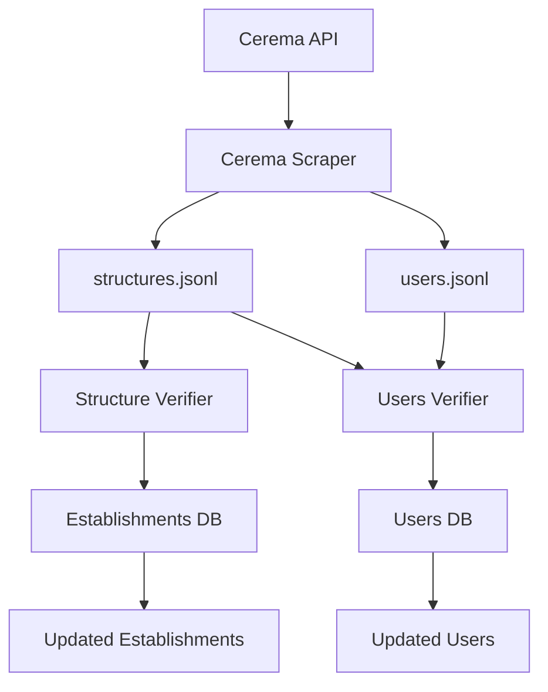

# Cerema Data Management

A comprehensive guide to manage Cerema DF Portal data synchronization and user/structure verification.

## Overview

This documentation covers the complete workflow for managing Cerema DF Portal data, from initial data retrieval to automated verification and deactivation processes.

### Components

1. **Cerema Scraper** - Retrieves structures and users from API
2. **Structure Verifier** - Validates establishments against structure data
3. **Users Verifier** - Manages user deactivation based on business rules

## 🔄 Workflow Overview



## 🚀 Quick Start Guide

### 1. Environment Setup

```bash
# Install dependencies
pip install requests click psycopg2-binary python-dateutil

# Get API token (first time setup)
curl -X POST https://portaildf.cerema.fr/api/api-token-auth/ \
  -H "Content-Type: application/json" \
  -d '{"username": "your_username", "password": "your_password"}'
# Response: {"token": "your_api_token_here"}

# Set up API credentials
export CEREMA_BEARER_TOKEN="your_api_token_here"

# Set up database credentials
export DB_HOST="localhost"
export DB_PORT="5432"
export DB_NAME="your_database"
export DB_USER="your_username"
export DB_PASSWORD="your_password"
```

### 2. Data Retrieval

```bash
# Navigate to scraper directory
cd 01-cerema-scraper/

# Retrieve both structures and users
python cerema-scraper.py

# Or retrieve individually
python cerema-scraper.py --structures-only
python cerema-scraper.py --users-only
```

### 3. Data Verification

```bash
# Verify establishments
cd ../02-establishment-verifier/
python establishment-verifier.py --jsonl-file ../01-cerema-scraper/structures.jsonl --dry-run

# Verify users
cd ../03-users-verifier/
python users-verifier.py \
  --users-file ../01-cerema-scraper/users.jsonl \
  --structures-file ../01-cerema-scraper/structures.jsonl \
  --dry-run
```

### 4. Apply Changes

```bash
# Apply establishment changes
cd 02-establishment-verifier/
python establishment-verifier.py --jsonl-file ../01-cerema-scraper/structures.jsonl

# Apply user changes
cd 03-users-verifier/
python users-verifier.py \
  --users-file ../01-cerema-scraper/users.jsonl \
  --structures-file ../01-cerema-scraper/structures.jsonl
```

## 📁 File Structure

```
cerema-data-management/
├── 01-cerema-scraper/
│   ├── cerema-scraper.py          # API data retrieval
│   ├── README.md                  # Scraper documentation
│   ├── api_scraper.log           # Scraper logs
│   ├── structures.jsonl          # Structure data (generated)
│   ├── users.jsonl               # User data (generated)
│   ├── api_structures_state.json # Resume state for structures
│   └── api_users_state.json      # Resume state for users
├── 02-establishment-verifier/
│   ├── establishment-verifier.py  # Establishment verification
│   ├── README.md                  # Establishment verifier documentation
│   └── structure_verifier.log     # Establishment verification logs
├── 03-users-verifier/
│   ├── users-verifier.py          # User verification
│   ├── README.md                  # User verifier documentation
│   └── user_deactivation.log      # User verification logs
├── README.md                      # This global documentation
└── scripts/
    ├── daily-sync.sh              # Daily synchronization script
    ├── health-check.sh            # Health monitoring script
    └── integration-test.sh        # Integration testing script
```

## 🔧 Detailed Components

### 1. Cerema Scraper

**Purpose**: Retrieve structures and users from Cerema DF Portal API

**Key Features**:
- Automatic pagination handling
- Resume capability on interruption
- Duplicate prevention
- Configurable rate limiting

**Usage**:
```bash
# Navigate to scraper directory
cd 01-cerema-scraper/

# Basic usage
python cerema-scraper.py

# Custom configuration
python cerema-scraper.py \
  --structures-output data/structures.jsonl \
  --users-output data/users.jsonl \
  --delay 1.0 \
  --verbose
```

**Output Files**:
- `structures.jsonl` - Structure data with LOVAC access information
- `users.jsonl` - User data with expiration dates and structure associations

**Documentation**: See `01-cerema-scraper/README.md` for detailed usage instructions.

### 2. Structure Verifier

**Purpose**: Validate establishments in database against structure data

**Business Rules**:
- Missing SIREN → mark establishment as deleted
- Expired LOVAC access → suspend establishment

**Usage**:
```bash
# Navigate to establishment verifier directory
cd 02-establishment-verifier/

# Preview changes
python establishment-verifier.py --jsonl-file ../01-cerema-scraper/structures.jsonl --dry-run

# Apply changes
python establishment-verifier.py --jsonl-file ../01-cerema-scraper/structures.jsonl
```

**Database Requirements**:
- `establishments` table with `deleted_at`, `suspended_at`, `suspended_cause` columns

**Documentation**: See `02-establishment-verifier/README.md` for detailed usage instructions.

### 3. Users Verifier

**Purpose**: Manage user deactivation based on business rules

**Business Rules**:
- Missing user → mark as deleted
- Expired user rights → suspend user
- Invalid Terms of Service → suspend user
- Expired structure rights → suspend user

**Usage**:
```bash
# Navigate to users verifier directory
cd 03-users-verifier/

# Preview changes
python users-verifier.py \
  --users-file ../01-cerema-scraper/users.jsonl \
  --structures-file ../01-cerema-scraper/structures.jsonl \
  --dry-run

# Apply changes
python users-verifier.py \
  --users-file ../01-cerema-scraper/users.jsonl \
  --structures-file ../01-cerema-scraper/structures.jsonl
```

**Database Requirements**:
- `users` table with `deleted_at`, `suspended_at`, `suspended_cause` columns

**Documentation**: See `03-users-verifier/README.md` for detailed usage instructions.

## 🗓️ Recommended Schedule

### Daily Operations

```bash
#!/bin/bash
# daily-sync.sh - Daily data synchronization

set -e

echo "=== Daily Cerema Data Sync - $(date) ==="

# Navigate to project root
cd "$(dirname "$0")/.."

# Check if API token is set
if [ -z "$CEREMA_BEARER_TOKEN" ]; then
    echo "ERROR: CEREMA_BEARER_TOKEN environment variable not set"
    echo "Please obtain token from: https://portaildf.cerema.fr/api/api-token-auth/"
    exit 1
fi

# 1. Retrieve latest data
echo "Step 1: Retrieving data from API..."
cd 01-cerema-scraper/
python cerema-scraper.py

# 2. Verify structures
echo "Step 2: Verifying structures..."
cd ../02-establishment-verifier/
python establishment-verifier.py --jsonl-file ../01-cerema-scraper/structures.jsonl --dry-run > /tmp/structure-preview.log
if [ $? -eq 0 ]; then
    python establishment-verifier.py --jsonl-file ../01-cerema-scraper/structures.jsonl
else
    echo "ERROR: Structure verification failed"
    exit 1
fi

# 3. Verify users
echo "Step 3: Verifying users..."
cd ../03-users-verifier/
python users-verifier.py \
  --users-file ../01-cerema-scraper/users.jsonl \
  --structures-file ../01-cerema-scraper/structures.jsonl \
  --dry-run > /tmp/user-preview.log
if [ $? -eq 0 ]; then
    python users-verifier.py \
      --users-file ../01-cerema-scraper/users.jsonl \
      --structures-file ../01-cerema-scraper/structures.jsonl
else
    echo "ERROR: User verification failed"
    exit 1
fi

echo "=== Sync completed successfully ==="
```

### Cron Configuration

```bash
# Add to crontab for daily execution at 2 AM
0 2 * * * cd /path/to/cerema-data-management && ./scripts/daily-sync.sh >> /var/log/cerema-sync.log 2>&1
```

## 🛡️ Security Best Practices

### Credential Management

```bash
# Get API token from Cerema Portal
curl -X POST https://portaildf.cerema.fr/api/api-token-auth/ \
  -H "Content-Type: application/json" \
  -d '{"username": "your_cerema_username", "password": "your_cerema_password"}'

# Response format:
# {"token": "abcd1234567890abcdef1234567890abcdef12"}

# Use environment variables
export CEREMA_BEARER_TOKEN="abcd1234567890abcdef1234567890abcdef12"
export DB_PASSWORD="your_database_password"
```

### File Permissions

```bash
# Secure data files
chmod 600 *.jsonl
chmod 600 *.log

# Secure scripts
chmod 750 *.py
```

### Log Analysis

```bash
# Daily statistics
echo "=== Daily Statistics ==="
echo "Structures retrieved: $(grep "Total unique structures" 01-cerema-scraper/api_scraper.log | tail -1)"
echo "Users retrieved: $(grep "Total unique users" 01-cerema-scraper/api_scraper.log | tail -1)"
echo "Establishments updated: $(grep "Updates applied" 02-establishment-verifier/structure_verifier.log | tail -1)"
echo "Users processed: $(grep "Total actions" 03-users-verifier/user_deactivation.log | tail -1)"

# Error summary
echo "=== Error Summary ==="
find . -name "*.log" -exec grep "ERROR" {} \; | tail -10
```

## 🔄 Troubleshooting Guide

### Common Issues

#### 1. API Rate Limiting
```bash
# Solution: Increase delays
cd 01-cerema-scraper/
python cerema-scraper.py --delay 2.0 --retry-delay 10.0
```

#### 2. Network Timeouts
```bash
# Solution: Increase retries and timeout
cd 01-cerema-scraper/
python cerema-scraper.py --max-retries 5
```

### API Token Authentication

```bash
# Method 1: Using curl
curl -X POST https://portaildf.cerema.fr/api/api-token-auth/ \
    -H "Content-Type: application/json" \
    -d '{"username": "your_username", "password": "your_password"}'

# Method 2: Using Python
python -c "
import requests
import json

response = requests.post(
        'https://portaildf.cerema.fr/api/api-token-auth/',
        headers={'Content-Type': 'application/json'},
        data=json.dumps({
                'username': 'your_username',
                'password': 'your_password'
        })
)

if response.status_code == 200:
        token = response.json()['token']
        print(f'export CEREMA_BEARER_TOKEN=\"{token}\"')
else:
        print(f'Error: {response.status_code} - {response.text}')
"

# Method 3: Using Postman
# 1. Create a new POST request to https://portaildf.cerema.fr/api/api-token-auth/
# 2. Set Headers: Content-Type: application/json
# 3. Set Body to raw JSON:
#    {
#      "username": "your_username",
#      "password": "your_password"
#    }
# 4. Send the request
# 5. Copy the token value from the response
```

**Response format:**
```json
{
  "token": "abcd1234567890abcdef1234567890abcdef12"
}
```

**Important Notes:**
- Tokens don't expire automatically but may be revoked
- Store tokens securely using environment variables
- Never commit tokens to version control
- Regenerate tokens if compromised

#### 5. File Permission Errors
```bash
# Fix permissions
chmod 644 01-cerema-scraper/*.jsonl
chown $USER:$USER 01-cerema-scraper/*.jsonl
```

### Recovery Procedures

#### Resume Interrupted Scraping
```bash
# The scraper automatically resumes
cd 01-cerema-scraper/
python cerema-scraper.py
# Output: "Resuming from page X"
```

#### Reset and Restart
```bash
# Clear state and restart
cd 01-cerema-scraper/
python cerema-scraper.py --reset-state
```

#### Rollback Database Changes
```bash
# Use database backups to rollback
pg_restore -d $DB_NAME backup_before_sync.sql
```

## 🧪 Testing

### Development Testing

```bash
# Test with dry-run mode
cd 02-establishment-verifier/
python establishment-verifier.py --jsonl-file ../01-cerema-scraper/structures.jsonl --dry-run --verbose

cd ../03-users-verifier/
python users-verifier.py \
  --users-file ../01-cerema-scraper/users.jsonl \
  --structures-file ../01-cerema-scraper/structures.jsonl \
  --dry-run --verbose

# Test with sample data
cd 01-cerema-scraper/
head -100 structures.jsonl > test-structures.jsonl
cd ../02-establishment-verifier/
python establishment-verifier.py --jsonl-file ../01-cerema-scraper/test-structures.jsonl --dry-run
```

## 🆘 Support

### Log Locations

- `01-cerema-scraper/api_scraper.log` - Scraper execution logs
- `02-establishment-verifier/structure_verifier.log` - Structure verification logs  
- `03-users-verifier/user_deactivation.log` - User verification logs

### Debugging Commands

```bash
# Enable verbose logging
cd 01-cerema-scraper/
python cerema-scraper.py --verbose

cd ../02-establishment-verifier/
python establishment-verifier.py --verbose  

cd ../03-users-verifier/
python users-verifier.py --verbose

# Check configuration
python cerema-scraper.py --help
python establishment-verifier.py --help
python users-verifier.py --help
```
---

This documentation provides a complete guide for managing the Cerema data synchronization workflow. For component-specific details, refer to individual script documentation.